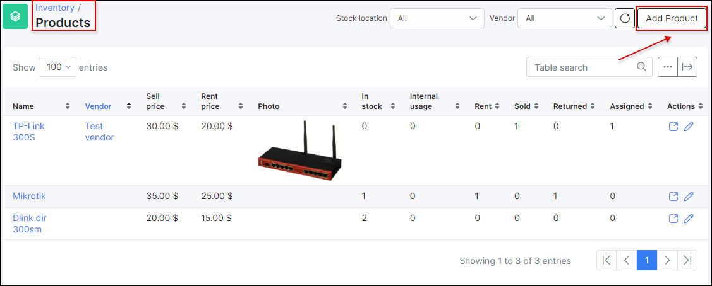

Products
==========

This section allows you to see all the products that are in the system,  add a new product as well.
Here are the filters for  Stock location and Vendor filter and Search.
If you click on a specific product, you will redirect to the Product page.
If you click to a specific product vendor, you will redirect to the Vendor page.

You can create new product via button «Add Product»section

* **Name** – the product’s name
* **Vendor** – the vendor of the product. (Not necessary)
* **Photo** – the product’s photo. You can choose a photo and it will be added to the product. It will appear in the list of products and in the list of items (near items of this product)
* **Sell price** – the default price for the sale of this product to customers.
* **Rent price** – the default price for the rent of this product to customers.