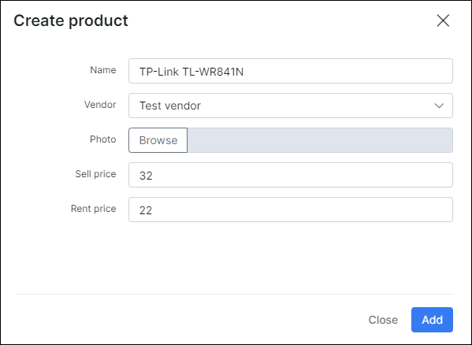

Products
==========

This section allows you to see all the products that are in the system,  add a new product as well.
Here are the filters for  Stock location, Vendor filter and Search.
If you click on a specific product, you will be redirected to the Product page.
If you click to a specific product vendor, you will be redirected to the Vendor page.

You can create new product by clicking on `Add Product`

* **Name** – name of the product
* **Vendor** – vendor of the product (not necessary)
* **Photo** – photo of the product. You can choose a photo and it will be added to the product. It will appear in the list of products and in the list of items (near items of this product)
* **Sell price** – the default price for the sale of this product to customers.
* **Rent price** – the default price for the rent of this product to customers.