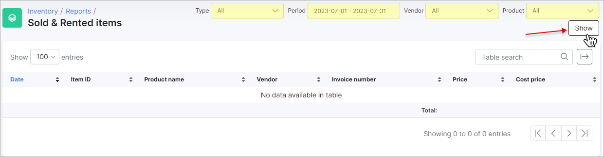
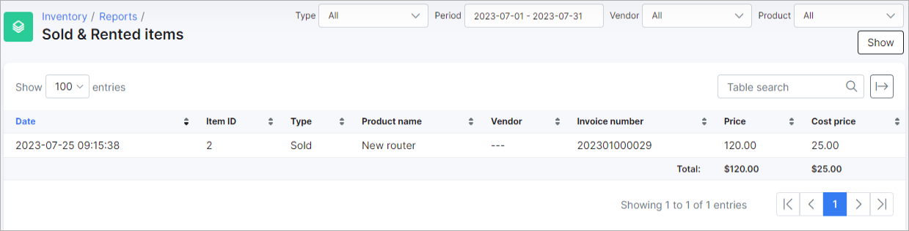
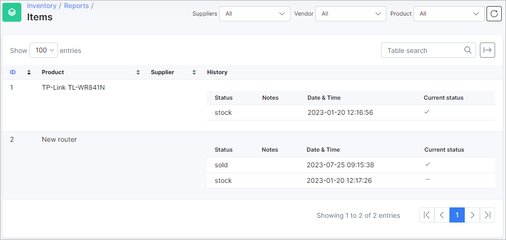
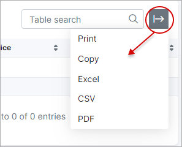

Reports
=================

In this section, you can find reports on sold and rented items, as well as general reports on all items, along with their respective statuses (*stock*, *sold*, *assigned*, etc.).

### Sold & Rented items

You can view reports on sold and rented items under *Inventory → Reports → Sold & Rented items*.

Choose **Type**, **Period**, **Vendor** and **Product** at the top of the page. Then click the `Show` button to display the information in the table below:

### Items

Under *Inventory → Reports → Items*, you will find general reports on all the items, regardless of their status - whether they are in stock, sold, assigned, rented, etc.

At the top of the page, you can filter the presented information by *Suppliers*, *Vendor*, *Product*.

### Export

You can export the tables in the *Reports* section in multiple formats and ways by clicking the *Export* button at the top right of the page:

