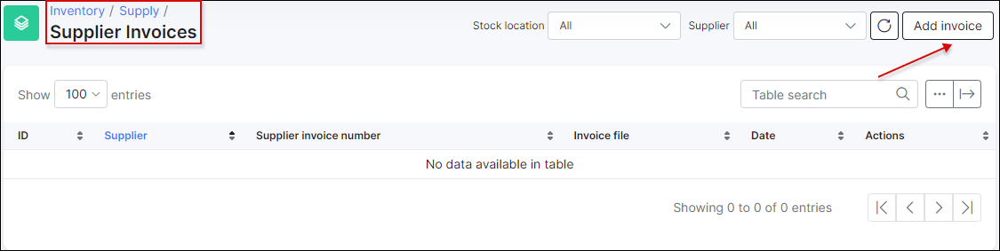
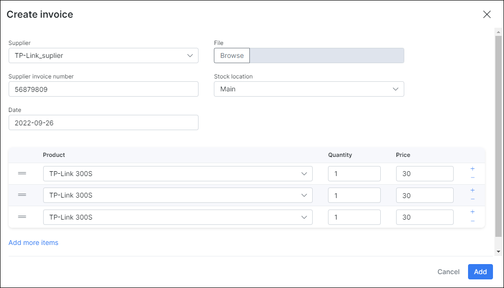
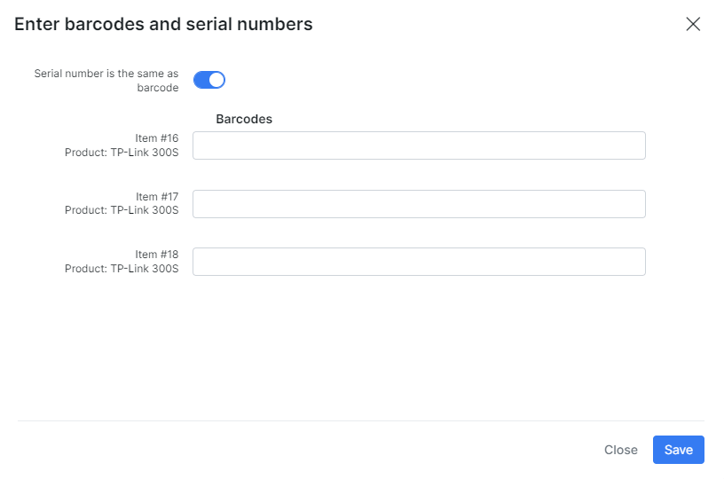

Supplier invoices
==========

If you want to add product items – you have to add it via creating «supplier invoice» here.

Press «Add invoice» and fill invoice fields.

* **Supplier** – choose a supplier. This is obligatory.
* **Supplier invoice number** – Invoice number from supplier. (Not necessary)
* **File** – if you have invoice file (an image or a document) you can specify it here. It’ll be downloaded in the system while invoice is creating. Afterwards you can view or download it for your needs.
* **Product** – choose an existing product. Or you can type new product name and product will be created automatically.
* **Quantity** – items count to add to the system
* **Price** – purchase price of this items.

---
If you press «Add» invoice – the new window will appear. There you can add barcodes of the items. (You can edit barcodes later by pressing <icon class="image-icon"></icon> )

After creating invoice – items of selected products will be added to the system. They will have status **In stock**

---
You can't remove 