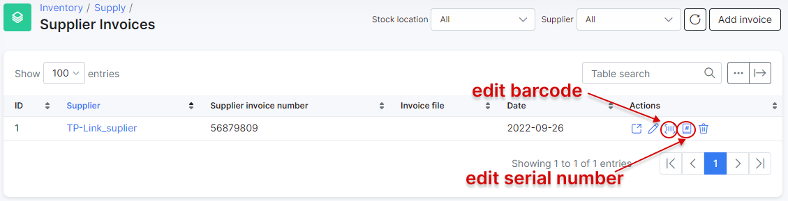

Supplier invoices
==========

If you want to add product items, do it via creating  a *supplier invoice*:

Press `Add invoice` and fill in the fields:

* **Supplier** – choose a supplier (obligatory).
* **Supplier invoice number** – invoice number from the supplier (if needed).
* **File** – if you have an invoice file (an image or a document) you can specify it here. It will be downloaded in the system while invoice is creating. Afterwards you can view or download it for your needs.
* **Product** – choose an existing product. Or you can type in a new product name, and a product will be created automatically.
* **Quantity** – items count to add to the system.
* **Price** – purchase price of this item.

---
After clicking on `Add`, a new window appears. There you can add barcodes and serial numbers of the items. 

You can edit them later by pressing <icon class="image-icon"></icon> for barcodes or <icon class="image-icon"></icon> for serial numbers:

After creating an invoice, items of the selected products will be added to the system (if they were not added before). They will have status **In stock**.

