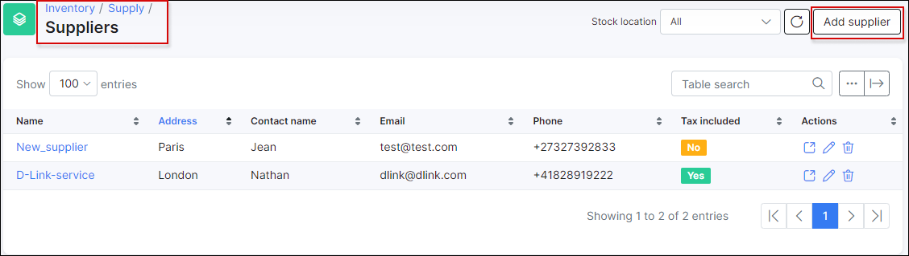
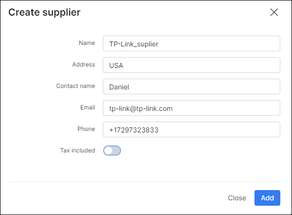
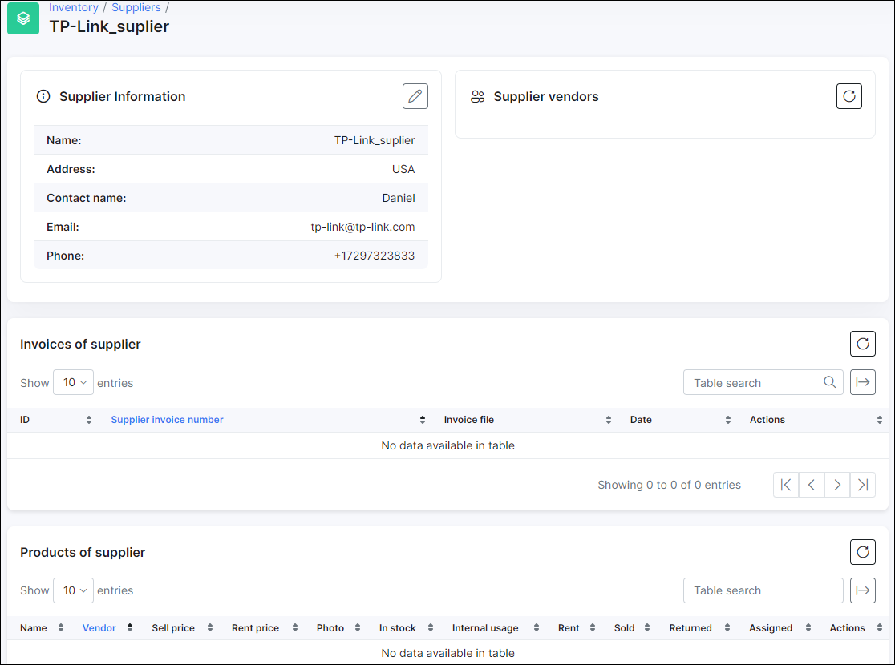

Suppliers
==========

The suppliers section shows you all suppliers of equipment and allows you to create new suppliers.
You cannot remove the supplier if it has at least one product with items.

You can create new supplier via button *«Add supplier»*

Only field **«Name»** is required.
* **Tax included** – include VAT% in supplier’s invoices.

If you click to specific supplier you will redirect to Supplier page, where you can see supplier details, supplier vendors, supplier invoices and supplier products.
   