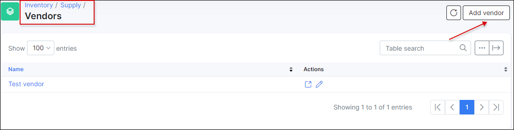
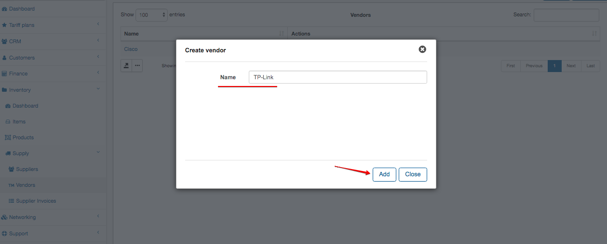
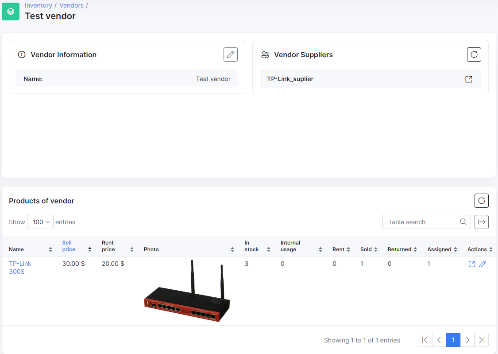

## Vendors

This section shows you all vendors and allows you to add new Vendors.

You can create new vendor via button «Add vendor»

Type the name of the vendor and press «Add»
You can't remove Vendor if it has Items.
If you click to the Vendor's name, you will redirect to the Vendors page. On this page you can see Suppliers that sell Vendors product.
And you can see a list of products with numbers of items in each status.
