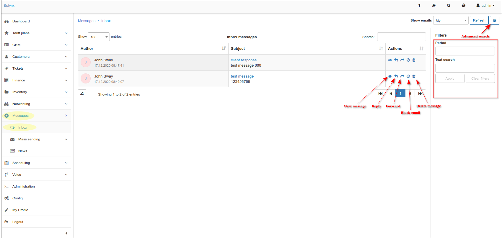
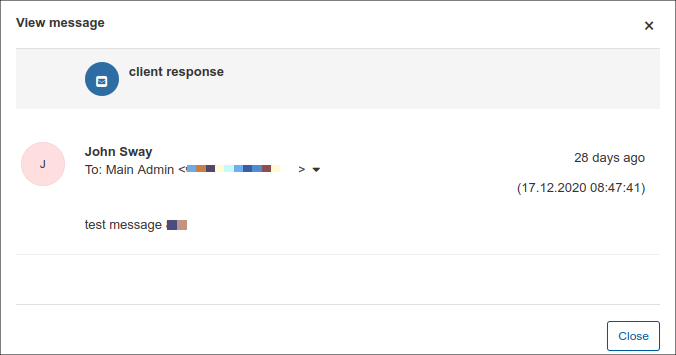
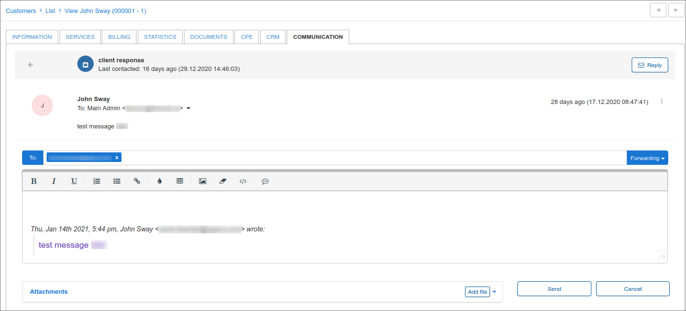
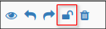
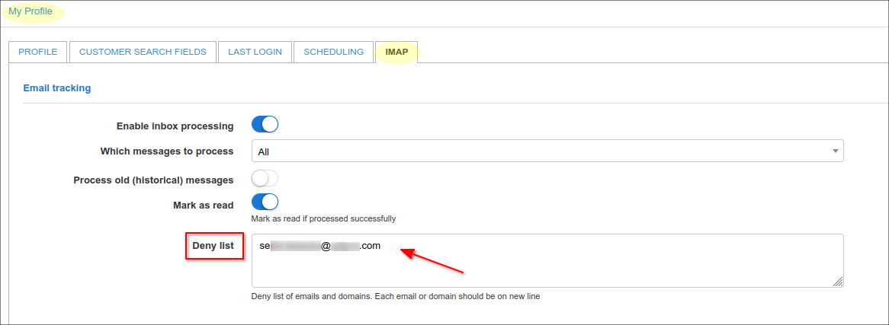

Inbox
==============

In this section Splynx administrator can check all addressed emails from the mailbox that is connected via [IMAP](my_profile/imap/imap.md). Using *Advanced search* the messages can be sorted by period of time and text context. In the *Inbox messages* table, the following actions can be applied to the email: *View message*, *Reply*, *Forward*, *Block email*, *Delete message*.

In case of *Reply* or *Forward* action, you will be redirected to *Communication* tab of customer profile page in order to write the message. Also, you can block the customer's email to stop receiving correspondents or delete message from the list.

In order to unblock the customer's email address, press unlock sign <icon class="image-icon"></icon> or remove the email address from *Deny list* in `My Profile → IMAP`:

