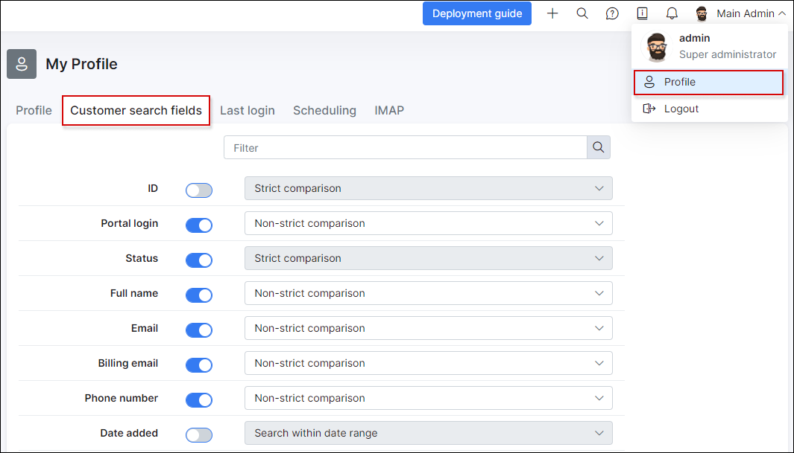

Customer search fields
=============

Administrators can customize which fields to use when searching for customers within the search feature (`Customers -> Search`) and under `Messages -> Mass sending -> Create`.

By simply enabling or disabling the provided fields, selected fields can be included or excluded in the search function.

Selected fields can also be made to have a strict comparison to the details entered when searching.

Be sure to save changes before leaving the page to apply any changes made.

Once fields are selected you'll be able to use them for search under `Customers -> Search` :

and under `Messages -> Mass sending -> Create` :

