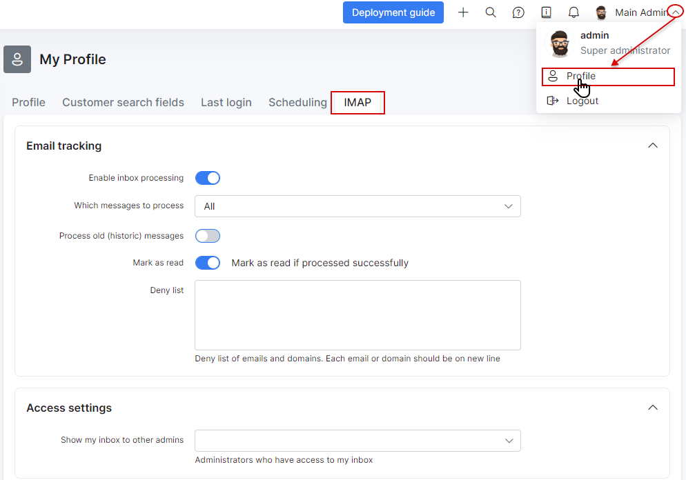
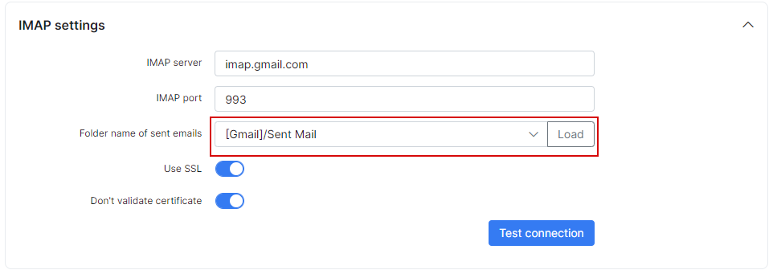
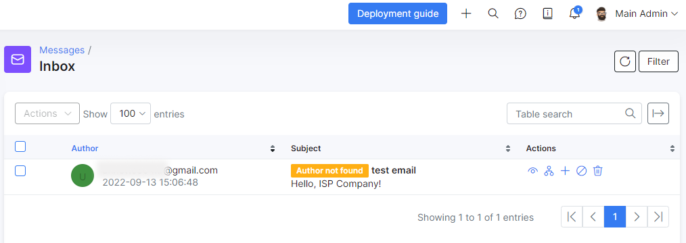

Personal IMAP / SMTP configuration
====

Using this feature an administrator can send emails to the customer/lead as a personal message. The conversation between an administrator and the customer/lead will be visible only for a sender and for a receiver. None of other administrators won't be able to see this conversation in Splynx.

You can find this feature configuration window under section **My profile** on **IMAP** tab:

Below you can find a description of all available options to configure.

#### Email tracking

* **Enable inbox processing** - enable/disable synchronization of incoming emails between email account and Splynx;

* **Which messages to process** - select _All_ or _Unread_ messages for processing;

* **Process old(historical) messages** - this option allows select of date from which Splynx will try to process emails. If disabled - Splynx will process emails from the moment when processing is enabled;

* **Mark as read** - mark email as read(into email account) if processed by Splynx successfully;

* **Deny list** - a list of emails and domains what will be ignored(won't be synced) by Splynx. Each email/domain should be on a new line;

#### Access settings

Here you can select admins who will have an access to your incoming emails. Be very attentive with this option as all enabled administrators can read your incoming emails.

#### Credentials

Here you need to set a username and a password to your email account. In this case it's a Gmail account login/password.

#### IMAP settings

* **IMAP server** - an address of your IMAP server;

* **IMAP port** - specify IMAP port(usually 143 or 993);

* **Folder name of sent emails** - here you need to click on "Load" button first and after this a folder should be selected automatically. It should be a folder of sent emails and not any other folder.

* **Use SSL** - enable/disable using of SSL when connecting to IMAP server;

* **Don't validate certificate** - enable/disable validation of certificate.

When all these settings are set, click on "Test connection" to ensure that connection between Splynx and mail server is active, if no - check your settings.

#### SMTP settings

Here we have ad administrator's personal SMTP settings(for email sending).

* **Enable sending** - enable/disable sending of email from admin's account;

* **Reply to** - here you can specify an email address to reply;

* **Use system SMTP** - allows to send messages to a customer using system email configuration in `Config → Main → Email`. The global SMTP config settings will be copied to the appropriate fields such as _SMTP server_, _SMTP port_, _SMTP security mode_ and _SMTP authentication type_. Double check if the email address in the field `Sender's email` has the correct format e.g. `username@mailserver.com` in `Config → Main → Email`, exactly this value will be used to send mail, not the value from `Username` field, where the simple login can be used as well.

* **SMTP server** - mail server address;

* **SMTP port** - mail server port(usually 25, 465 or 587);

* **SMTP security mode** - mail server security type(none, TLS or SSL);

* **SMTP authentication type** - type of authentication on mail server.

Don't forget to test connection and send a test email.

### How it works. Example.

Once we have configured IMAP and SMTP under _My profile_ let's test with some customer.

First I'll send some message directly to splynx.engineer@gmail.com from some not-registered in Splynx email:

it's exactly the same message what we have on our Gmail account:

As you can see under _Messages / Inbox_ we received an not-registered message with mark "Author not found" but near each message we have the "Action" section where we can:
1. View message;
2. Pair to a customer;
3. Add a customer with this email address;
4. Block email;
5. Delete message.

Now let's test with some registered customer.

To create a personal message to a customer navigate to "Communication" tab and click on "Send email":

Customer received this message and reply to it:

Once customer replied - admin will see this message under Communication tab:

**Note!** In a previous steps I enabled access to my inbox for _splynx_ admin:

It means that _splynx_ admin can view Inbox and messages under _Communication_ tab under customer profile of that admin who allowed this but if _splynx_ admin has no configured IMAP under **My profile** he won't see any messages:

