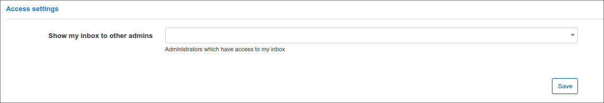

Imap
=============
Administrator can add here the work email and Splynx, in its turn, can track mail letters there. It can be useful when customers reply to such work email and it's necessary to have the full correspondence history in Splynx. The inbox can be visible for other admins in system.
On this tab there are the following categories of settings:

**Email tracking**

- Enable inbox processing - swtich on/off a check emails in Inbox.
- Which messages to process - type of messages to process: All or Unread.
- Process old (historical) messages - to check previous messages.
- Mark as read - mark as read the emails if processed successfully.
- Deny list - deny list of emails and domains. Each email or domain should be on new line.

**Credentials**

- Username - an email address.
- Password - a mail box password. If you use Gmail.com IMAP, you need use App password here.

**IMAP settings**

- IMAP server - an address of imap server.
- IMAP port - a specific imap port.
- Folder name of sent emails - can be loaded specific folder.
- Use SSL - use  Secure Sockets Layer certificate.
- No validayte cert - use to ignore server certificate validation. It allows a use of a self-signed certificate for incoming mailbox.

**SMTP settings**

- Enable sending - enable sending from a previous specified mail address.
- Reply to - Change `Reply-to` address to receive response in a different mailbox.
- Use system SMTP -use global SMPT which is specified in Config → Main → Email.
- SMTP server - an address of smtp server.
- SMTP port - a port of smtp server.
- SMTP security mode - use SSL or TLS mode
- SMTP authentication type - available such types: Plain, Login, CRAM-MD5, NTLM, XOAUTH2.
- Test email - Email to use for testing. Recommended to send test email to public email service like Gmail.com or Hotmail.com.

**Access settings**

- Show my inbox to other admins - choose administrators which have access to my inbox.
