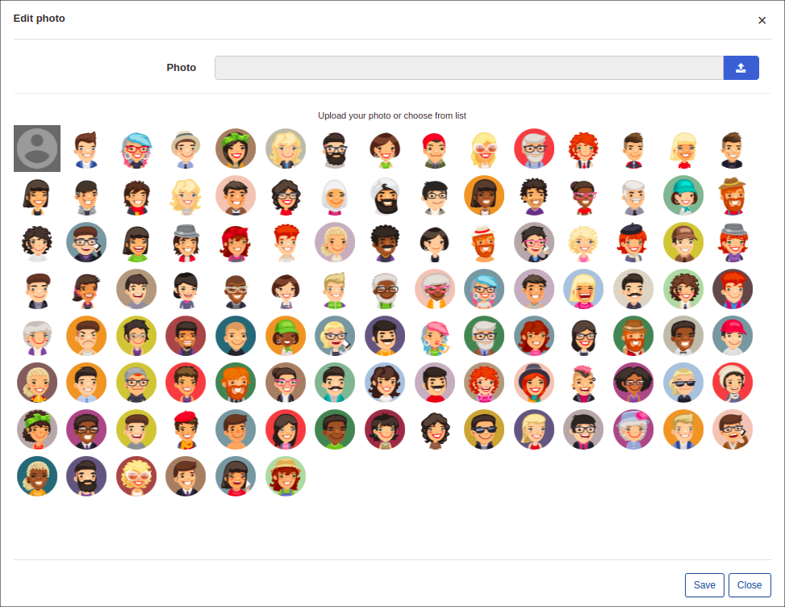
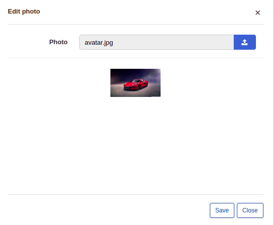
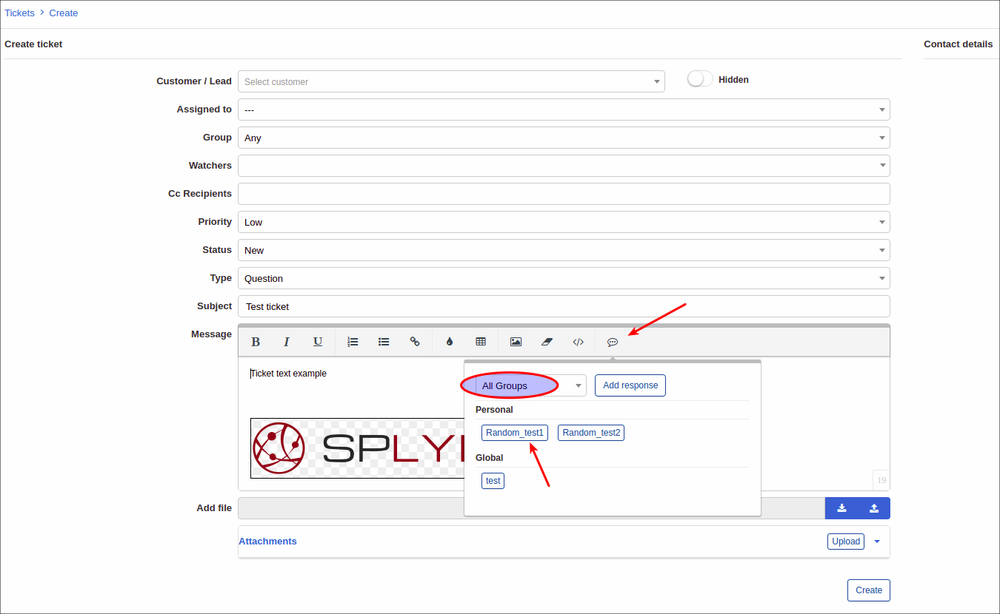

Profile
=============

Administrators can customize their profile details here. Details like photo, password and signatures can be personalized, saved column preferences can be reset, tickets canned responses, its groups, logout time and two-factor authentication can be configured here for the admin as well.

**Profile** - displays the full name of the current administrator and a photo can be added here. In order to change your photo/avatar just click on the default profile image, in the new window you can choose one of the built-in avatars or your own photo.

**Change Password** - to change the current password of the administrator the old password needs to be entered first and the new password can be entered and confirmed with the fields provided.

**Two-Factor-Authentication** - for enhanced security, administrators can choose to enable and configure two-factor-authentication to log into their profile. All platforms are supported. You can use [FreeOPT+](https://github.com/helloworld1/FreeOTPPlus) or any other app on your smartphone to scan the QR code.

**Change Timeout** - you can choose to enable and set a timeout period for auto-logout or simply leave the value on 0 to disable this function.

**Reset Columns** - all [columns](configuration/system/additional_fields/additional_fields.md) that were added to the default view of any table within Splynx can be reset with this function.

**Support** - administrators can add a signature here to use in ticket responses.

**Ticket canned groups** - groups for canned responses can be created here to organize and group canned responses. Simply click on the `+` add button to create a new group.

**Ticket canned responses** - pre-configured responses for tickets can be created and saved here to optimize response time and improve efficiency. Simply click on the `+` add button to add a new response.

Use *canned responses* and its groups when you create or reply to a ticket, just click on <icon class="image-icon"></icon> icon, then select the required group and click on the canned response title to insert the text into message field.

