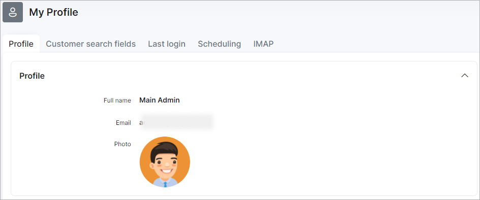
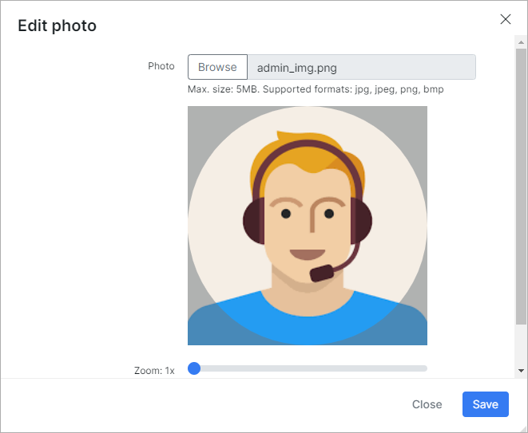
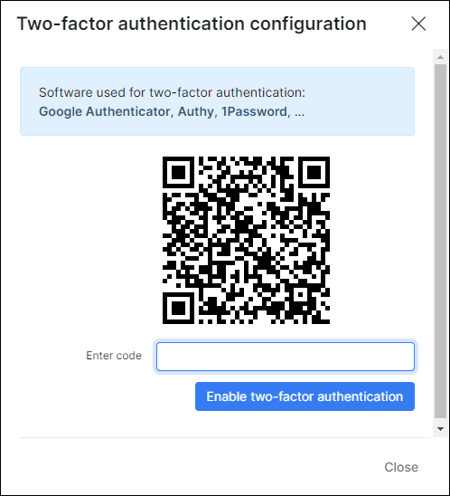
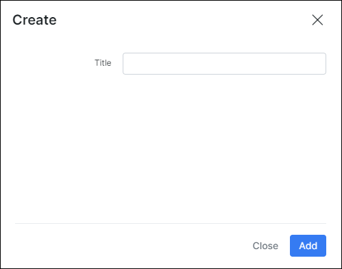
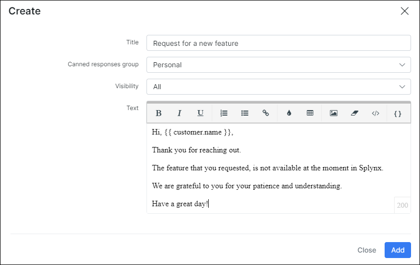

Profile
=============

Administrators can customize their profile details here. Details like photo, password and signatures can be personalized, saved column preferences can be reset, tickets canned responses, its groups, logout time and two-factor authentication can be configured here for the admin as well.

**Profile** - displays the full name of the current administrator and a photo can be added here. In order to change your photo/avatar just click on the default profile image, in the new window you can choose one of the built-in avatars or your own photo.
The custom image requirements are: file with *jpg/jpeg/png/bmp* extension, size is not more than 5 megabytes. Zoom and visible image region selection functions are supported.

**Change Password** - to change the current password of the administrator the old password needs to be entered first and the new password can be entered and confirmed with the fields provided.

**Two-Factor-Authentication** - for enhanced security, administrators can choose to enable and configure two-factor-authentication to log into their profile. All platforms are supported. You can use [FreeOPT+](https://github.com/helloworld1/FreeOTPPlus) or any other app on your smartphone to scan the QR code.

**Change Timeout** - you can choose to enable and set a timeout period for auto-logout or simply leave the value on 0 to disable this function.

**Reset Columns** - all [columns](configuration/system/additional_fields/additional_fields.md) that were added to the default view of any table within Splynx can be reset with this function.

**Support** - administrators can add a signature here to use in ticket responses.

**Canned groups** - groups for canned responses can be created here to organize and group canned responses. Simply click on the `+` add button to create a new group.

 You can create the additional group (-s), just click on **Add** button at the top-right corner of the table and specify the group name e.g. *Support*, *Network* etc.

**NOTE:** Canned group names in `My profile` and `Config → Helpdesk → Canned responses` cannot be the same.

`Personal` group is not visible in the table but it's used by default for new responses. The responses created in `My profile` are unique to each user and cannot be used by other administrators in Splynx (except super administrator).

**Canned responses** - pre-configured responses for tickets can be created and saved here to optimize response time and improve efficiency. Simply click on the `+` add button to add a new response. By default

* **Title** - the title name of the response. Make sure to choose an easy recognizable response title that you can understand.;

* **Canned responses group** - choose the group you'd like to place this new canned response into. By default, `Personal` group is used. The additional groups can be created in **Canned groups** section above;

* **Visibility** - choose where the created response can be inserted: `All`, `Tickets` or `Messages`. By default `All` value is used;

* **Text** - the canned response text body. The pre-formatted replies can be customized by customer name, agent signature, links etc. using the dynamic [placeholders](configuration/system/templates/templates_variables/templates_variables.md).

Use *canned responses* withing its groups when you create or reply to a ticket/message, just click on <icon class="image-icon"></icon> icon, then find the required group and click on the canned response title to insert the text into message field.

The information how to created the canned responses for all administrators in Splynx you can find in [Canned responses](configuration/support/ticket_canned_responses/ticket_canned_responses.md) article.
