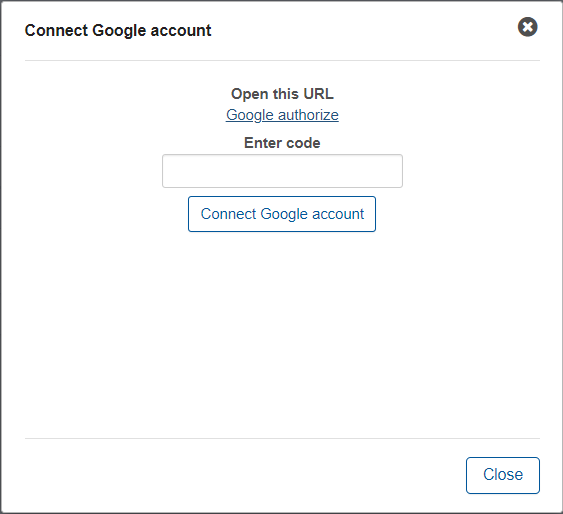
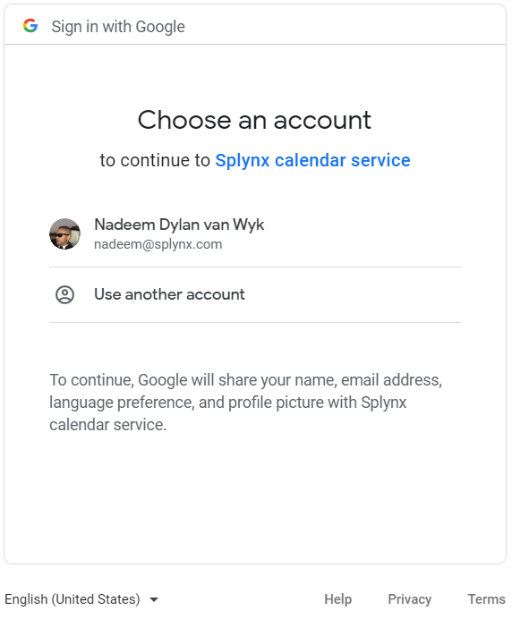
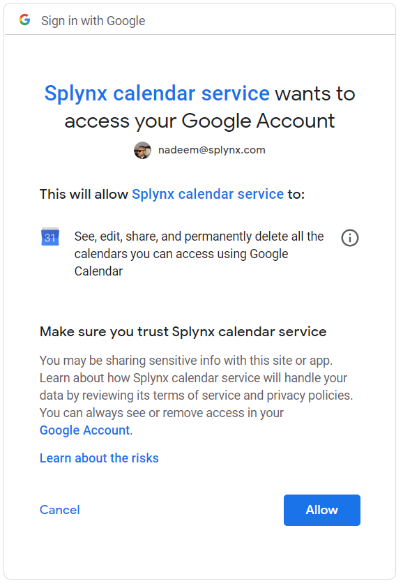
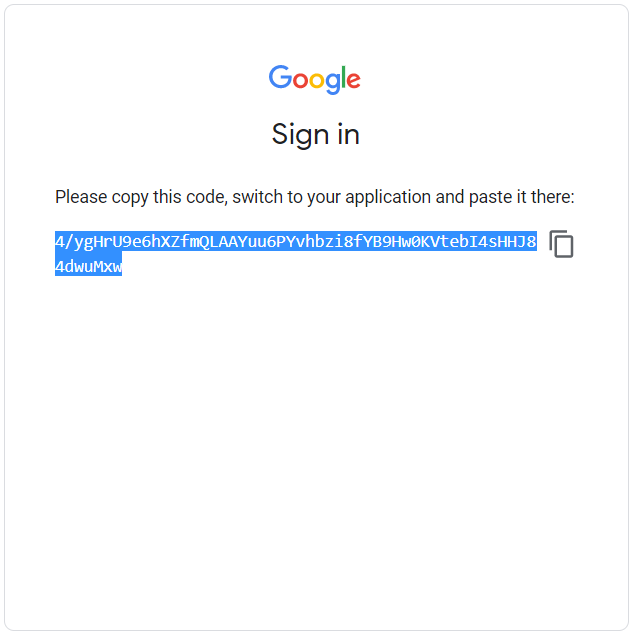
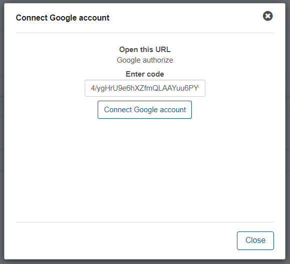
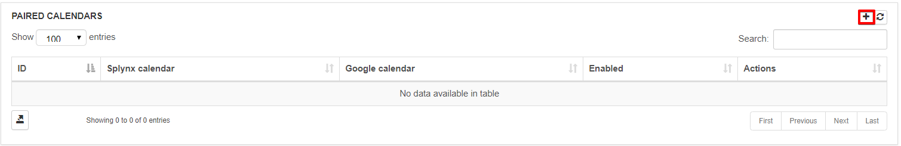
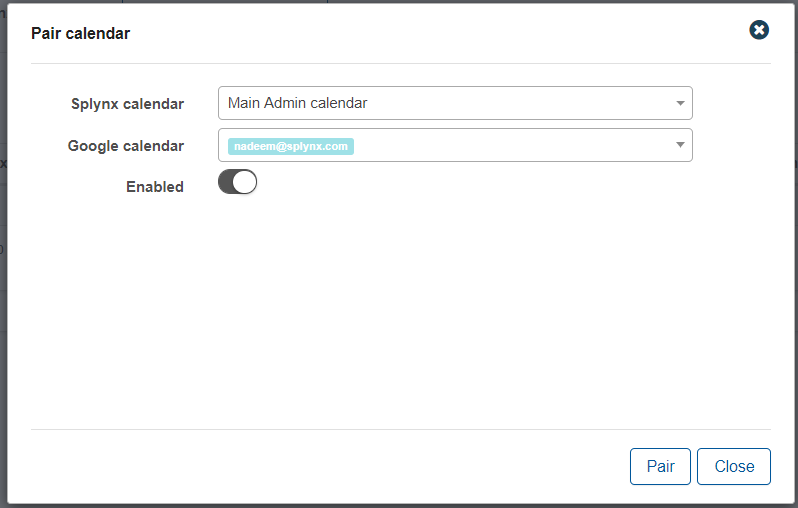

Administrators can connect Splynx to their Google account to sync tasks assigned to them to their Google calendars.

To connect a Google account, click on the Connect Google account button and follow the steps to connect the account.

Upon clicking on the Add Google account button, the following window will appear:

Click on the Google authorize link to sign in or select an account to connect. You will be redirected to the a Google sign in page:

You have the option to use the current profile signed into the browser or you may chose to use another account.

After signing in successfully, you will be prompted to allow access to your Google calendar services.

You will then receive a code which you will enter into the field provided to connect the Google calendar in Splynx.

Simply copy this code and click on connect google calendar to complete the process.

To sync Splynx tasks to the connected google calendar, it is necessary to add a paired calendar. This allows the Splynx calendar of the administrator to sync items into the Google calendar. Simply click on the + add paired calendar button to add a paired calendar.

A window will appear for you to select the Google calendar and the Splynx calendar to pair with.

**Splynx calendar** - select a administrator on the system to push the calendar tasks from.

**Google calendar** - select a connected Google calendar to push the calendar tasks to.

**Enabled** -  enables/disables syncing.
