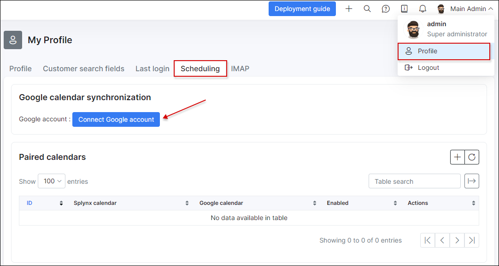
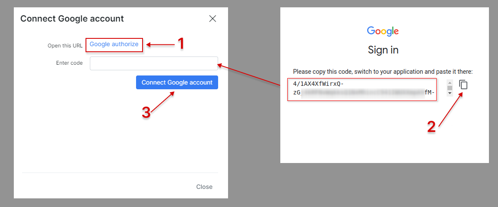

Scheduling (Google calendar synchronization)
=============

Administrators can connect Splynx to their Google account to sync tasks assigned to them and link to their Google calendars.



To connect a Google account, click on the **Connect Google account** button and follow the steps to connect the account.

Upon clicking on ```Connect Google account``` button, the following window will appear:



Click on the `Google authorize` link (1) to sign in. You will be redirected to the Google sign in page. Follow the instructions and allow using of the Splynx calendar into the Google account: enter 2-step verification code and put all check marks


After the code is generated, you should copy and paste it into the field provided to connect the Google calendar in Splynx (2).

After that, click on *Connect Google account* (3) to complete the process.


To sync Splynx tasks to the connected Google calendar, it is necessary to add a paired calendar. This allows the Splynx calendar of the administrator to sync items into the Google calendar. Simply click on the `+` add paired calendar button to add a paired calendar:


Once this is done, let's assign a task to this admin:


Now the admin will be able to see this task directly on their Google calendar:


Let's imagine a scenario when you add a [scheduling team](configuration/scheduling/teams/teams.md) named `Technicians` where a current admin is a member of this team. You assigned a task to the team `Technicians`:


Even if the admin is a member of the team, the task is not synced to Google calendar.

The reason for this is that you did not pair the calendar of this team. Let's apply this:


once this done, you can check your Google calendar:


**Conclusion**: if an admin wants to sync tasks that are assigned directly to him and tasks that are assigned to a team (where this admin is a member), it is necessary to pair the personal calendar and the team calendar:


Note that if the admin is a member of few teams, each calendar of this team needs to be paired here to sync tasks assigned to these teams.
