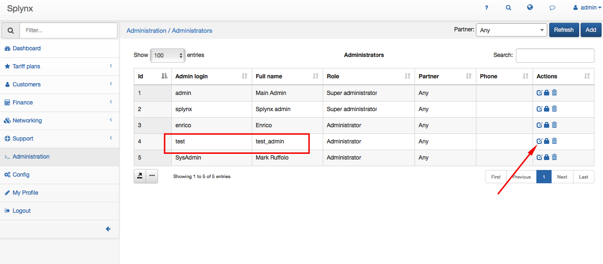
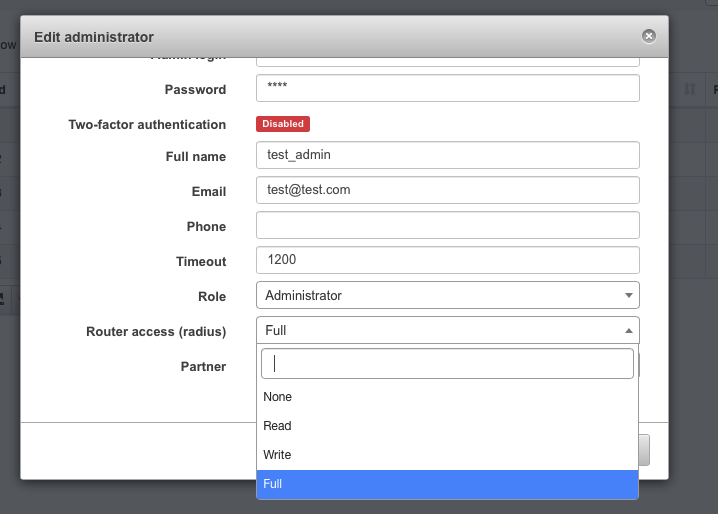
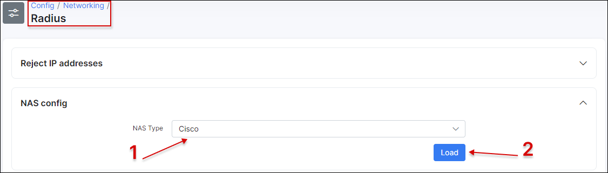
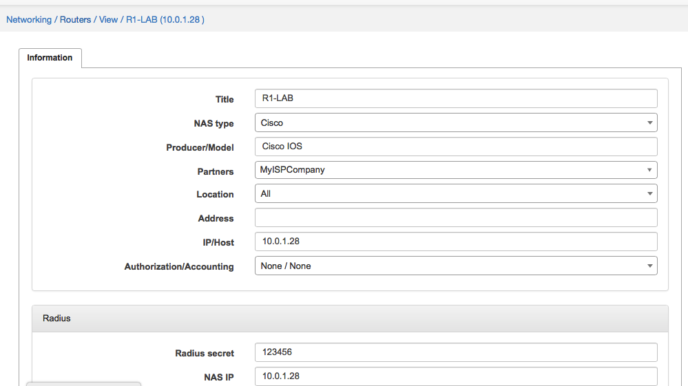
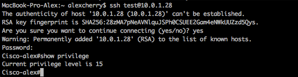

Admin login to Cisco devices
==========

First of all, we need to grant permissions to access routers to Admin in Splynx. We have created a test admin who will login to devices:




Splynx has 3 permission levels - *Full, Write and Read.* These levels can be mapped to Cisco privilege levels:


I'm creating admin with Full rights and then in `Config → Radius → Cisco` will choose that attribute used for Full access has privilege level 15:


Cisco-AVPair = shel:priv-lvl=15 says that Splynx will grant privilege level 15 to test admin when he connects to Cisco router/switch:


Also we need to add router to Splynx and choose NAS type = Cisco and setup the same Radius secret as we will setup on Cisco router:


Now we need to configure Cisco device to accept radius authentication and privilege levels:

```
aaa new-model
aaa authentication login SPLYNX group radius local
aaa authorization exec SPLYNX group radius local

radius-server attribute 6 on-for-login-auth
radius-server host 10.0.1.16 auth-port 1812 acct-port 1813
radius-server key 123456

line vty 0 4
authorization exec SPLYNX
login authentication SPLYNX
transport input ssh

for SSH configuration please run these commands:

cisco(config)# ip domain name splynx.test
cisco(config)# crypto key generate rsa   || (chose at lease 1024 bit key)
cisco(config)# ip ssh version 2
```

When commands entered to Cisco and Splynx are configured, admin is able to login to the Cisco router via SSH:


