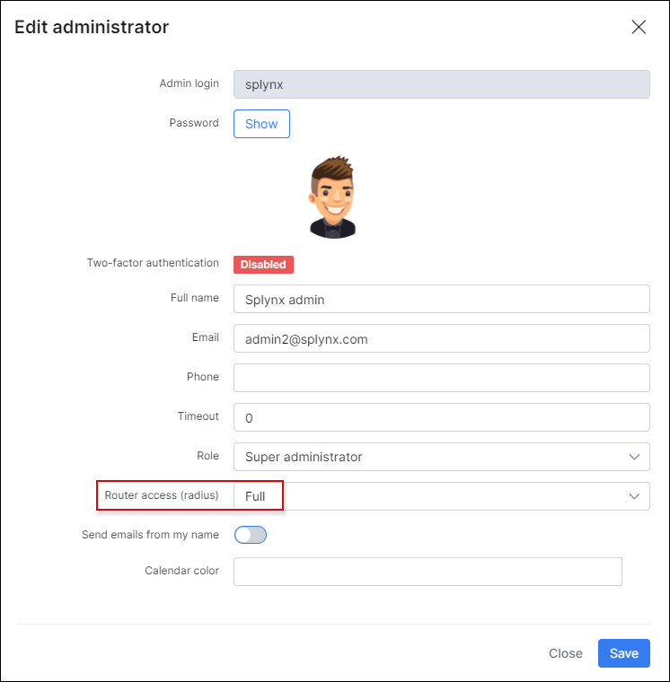

Admin login to Cisco IOS and IOS XE devices
==========

First of all, we need to grant permissions to access routers for the `administrator` account in Splynx. We created a test administrator, which we will use to log in to the devices:


Splynx has 3 permission levels - `Full`, `Write` and `Read`. These levels can be mapped to Cisco privilege levels:


In this example, we create an admin with `Full` rights and then in `Config → Radius → Cisco Configuration` we will choose the attribute that is used for `Full` access and has the **privilege level 15**:


`Cisco-AVPair = shel:priv-lvl=15` defines that Splynx will grant the privilege level **15** to the test admin when he connects to the Cisco router/switch:


Also, we need to add the router to Splynx, choose the **NAS type =** `Cisco`, and setup the same **Radius secret** we intend to use when setting up the Cisco router:


Now we need to configure the **Cisco IOS** device to accept radius authentication and privilege levels:

```
aaa new-model
aaa authentication login SPLYNX group radius local
aaa authorization exec SPLYNX group radius local

radius-server attribute 6 on-for-login-auth
radius-server host 10.0.1.16 auth-port 1812 acct-port 1813
radius-server key 123456

line vty 0 4
authorization exec SPLYNX
login authentication SPLYNX
transport input ssh

```
The commands to configure the **Cisco IOS XE** device are almost the same:

```
aaa new-model
aaa authentication login SPLYNX group radius local
aaa authorization exec SPLYNX group radius local

```
where `SPLYNX` - the client list with all users which use RADIUS to connect will be included to this list.

To **define a RADIUS server**:

```
radius server splynx
address ipv4 x.x.x.x auth-port 1812 acct-port 1813
key 7 <your radius key>

```

To **define a source interface** used to connect users to a RADIUS server:

```
ip radius source-interface Loopback0

```

To **define a radius attribute**:

```
radius-server attribute 6 on-for-login-auth
radius-server key 7 011751010A58005B711817081A

```

And finally, when radius configuration is finished, it's required to **add the next rules to your router**:

```
line vty 0 4
authorization exec SPLYNX
login authentication SPLYNX
transport input ssh
```

For **SSH configuration** please run these commands (can be applied to both types of devices):

```
cisco(config)# ip domain name splynx.test
cisco(config)# crypto key generate rsa   || (chose at lease 1024 bit key)
cisco(config)# ip ssh version 2
```

When these commands are entered on the Cisco router/switch and Splynx has been configured, the admin is now able to login to the Cisco router/switch via SSH using the Splynx administrator credentials:


