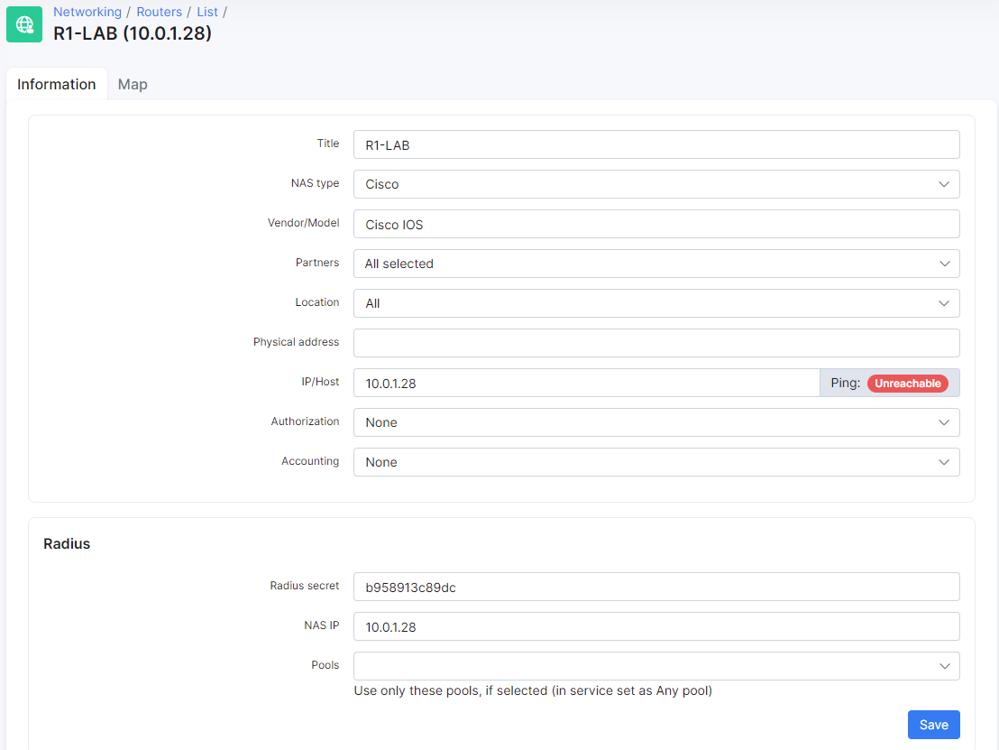

Admin login to Cisco devices
==========

First of all, we need to grant permissions to access routers for the Admin in Splynx. We have created a test admin which we will use login to devices:


Splynx has 3 permission levels - *Full, Write and Read.* These levels can be mapped to Cisco privilege levels:


In this example, we are creating an admin with Full rights and then in `Config → Radius → Cisco` we will choose the attribute that is used for Full access and has the privilege level 15:


Cisco-AVPair = shel:priv-lvl=15 defines that Splynx will grant the privilege level 15 to the test admin when he connects to the Cisco router/switch:


Also, we need to add the router to Splynx, choose the NAS type = Cisco, and setup the same Radius secret we intend to use when setting up the Cisco router:



Now we need to configure the Cisco device to accept radius authentication and privilege levels:

```
aaa new-model
aaa authentication login SPLYNX group radius local
aaa authorization exec SPLYNX group radius local

radius-server attribute 6 on-for-login-auth
radius-server host 10.0.1.16 auth-port 1812 acct-port 1813
radius-server key 123456

line vty 0 4
authorization exec SPLYNX
login authentication SPLYNX
transport input ssh

for SSH configuration please run these commands:

cisco(config)# ip domain name splynx.test
cisco(config)# crypto key generate rsa   || (chose at lease 1024 bit key)
cisco(config)# ip ssh version 2
```

When these commands are entered on the Cisco router/switch and Splynx has been configured, the admin is now able to login to the Cisco router/switch via SSH:


