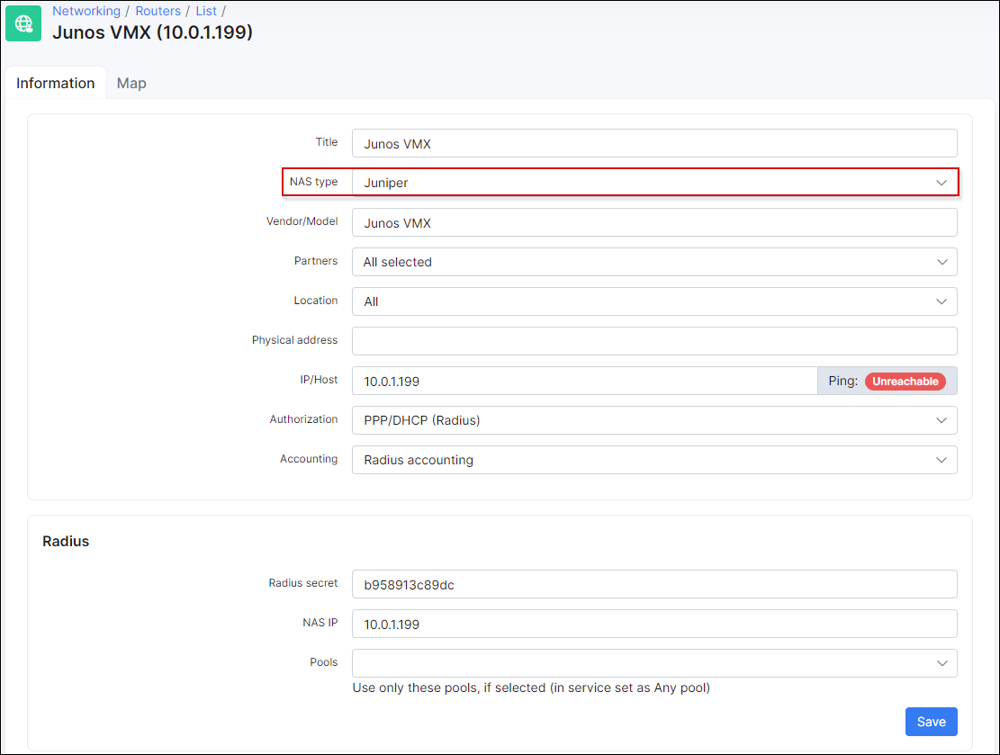

Admin login to Juniper (JUNOS)
==========

First of all we need to add router to Splynx and define NAS Type = Juniper.



If you choose wrong NAS Type, authentication of administrators will not work. The difference between Junos Radius admin login and other vendors is that Juniper doesn't send Session-Type in Radius packet when administrator tries to login to the system. Because we set the NAS type to Juniper, Splynx expects this behaviour and knows that it's administrator, checks DB and if admin is there, he can login to router. Below is the packet format sent to Radius server in Access-request when administrator logins to Juniper router :


How to configure Juniper router for Radius admin login :

```
test@VMX-spl> configure
Entering configuration mode

[edit]

test@VMX-spl# show

system {
host-name VMX-spl;
authentication-order [ radius password ];

radius-server {
172.16.200.1 {
secret "$9$JQGHqP5Qn9Af5hS"; ## SECRET-DATA
timeout 5;
source-address 10.0.1.199;
}
}
services {
ssh;
}
```

Statement authentication-order [ radius password ]; defines that we want to use Radius and then local login.

Also we define Radius server IP and services that we will use to login to router, here it's SSH.

If we want to have also local login, this configuration helps us to achieve it :
```
groups {
global {
system {
login {
user test {
uid 2001;
class super-user;
authentication {
encrypted-password "$6$jGuS4u2w$KxLWzdpnDq2faqVV1Tp/isD2Azbz/w90275EkcRkZBBhAxOR6As84BpSblR05HbsRLifO1h5Uu/Ecdgu10c4e."; ## SECRET-DATA
}
}
}
}
}
}
apply-groups global;
```

---
Our version of Junos that was tested :

Model: vmx
Junos: 17.2R1.13
