Admin login to Mikrotik routers
==========

It is possible to authenticate administrators locally on the router or using the Splynx Radius server.

To configure the Radius Server, click on `Config → Networking → Radius` and click on load at the bottom of the page.

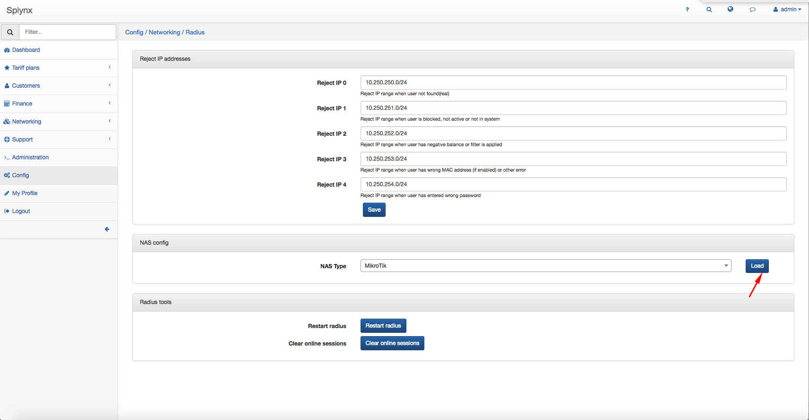

Turn the mode Use admin login on:
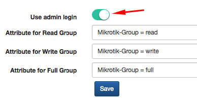

Select the router you want to configure with Radius. Click on `Networking → List`, select the router and write down the Radius secret password that is going to be used in the router Radius configuration.

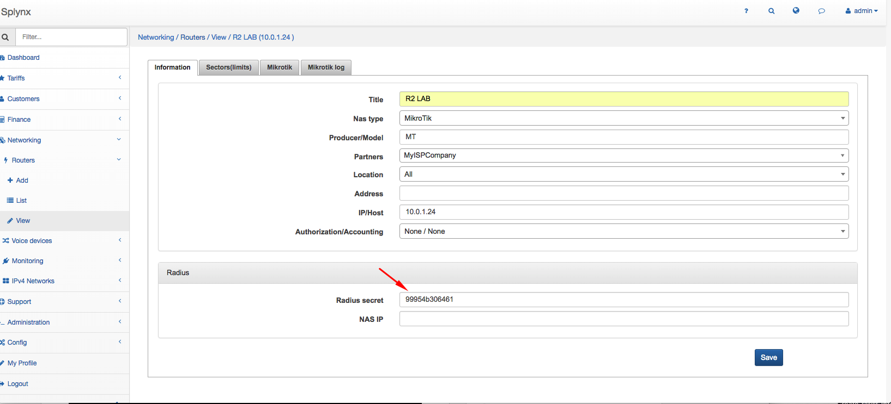

Open Winbox, click on System → User and the User List window will pop up. Click on AAA (Authentication and Accounting), flag Use Radius.

Click on `System → User`, the User List window will pop up. Select the tab *Active Users*, click on Radius, click on the default service and flag the Radius service you want to use: *ppp, hotspot, dhcp, login*. Insert the Radius Server, the Radius secret password, the source address of the interface connected to the Radius server.

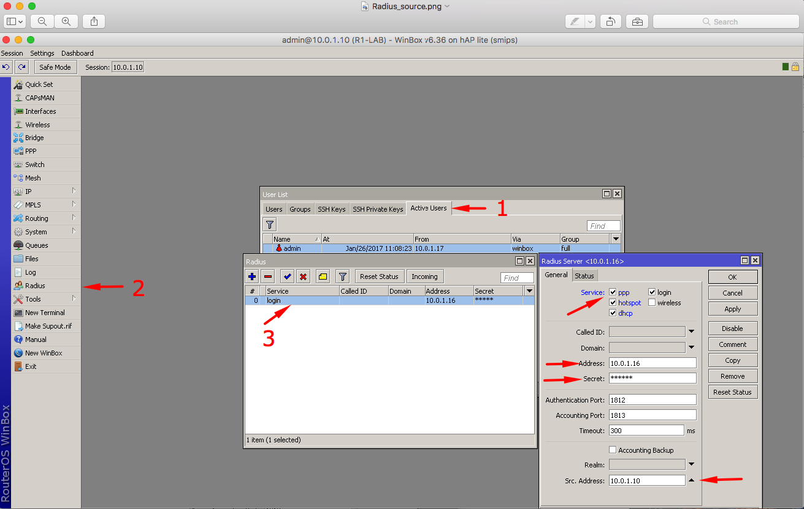

In Splynx, click on `Administration → Administrators`, click on Add and fill up the administrator's fields.

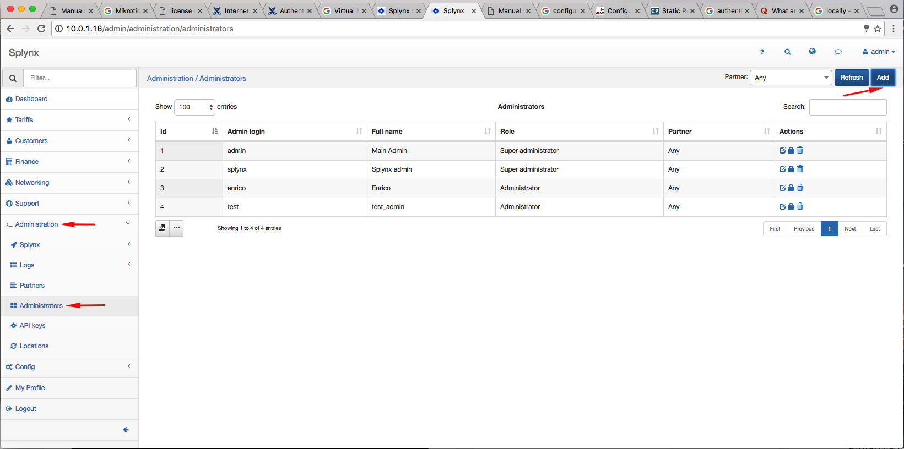

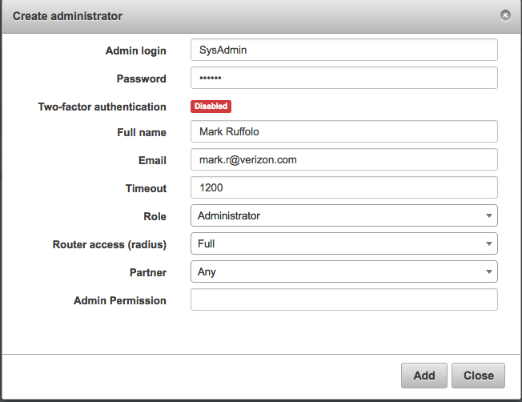

It is possible to chose **the role of the administrator:** Administrator, Customer Creator, Financial Manager, Manager, Super Administrator. In Router access (radius) the default permission are: read, write, full.

It is possible to edit, change the permissions or delete the administrator with .

Now, if you try to connect the new Administrator to the winbox-router, you will see the new user created with the Radius server in User list.

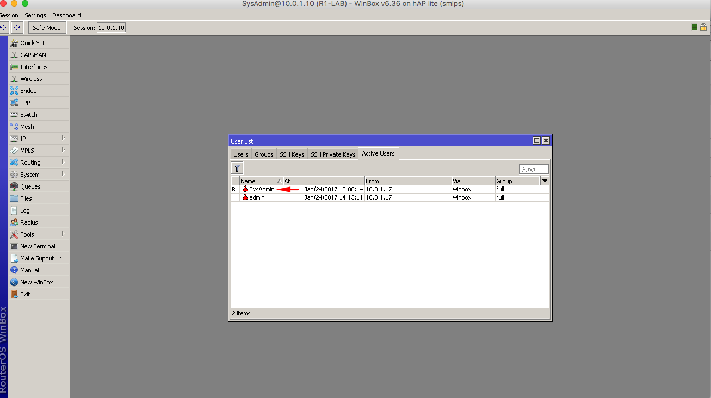

It is possible to see all operations of each Administrator. Click on `Administration → Logs → Operation`.

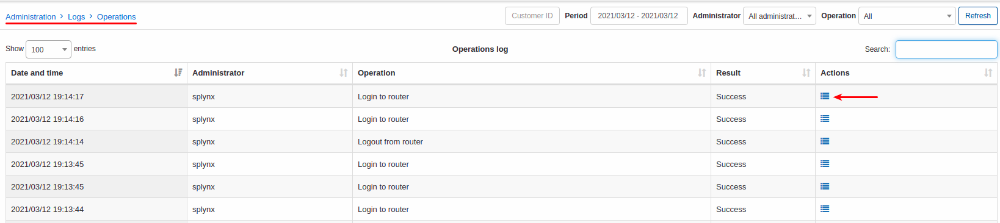

If you click on , you will see a pop up window with the operation in details.
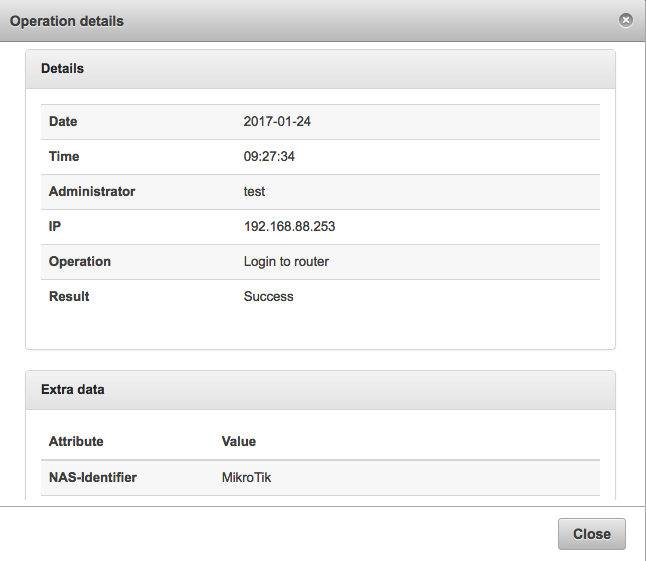

If you need a short log of the Radius login, click on `Administration → Logs → Operation` and click on the icon 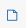

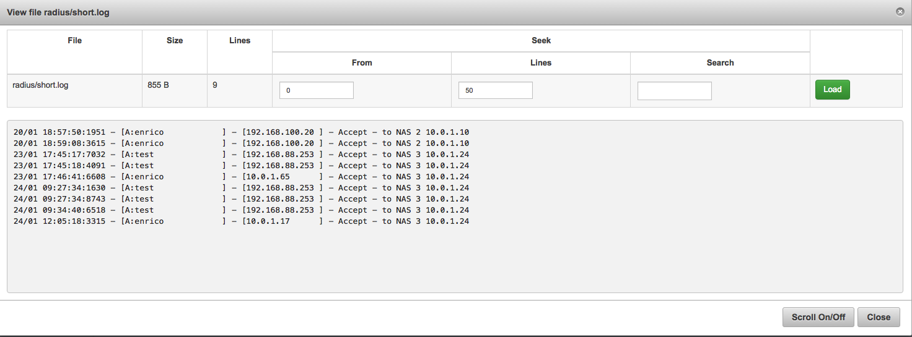
