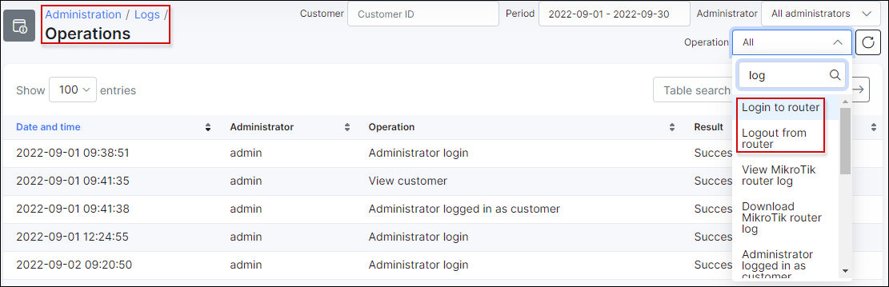

Admin login to Mikrotik routers
==========

With the help of the Splynx Radius server, authenticating administrators locally has never been easier.

To configure the Radius Server, navigate to `Config → Networking → Radius` and click on the load button under the Nas config section.

Enable the "Use admin login" option:

Select the router you want to configure with Radius. Navigate to `Networking → Routers → List`, select the router and type the Radius secret password that is going to be used in the router Radius configuration.

Open Winbox, click on System → User and the User List window will pop up. Click on AAA (Authentication and Accounting), flag Use Radius.

Click on `System → User`, the User List window will pop up. Select the tab *Active Users*, click on Radius, click on the default service and flag the Radius service you want to use: *ppp, hotspot, dhcp, login*. Insert the Radius Server, the Radius secret password, the source address of the interface connected to the Radius server.

In Splynx, click on `Administration → Administrators`, click on Add and complete the administrator's details fields.

It is possible to choose **the role of the administrator:** Administrator, Customer Creator, Financial Manager, Manager, Super Administrator. In Router access (radius) the default permission are: read, write, full.

You can edit, change the permissions or delete the administrator with the provided icons <icon class="image-icon"></icon>.

Now, if you try to connect the new Administrator to the winbox-router, you will see the new user created with the Radius server in User list.

You can conveniently view all operations of each Administrator by navigating to  `Administration → Logs → Operation`.

If you click on the details icon <icon class="image-icon"></icon>, a window will appear displaying the details of the selected operation.

If you need a short log of the Radius logins, navigate to `Administration → Logs → Files`, search for radius and click on the file icon:

