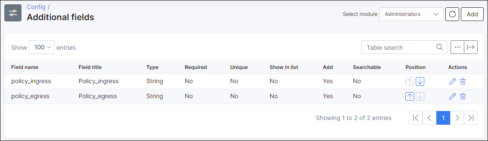
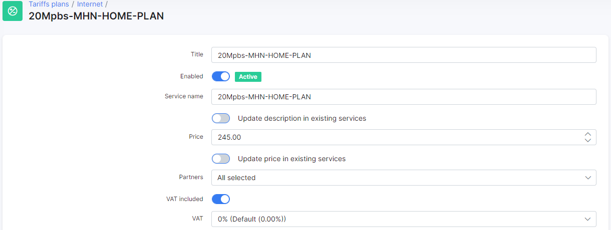
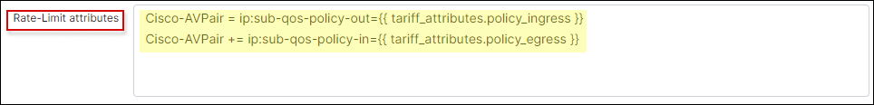

Cisco ASR 9010: PPPoE with Radius
==========

This tutorial shows how to configure Cisco ASR 9010 device with Splynx server.

1. Make RADIUS configuration on ASR and Splynx server side

**Splynx server**

Navigate to `Networking → Routers → Add` in order to add a new router. In new window fill out the required fields.

**NOTE:**

- In **NAS type** field choose `Cisco IOS XE` value, if such type doesn't exist, it can be created in `Config → Networking  → NAS types`;
- The IP address of your Cisco ASR router in **IP/Host** and **NAS IP** should be the same;
- The value in **Radius secret** filed will be used in your Cisco ASR device to connect it with *radd* server in Splynx;
- In **Authorization/Accounting** field choose `PPP/DHCP(Radius) / Radius accounting ` value.


**Cisco ASR 9010**

To determine the radius server use the following commands:

**NOTE:** It's necessary to create a RADIUS server group to attach AAA functions to Splynx radius server

```
aaa group server radius SPLYNX
server x.x.x.x auth-port 1812 acct-port 1813
vrf DMZ
source-interface INtxxxx #use interface connected to Splynx

```


```
radius-server host x.x.x.x auth-port 1812 acct-port 1813 #these ports are default but can be changed
key XXXXXXXXXXXX #use the Radius secret generated in Splynx
timeout 10
retransmit 5

```

**Radius configuration for AAA**

```
aaa authorization network default group SPLYNX
aaa accounting network default start-stop group SPLYNX
aaa accounting service default group SPLYNX
aaa accounting subscriber default group SPLYNX
aaa authorization subscriber default group SPLYNX
aaa authentication subscriber default group SPLYNX

```

Also, it's required to configure COA/COD session disconnect:

**To allow incoming requests from RADIUS server:**

```
 aaa server radius dynamic-author
 port 3799
 client x.x.x.x vrf DMZ #Splynx radd server IP
 server-key #(key defined in Splynx)

```

2. Make the following configuration on Cisco ASR

**Create loopback interface which will be a default gateway for your PPPoE users:**

```
 interface Loopback10
 ipv4 address x.x.x.x 255.255.255.255

```

**Create a dynamic template for your PPPoE users:**

```
dynamic-template
type ppp SPLYNX_PPP_Chap
ppp authentication chap
keepalive 60 3
ppp ipcp dns 1.1.1.1 8.8.8.8
accounting aaa list default type session periodic-interval 5
ipv4 unnumbered Loopback10
```

```
type ppp dynamic-template
type service s1
ipv4 unnumbered Loopback10

```

3. PPPoE access for subscribers and define policy on Splynx/ASR

**Cisco ASR:**

This configuration is a one-off and does not trigger your tariffs.

```
subscriber
pta tcp mss-adjust 1430

pppoe bba-group SPLYNX_PPPOE
service selection disable

class-map type control subscriber match-any PPP
match protocol ppp
end-class-map

policy-map type control subscriber PPP_PM
event session-start match-first
class type control subscriber PPP do-until-failure
10 activate dynamic-template SPLYNX_PPP_Chap

event session-activate match-first
class type control subscriber PPP do-until-failure
10 authenticate aaa list default

end-policy-map
```

After that it's required to configure interface:

```
interface Bundle-Ether1.920
ipv4 point-to-point
ipv4 unnumbered Loopback10
service-policy type control subscriber PPP_PM
pppoe enable bba-group SPLYNX_PPPOE
encapsulation dot1q 920

```

4. If the different VLANs are used it's required to configure more interfaces but service policy will be the same, On this step you configure Splynx and Cisco ASR to define speed limits according tariff plan.

**Splynx server**

Add the two additional fields to tariff plan (e.g. Internet plan) - `policy_ingress` and `policy_egress` (if you already have this fields, please skip this step).
In this fields you should put the names of policy which are defined in Cisco ASR according to your plan.
**Important:** the policy names should be the same as were defined in Cisco ASR.





And in `Config → Networking → Radius → NAS config → Cisco IOS XE Configuration → Rate-Limit attributes` the next rules need to be set:

```
Cisco-AVPair = ip:sub-qos-policy-out={{ tariff_attributes.policy_ingress }}
Cisco-AVPair += ip:sub-qos-policy-in={{ tariff_attributes.policy_egress }}

```



**Cisco ASR:**

Create a policy map to control upload and download speed.
**Important:** the policy map names should be the same as were defined in the additional fields of tariff plan.

```
policy-map POLICY_CUSTOMER_EGRESS_100Mbps
class CUSTOMER_PREC_ALL
shape average 100000000 bps
queue-limit 1000000 bytes

class class-default

end-policy-map

```


```
policy-map POLICY_CUSTOMER_INGRESS_100Mbps
class class-default
police rate 100000000 bps
conform-action transmit
exceed-action drop

end-policy-map
```
