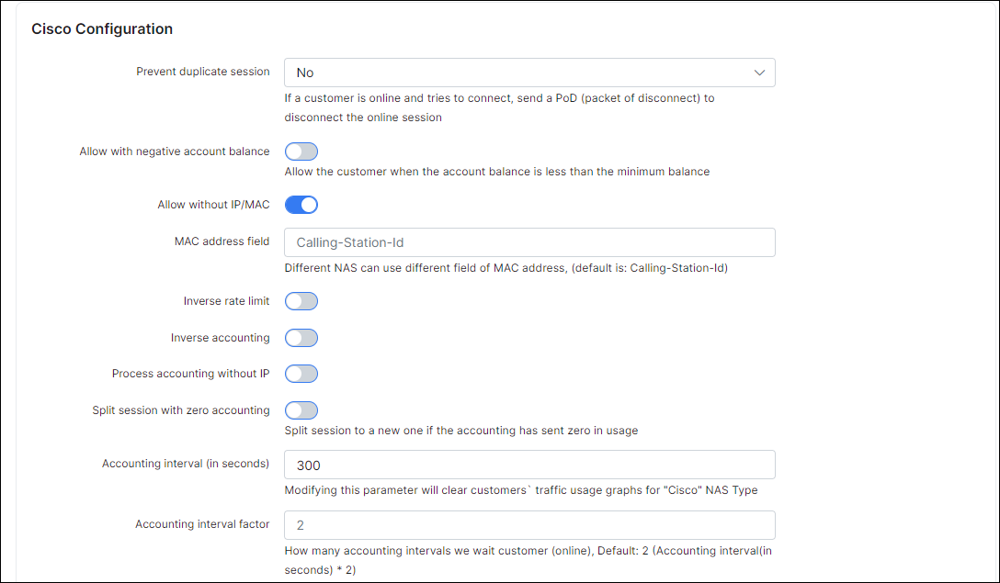
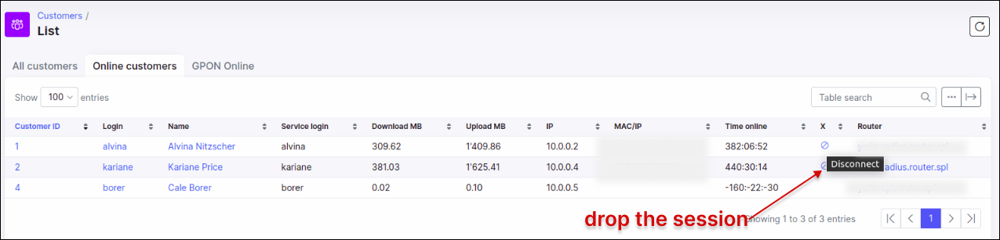

Cisco IOS: PPPoE with Radius
==========

Cisco IOS and Cisco IOS XE has slightly different commands, but the main difference is that Cisco IOS allows pushing the rate-limit attributes and the use of rate-limiting on Virtual interfaces, while Cisco IOS XE does not have the option to use rate-limiting. That is why in Cisco IOS XE we should use the policing for speed limitations.

This tutorial shows Cisco IOS Radius configuration :

First of all, we need to configure correctly a NAS type in Splynx with all attributes.

`Config → Networking → Radius → Choose NAS type Cisco`, then click on `Load`:




The Radius Incoming port is the port that Splynx will use to send Change of Authorization (COA) or Packet of Disconnect (POD) messages to the router.

The most important part, is the rate-limit attributes. Rate limit attributes are used in these cases:

1. When a PPPoE session is created on the Cisco router and we need to setup the speed of the customer according to their tariff plan
2. If customer reaches the FUP limit, Splynx changes the speed using a COA packet. The packet is sent to the Cisco router's incoming port from the Radius server
3. You can also limit the customer's speed when they are blocked, for example to 56 kbps

---
The syntax of the attribute in the Splynx Radius server is :

```
Cisco-Avpair=lcp:interface-config#1=rate-limit input {{ rx_rate_limit }} 80000 80000 conform-action transmit exceed-action drop
Cisco-Avpair+=lcp:interface-config#1=rate-limit output {{ tx_rate_limit }} 80000 80000 conform-action transmit exceed-action drop
```

* **rx_rate_limit** - is the Download speed of the plan, it is applied to the Output direction of the PPPoE tunnel in the Cisco router.

* **tx_rate_limit** - is the Upload speed of the plan, it is applied to the Input direction of the PPPoE tunnel in the Cisco router.

* **80000** are the burst values, which you can change. We prefer to have a static burst value, for example: 100 kbps.


---
The whole description of the Cisco rate-limit attribute is :

`rate-limit {input | output} [dscp dscp-value] [access-group [rate-limit] acl-index] bps burst-normal burst-max conform-action conform-action exceed-action
exceed-action`


The burst can be taken from Splynx this way as well, but then Bursts must always be configured in Splynx, if you left it as 0, PPPoE sessions will not be established :

```
Cisco-Avpair=lcp:interface-config#1=rate-limit input {{ rx_rate_limit }} {{ rx_burst_rate }} {{ rx_burst_rate }} conform-action transmit exceed-action drop
Cisco-Avpair+=lcp:interface-config#1=rate-limit output {{ tx_rate_limit }} {{ tx_burst_rate }} {{ tx_burst_rate }} conform-action transmit exceed-action drop
```

---
In the testing scenario, we have a 1 Mbps Download / 512 Kbps Upload plan :


The following is the configuration of Cisco routers for the IOS version 15 and above :

The First part is related to aaa, here we are stating that we want to Authenticate, Authorize and Account our PPPoE sessions using the Radius server:

```
aaa new-model

aaa authentication ppp default group radius
aaa authorization network default group radius
aaa accounting delay-start
aaa accounting network default start-stop group radius
```

---
Then we configure the incoming packets for the Radius protocol. The Server from the IP: 10.0.1.16 can send us the COA or POD messages on port 3799
```
aaa server radius dynamic-author
client 10.0.1.16 server-key 123456
server-key 123456
port 3799
auth-type any
ignore session-key
```

---
Configuration of the PPPoE server :
```
bba-group pppoe SPLYNX
virtual-template 1

interface Virtual-Template1
mtu 1492
ip unnumbered Loopback0
no peer default ip address
ppp authentication pap chap ms-chap ms-chap-v2
```

---
Applying the PPPoE server on the interface where customers will connect :
```
interface Ethernet0/0
no ip address
pppoe enable group SPEED
```

And then finally the Radius server connection details :
```
radius-server attribute 6 on-for-login-auth
radius-server attribute nas-port-id include vendor-class-id plus remote-id plus circuit-id
radius-server host 10.0.1.16 auth-port 1812 acct-port 1813
radius-server key 123456
```

If everything is configured properly, we should be able to connect a PPPoE customer :
```
#show pppoe session

1 session in LOCALLY_TERMINATED (PTA) State
1 session total

Uniq ID PPPoE RemMAC Port VT VA State
SID LocMAC VA-st Type
12 12 5000.0001.0001 Et0/0 1 Vi3 PTA
aabb.cc00.0200 UP
```

---
When the PPPoE session is established, we can display the rate-limiting on the PPPoE interface on the Cisco device using the following command:

```
#show interfaces rate-limit
```
The output should be :
```
Virtual-Access3
Input
matches: all traffic
params: 512000 bps, 80000 limit, 80000 extended limit
conformed 23 packets, 2829 bytes; action: transmit
exceeded 0 packets, 0 bytes; action: drop
last packet: 19387ms ago, current burst: 0 bytes
last cleared 00:21:25 ago, conformed 17 bps, exceeded 0 bps

Output
matches: all traffic
params: 1024000 bps, 80000 limit, 80000 extended limit
conformed 0 packets, 0 bytes; action: transmit
exceeded 0 packets, 0 bytes; action: drop
last packet: 1947334ms ago, current burst: 0 bytes
last cleared 00:21:25 ago, conformed 0 bps, exceeded 0 bps
```

When the customer is online in Splynx, we can try to kill his session to verify that the Radius Incoming port on the Cisco router is working as expected:



---
The complete, final configuration for Cisco is as follows :
```
aaa new-model

aaa authentication ppp default group radius
aaa authorization network default group radius
aaa accounting delay-start
aaa accounting network default start-stop group radius

aaa server radius dynamic-author
client 10.0.1.16 server-key 123456
server-key 123456
port 3799
auth-type any
ignore session-key

bba-group pppoe SPLYNX
virtual-template 1

interface Virtual-Template1
mtu 1492
ip unnumbered Loopback0
no peer default ip address
ppp authentication pap chap ms-chap ms-chap-v2

interface Ethernet0/0
no ip address
pppoe enable group SPEED

radius-server attribute 6 on-for-login-auth
radius-server attribute nas-port-id include vendor-class-id plus remote-id plus circuit-id
radius-server host 10.0.1.16 auth-port 1812 acct-port 1813
radius-server key 123456
```
