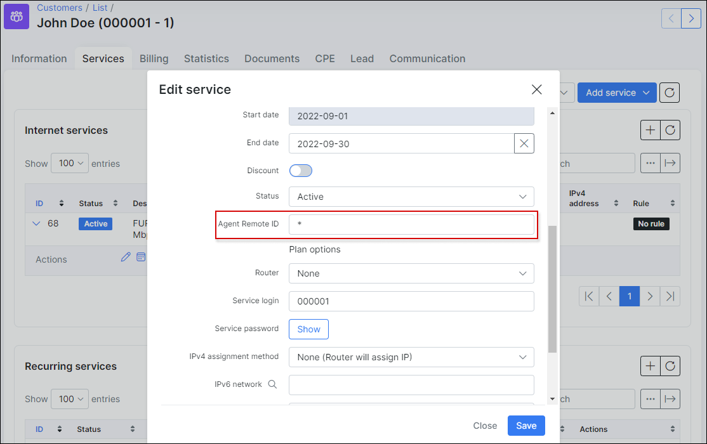

DHCP Option 82
==============

In Splynx we have the ability to authenticate customers via DHCP option 82 (Relay Agent Information). We can take both sub-options into account: **Agent Remote ID** and **Agent Circuit ID**.

### Description

When a switch or DHCP Relay forwards a DHCP request from the customer, Splynx can insert DHCP option 82 (Relay Agent Information) into the DHCP packet. Option 82 consists of two sub-options: **Agent-Remote-Id** and **Agent-Circuit-Id**.

**Agent-Remote-Id** is very simple, for almost all vendors, this is the main MAC address of the switch.
In many cases it can be changed to a custom string:

* For Cisco the command is: `ip dhcp snooping information option format remote-id ASW1`, where `ASW1` is a custom name/string.

* For Mikrotik DHCP relay, it can be changed in the relay configuration field: **Relay Info Remote ID**:


**Agent-Circuit-Id** states where customer lies.
Different vendors process it in different ways:

* Cisco (switch): Agent-Circuit-Id = 0x000400640001
The first 2 bytes show us the length of the payload (4 bytes), 4 bytes of payload can parse. 00640001 means : 0064 - number of VLAN (0x64 hex = 100), 00 01 = Ether 0/1

* Mikrotik (DHCP relay): Agent-Circuit-Id = 0x500300010001
This is the MAC address of the interface where the DHCP request comes from (where DHCP relay is listening).

* Mikrotik (bridge): Agent-Circuit-Id = 0x4d79204d696b726f74696b2065746820302f32
This is the string "My Mikrotik eth 0/2" converted from ASCII to HEX. Where:
  * **My Mikrotik** - current system identity (Winbox->System->Identity).
  * **eth 0/2** - interface where DHCP request comes from.

 Mikrotik bridge supports DHCP Snooping and DHCP Option 82 starting from RouterOS version 6.43.

### Splynx configuration

By default, Splynx supports only Agent Circuit ID. However you can also add Agent Remote ID support.

To use Agent Circuit ID, enter its value in the internet service field **Port ID**:


 You should use HEX value in this field. Example: `0x001122334455`.

### How to add Agent Remote ID support

To add support of Agent Remote ID, add an additional field for internet services. The field name must be `agent_remote_id`:


**Field name** - exactly `agent_remote_id`.
**Field title** - any. This title will be used on internet services configuration page.
**Type** - String.
**Default value** - you can enter `*` here. If you do so, this value (`*`) will be used for all current and new services. `*` means that DCHP requests can contain any Agent Remote ID. This is useful for example when you add support of Agent Remote ID (additional field for services), but don't want to use Agent Remote ID for some services.

After the additional field is added it will appear in internet service configuration:



You should use HEX value in this field. Example: `0xaabbccddeeff`. Also you can use `*` (asterisk) here. `*` means that DCHP requests can contain any Agent Remote ID.

 Please note, if you leave this field blank/empty, this means that the Agent Remote ID option in the DHCP request should also be exactly blank/empty.

### Debug (freeradius)

Sometimes you don't know the actual Agent Remote ID or Agent Circuit ID or don't even know if it is being received by Splynx Radius server. In this case you can enable the Freeradius debug to see the contents of the Radius packets.

To enable debug, follow these steps:

1. Enable freeradius control socket:
```bash
ln -s /etc/freeradius/sites-available/control-socket /etc/freeradius/sites-enabled/
```
2. Uncomment or add the line `mode = rw` in */etc/freeradius/sites-enabled/control-socket*. You can use nano or any other editor:
```bash
nano /etc/freeradius/sites-enabled/control-socket
```
3. Reload the freeradius service to apply changes:
```bash
systemctl restart freeradius
```

Then you can run `raddebug` in the terminal to see the freeradius debug messages:
```bash
raddebug -t0
```
You can filter the output to show only option 82 related information:
```bash
raddebug | grep Agent
```

### Splynx Radius debug

You also have the option to enable Splynx Radius debug messages. It can be done under *Config / Networking / Radius extended*:


These settings will be applied in a few minutes or you can restart Radius to apply the new settings immediately. To restart Radius use the button at the bottom of the same page.


To follow Splynx Radius debug log you can use the following command:

```bash
tail -F /var/www/splynx/logs/radius/debug.log
```
