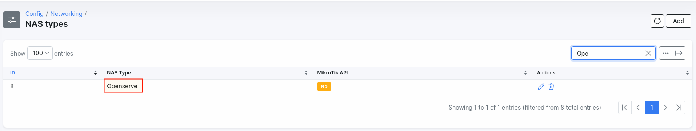

DSL Telkom (Openserve) authentication
==========

South African provider Telkom allows smaller ISPs to resell their services. The services are sold under the Openserve trademark (https://openserve.co.za/). Splynx can communicate with Telkom/SAIX proxy servers and authenticate PPPoE DSL customers. But a few configuration steps are needed to allow Splynx to be able to communicate with Openserve proxies.


1. First of all, create a NAS type as Openserve or a similar name that will help you to recognise it as the Openserve server. To do this, navigate to `Config -> Networking -> NAS types` and click on the "Add" button:



2. Configure the "Openserve" NAS type under `Config -> Networking -> Radius`:


 Please add Radius attributes provided to you by Telkom. Please setup accounting intervals to the default SAIX intervals :


Example of Radius attributes:

```
Cisco-AVPair = ip:ip-unnumbered=Loopback1111
Cisco-AVPair += ip:addr-pool=xnet001ipc2
X-Ascend-Client-Primary-DNS = 196.46.XXX.XXX
X-Ascend-Client-Secondary-DNS = 196.46.XXX.XXX
```

Don't forget to save the changes.

3. Then add all proxies as Routers to Splynx software, please specify the NAS type = Openserve (configured in previous step). Also define the Radius secret that is used for proxy server and Radius server communication:


4. Next step is to edit Radius extended settings under `Config -> Networking -> Radius extended`


An Important field is **Default NAS Id**. This is the ID of the Router in Splynx routers, that will "link" customers - to show that they are connected through it online.


5. The Last step is to add the missing attribute to the Freeradius dictionary, open the file `/etc/freeradius/dictionary` and add the line :
```
ATTRIBUTE Alcatel-Lucent-Service- 3002 integer
```

Please download the Openserve [network configuration document](RADIUS_Authentication_Information_For_IPC_Customers.pdf).
