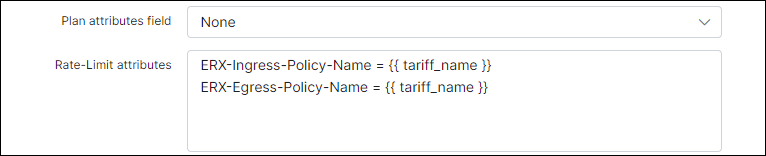
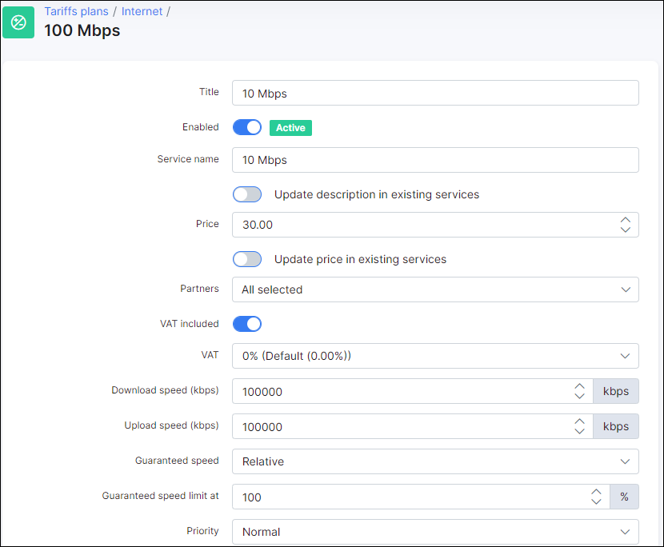

Juniper: PPPoE with Radius
==========================

Juniper Networks is one of the leading vendors producing networking equipment. Together with Cisco, Juniper defines where networks are moving. The company sells different solutions starting from routers, switches and up to software-defined products such as Open Contrail.

In Internet provider’s networks, Juniper is mainly used as a BRAS equipment (broadband remote access server). The MX series routers ideally fit as BRAS with the ability to process gigabits and hundreds of gigabits of traffic together with providing access services such as PPPoE, bandwidth limitation, policing and NAT.

We have deployed Splynx in different networks running on Juniper MX80, MX104 and MX960 routers with JunOS versions from 14 up to 18.
The configuration below should work on any MX router and is based on a combination of Dynamic profiles and Policy names.

### 1. RADIUS SERVER definition
In the first step we should define the Access and describe the Radius configuration. The Radius server IP is 192.168.1.5 and the Juniper router IP is 192.168.1.6.

```
access {
profile Splynx {
accounting-order radius;
authentication-order radius;
radius {
authentication-server 192.168.1.5;
accounting-server 192.168.1.5;
options {
nas-identifier JUN;
accounting-session-id-format decimal;
}
}
radius-server {
192.168.1.5 {
secret "$9$TFCuIEyMWxO1hSrlMWJGUHP5TQ3/ApmPO1Rcle"; ## SECRET-DATA
timeout 300;
retry 3;
max-outstanding-requests 1000;
source-address 192.168.1.6;
}
}
accounting {
order radius;
accounting-stop-on-failure;
accounting-stop-on-access-deny;
immediate-update;
coa-immediate-update;
update-interval 10;
statistics volume-time;
}
}
}
```

The following configuration sets the access profile "Splynx" to the Juniper MX router's configuration in the hierarchy level:

```
access-profile Splynx;
```

### 2. DYNAMIC PROFILES
The next step is to define Dynamic profiles. This configuration can be a bit tricky and complex. Depending on how complex your overall setup is, how VLANs are organized, if there are Port Aggregations or PPPoE services running directly on Gigabit and 10G Ethernet interfaces. The example below shows the PPPoE profile that is ready for dynamic VLANs that are running on Aggregated interface ae0.

```
dynamic-profiles {
PPPOE {
interfaces {
demux0 {
interface-mib;
unit "$junos-interface-unit" {
vlan-id "$junos-vlan-id";
family pppoe {
duplicate-protection;
dynamic-profile ppp-profile;
max-sessions 16000;
}
}
}
}
}
ppp-profile {
interfaces {
pp0 {
interface-mib;
unit "$junos-interface-unit" {
no-traps;
ppp-options {
pap;
}
pppoe-options {
underlying-interface "$junos-underlying-interface";
server;
}
keepalives interval 30;
family inet {
rpf-check;
filter {
input "$junos-input-filter";
output "$junos-output-filter";
}
unnumbered-address lo0.0;
}
}
}
}
}
}
```

Describing the configuration above – as you can see the dynamic profile ppp-profile is encapsulated into the other dynamic PPPoE profile. The speed limitation filters are set in the dynamic ppp-profile interface pp0.
When dynamic profiles are defined, we apply the PPPOE profile on AE0 interface :

```
ae0 {
description "PPPOE LINK aggregation ";
flexible-vlan-tagging;
auto-configure {
vlan-ranges {
dynamic-profile PPPOE {
accept pppoe;
ranges {
100-200;
}
}
}
remove-when-no-subscribers;
}
mtu 4000;
encapsulation flexible-ethernet-services;
aggregated-ether-options {
lacp {
active;
}
}
}
```

### 3. SPEED LIMITATIONS
The last step in the configuration is to define the Firewall filter and policers to control the subscriber’s bandwidth.
Here is an example of a filter and policer for a 10 Mbps plan :

```
firewall {
family inet {
filter 10Mbps {
interface-specific;
term 1 {
then policer p_10Mbps_limit;
accept;
}
}
}
policer p_10Mbps_limit {
if-exceeding {
bandwidth-limit 10m;
burst-size-limit 1m;
}
then discard;
}
```

### 4. JUNIPER RADIUS ATTRIBUTES
The attributes that are used to set the Filter name in Radius Access-accept are :

```
ERX-Ingress-Policy-Name = "{{ tariff_name }}"
ERX-Egress-Policy-Name = "{{ tariff_name }}"
```

These attributes are configured in Splynx under: Config -> Radius -> Selection of NAS type -> Juniper -> Rate-limit attributes



Tariff names should be set in Splynx “10Mbps” as depicted on the image below :


