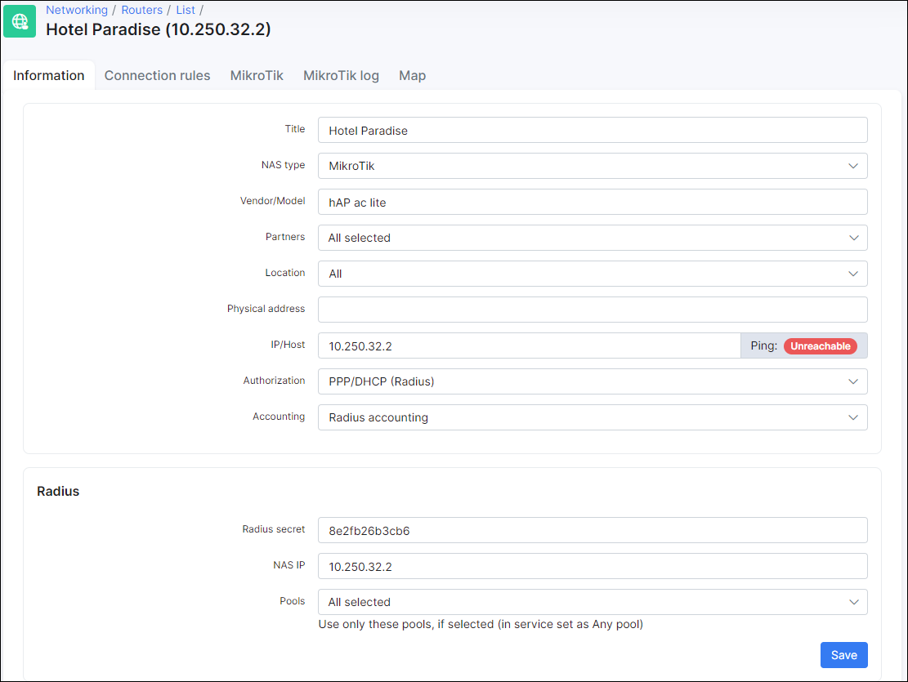
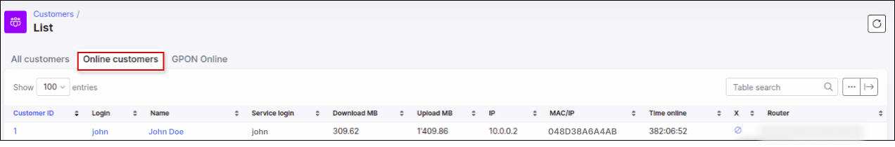

Mikrotik: DHCP with Radius
==========

### Step 1 - Configure RADIUS server on a router

First of all we need to configure the RADIUS server on the router to communicate with Splynx.


In this case 10.250.32.1 is the Splynx server IP and 10.250.32.2 is the router IP. The RADIUS secret should be specified in the `Secret` field - we will use this in Splynx in the router settings and then enable the `DHCP` service.

Lastly we need to enable `RADIUS incoming`:


### Step 2 - Configure DHCP server on a router

We can setup the DHCP server manually or using the setup wizard.


The main options here are: `Address pool=static-only` (it means that Splynx (Radius server) will assign the IP) and `use RADIUS=yes`. Specify the name, correct interface, lease time and save the settings.

### Step 3 - add new router in Splynx

Now we need to add a new router in Splynx under *Networking → Routers → Add* :



The main parameters here are:

1. **IP / Host** - IP of the router;

2. **Authorization / Accounting** - PPP/DHCP (Radius) / Radius acounting;

3. **Radius secret** - the same as the RADIUS secret on the router;

4. **NAS IP** - IP of the router.

### Step 4 - create IP network in Splynx

#### IP assignment - static IPs (recommended)

In case you will use static IPs in Splynx you need to navigate to *Networking → IPv4 Networks → Add* and add a network with `Type of usage = static`:


#### IP assignment - assign IP from pool

In this case we need to create IPv4 network with `Type of usage = Pool`:


### Step 5 - add the internet service for a client

#### Static IP (recommended)

Under *Customers → List* select the customer, open _Services_ tab and add a new internet service with following networking parameters:


Select `IPv4 assignment method = Permanent IP(from static IPs)`, select the IP address and specify the MAC address of the interface on the CPE that will be receiving the IP.

Once this done the client should be connected:


On the router under the _Leases_ tab we can see the DHCP lease with the IP that we specified in Splynx.

In Splynx we can see the customer's online session:



We can add more MAC addresses to the service field _MAC(s)_ separated by a comma:


So a customer connection with the second MAC address can be authenticated:


Blocking of static IP customers will be performed using their own static IP in the address list. More information about customer blocking here - [Blocking of customers in Splynx](networking/blocking_customers/blocking_customers.md)

#### IP from pool

Under *Customers → List* select the customer, open _Services_ tab and add a new internet service with the following networking parameters:


and this connection will receive an IP from the specified pool:


Some advanced parameters for RADIUS can be configured under <u>[*Config-Networking-Radius*](configuration/network/radius/radius.md)</u> and <u>[*Config-Networking-Radius Advanced*](configuration/network/radius_extended/radius_extended.md)</u>.

Blocking of customers will be performed with reject IP pools in the address list. You can find more information about customer blocking here: [Blocking of customers in Splynx](networking/blocking_customers/blocking_customers.md).

### <icon class="image-icon"></icon> NOTE

For DHCP to report accounting correctly queues have to be applied dynamically via radius. API queues will not report the accounting stats to Splynx.

### Troubleshooting

#### Additional network issue for services with static IPs

If you set additional network(s) in Splynx internet services, network routes will be sent to the router (NAS) during authorization. The router will then send all traffic with destination=additional network to the customer device. It is possible that these routes will also appear on the customer's device. To fix this issue, set use-framed-as-classless to disabled in the DHCP server settings:


#### Incoming RADIUS

What if the plan change queue was not updated and customer still has the same speed as on a previous plan? The reason is because CoA (change of authorization) and (Packet  of Disconnect) is not supported by Mikrotik. The alternative is to use a short lease time which caters for any CoA related changes and "Disabled customers to address list" from API to block the customer's internet access.

#### Session timeout for disabled services

To change the timeout, navigate to *Config → Networking → Radius*, find **NAS config** section, in **NAS Type** choose `MikroTik` and press **Load** button. In the appeared **MikroTik Configuration** section, the following line should be added in the rate-limit-attributes (Access-accept) section:

```
Session-Timeout = "Lease time in seconds"
```
This config is critical and if not added the router will control the lease time internally, not release the IP and not renew the lease with the Radius server.
This is especially important when dealing with disabled services (disconnected without active service).


For more information, watch the next video:

<iframe width="350" height="270" src="https://www.youtube.com/embed/vCOecp75g0s" title="YouTube video player" frameborder="0" allow="accelerometer; autoplay; clipboard-write; encrypted-media; gyroscope; picture-in-picture" allowfullscreen></iframe>
