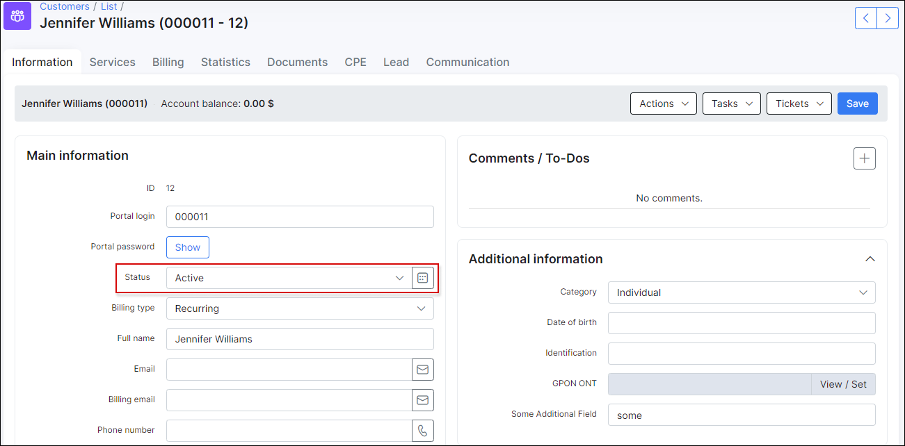
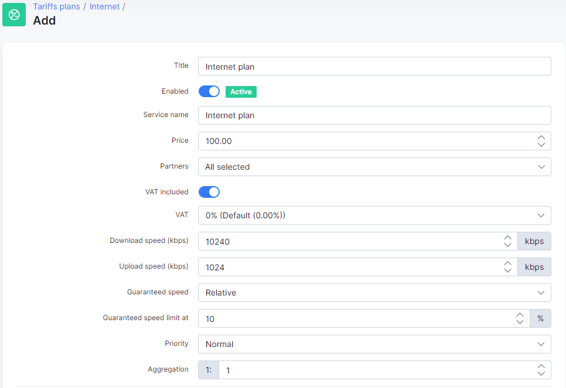
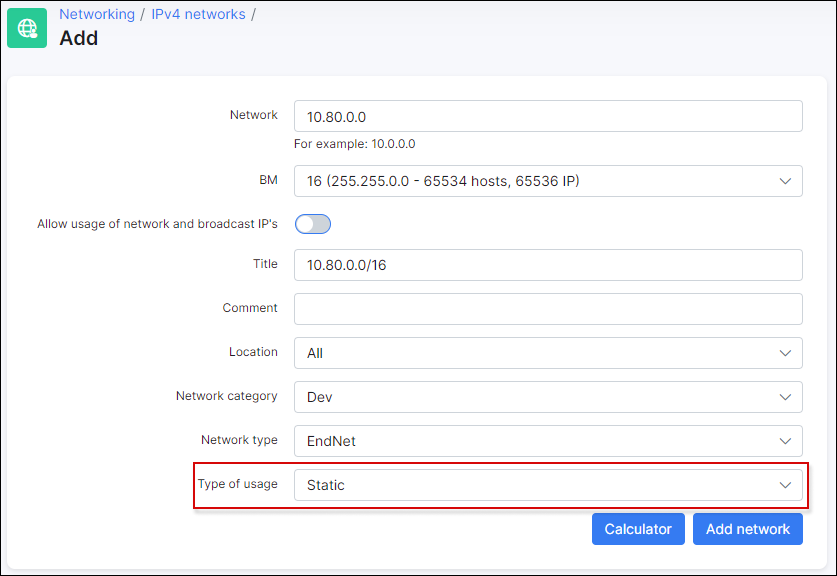
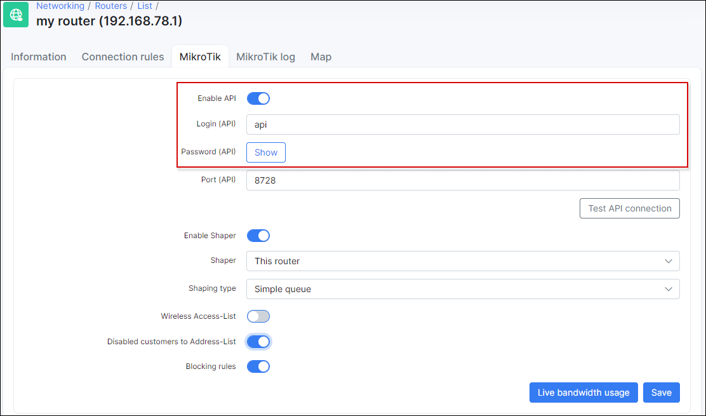
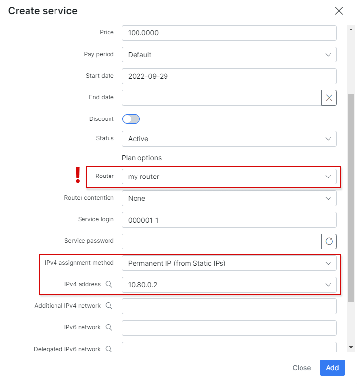

Mikrotik Hotspot Login from Splynx portal
==========================================

This Splynx feature allows you to set up fully automatic customers registration and internet usage via Mikrotik Hotspot. Automatic registration can be done with the [Splynx self-registration add-on](addons_modules/self_registration/self_registration.md). Customers can pay for internet by using one of the [payment systems](payment_systems/payment_systems.md), and then customers will be able login to the Mikrotik Hotspot using the Splynx portal. No admin intervention is required to register customers and to allow the use of the internet services (activate customers, etc.).

### Splynx settings

This is a built-in feature in Splynx starting from version 2.3 and can be configured under *Config → Main → Portal → Per partner settings*:


Please note: Protocol (http, or https) should be the same on Splynx and on Mikrotik (in case of HTTPS valid SSL Certificate (not self-signed) should be installed to Mikrotik.

* **Enable hotspot** - Enable or disable this feature.
* **Hotspot hostname** - Should be the same as in your Mikrotik settings. In the Hotspot Server Profile (*DNS Name*):

    
* **Login**:
  * **Automatic, after login to portal** - customer will be logged into the Hotspot automatically right after entering the Splynx portal.
  * **Click to login button** - a Hotspot login button will appear on the Splynx portal page. Customer's will be logged into the Hotspot after they press this button.

  
  * **Disabled** - Hotspot login button will appear on the Splynx portal page. Customer won't be logged into Hotspot after he presses this button.
* **Hotspot status page**
  * **Enabled** - the status page will show the Mikrotik Hotspot status after successfully logging in , with details of the connection and a log off button:

  

  * **Disabled** - the status page will simply show "Hotspot connected..." after successfully logging in:

  

### Mikrotik settings

We use custom Hotspot HTML pages. You can download them here - [splynx-hotspot.zip](networking/authentication_users/mikrotik_hotspot_from_portal/splynx-hotspot.zip)

1. Extract the archive.
2. Replace http://example.com with your own Splynx URL in all the HTML files. In Linux you can do this by using `sed`. In the folder with the HTML files, where the zip archive was extracted, run the following in the terminal:
    ```bash
    sed -i s%http://example.com%http://yoursplynxurl%g *
    ```
    \* replace **yoursplynxurl** with the actual domain name or IP.
3. Copy the modified files into your Mikrotik router. To perform the copy, you can use FTP, SSH or Drag and Drop, etc.
4. In the Hotspot Server Profile set the *HTML Directory override* to the directory you've just copied:

   

5. In the Hotspot Server Profile set the *Login By* method to **HTTP CHAP**:

   

6. If you would like to use RADIUS authorization, be sure to enable **Use RADIUS**, and add the RADIUS entry:

   
   

7. Add the IP address of the Splynx server to the *Walled Garden IP List* to allow access to the Splynx portal for unauthorized customers:

   

<icon class="image-icon"></icon> Please note:

* The First Active internet service will be used to login via Mikrotik Hotspot.
* The customer will only be redirected to the Splynx portal if he is trying to connect to the HTTP web-page (not to HTTPS).


### Example #1. RADIUS authorization

In this scenario we use the simplest configuration, without using IP pools from Splynx. The Router (NAS) will assign IP addresses to customers.

Assuming we have a clean instance of Splynx, the following steps can be taken:

1. [Create customer](customer_management/add_new_customer/add_new_customer.md), then change the customer's status to active (status=active):

    

2. Create an [internet plan](configuring_tariff_plans/internet_plans/internet_plans.md):

    
    
    

3. Create the [internet service](customer_management/customer_services/customer_services.md) for the customer:

    
    

4. Add your router (NAS) into [Splynx routers](networking/routers_settings/routers_settings.md). **Authorization/Accounting** - **Hotspot (Radius) / Radius accounting**:

    

5. After you add the router in Splynx, a RADIUS secret will be generated. Create the RADIUS record in your Mikrotik router settings with the same RADIUS secret:

    
    

6. Disable **Use reject IP 0..4** under *Config → Networking → Radius*:

    

7. Create Mikrotik Hotspot server:

    
    
    
    
    
    
    
    

8. In the Hotspot Server Profile set the *Login By* method to **HTTP Chap** and enable **Use RADIUS**:

    
    

9.  Download [this archive](splynx-hotspot.zip), and extract it.

10. Replace "example.com" to your Splynx URL (domain name or IP) in all the HTML files:

    

11. Copy these files into your Mikrotik router and set the *HTML Directory override* in your Hotspot Server Profile to the "splynx-hotspot" directory:

    
    

12. Add your Splynx server IP into the Walled Garden IP list:

    

13. Enable Hotspot login via Splynx Portal under *Config → Main → Portal*:

    


### Example #2. API authorization

In this scenario we will use the IP pool option in Splynx.

Assuming we have fresh Splynx instance, the following steps should be taken:

1. [Create a customer](customer_management/add_new_customer/add_new_customer.md), and change their status to active (status=active):

    

2. Create the [internet plan](configuring_tariff_plans/internet_plans/internet_plans.md):

    
    

3. Create the IP pool for customers. Selecting the **Type of usage** as *Static*:

    

4. Reserve the first IP of the pool for the router:

    
    
    

5. Add this IP to the hotspot interface:

    

6. Create a NAT rule for the Splynx pool:

    
    

7. Add your router (NAS) into [Splynx routers](networking/routers_settings/routers_settings.md). **Authorization/Accounting** - *Hotspot (Users) / API accounting*:

    

8. Enable API usage for this router in Splynx, and enter an API login and password:

    

9. Enable API for the router in Winbox, create the API group and API user:

    
    

10. Create the [internet service](customer_management/customer_services/customer_services.md) for the customer. Select the Router (required !) and permanent IP:

    
    

11. Create the Mikrotik Hotspot server:

    
    
    
    
    
    
    
    

12. In the Hotspot Server Profile set the *Login By* method to **HTTP Chap** and disable **Use RADIUS**:

    
    

13. Download [this archive](splynx-hotspot.zip), and extract it.
14. Replace "example.com" with your Splynx URL (domain name or IP) in all the HTML files:

    

15. Copy these files into your Mikrotik and set the *HTML Directory override* in your Hotspot Server Profile to the "splynx-hotspot" directory:

    
    

16. Add your Splynx server IP into the Walled Garden IP List:

    

17. Enable Hotspot login via Splynx Portal under *Config → Main → Portal*:

    


### How it works (scheme)

* The customer will try to access the web page (HTTP site).
* The Router (NAS) redirects the customer to the Mikrotik Hotspot IP (to router IP).
* Mikrotik Hotspot redirects the customer to Splynx portal (to Splynx URL).
* The customer then authenticates on the portal and logs in into the Mikrotik Hotspot on the Splynx portal.
* Customer is authenticated and can then access the internet.
