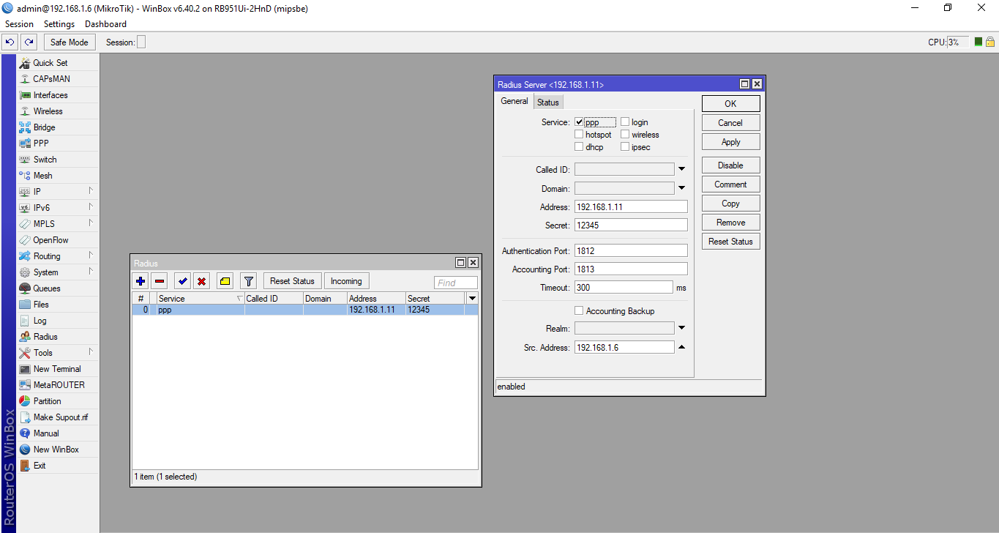
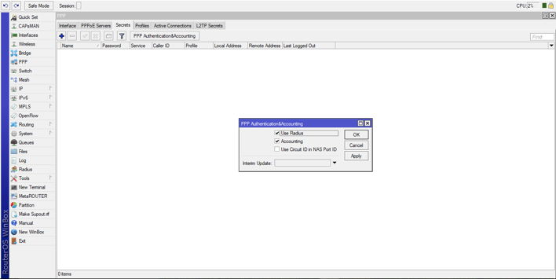
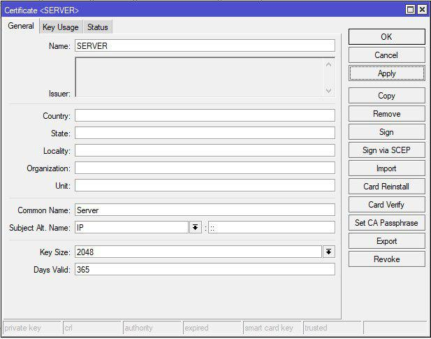
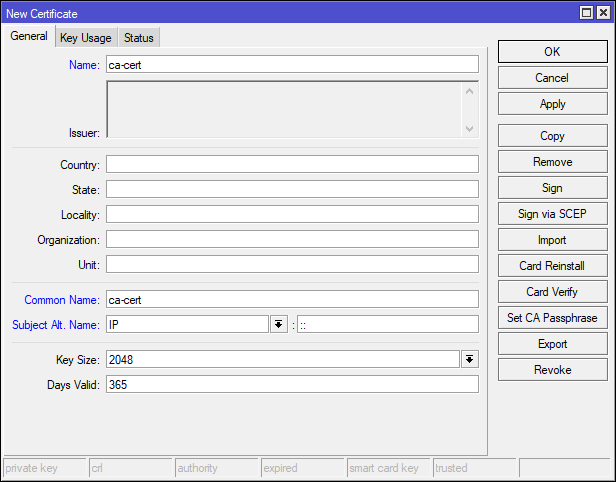
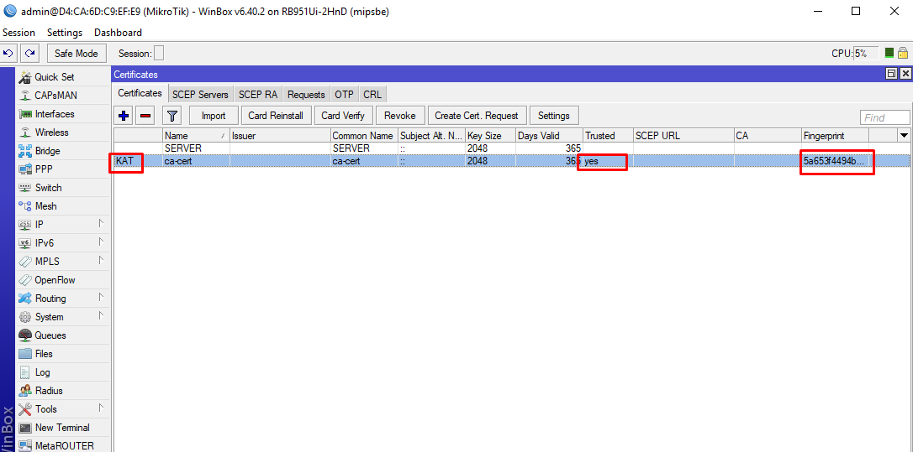
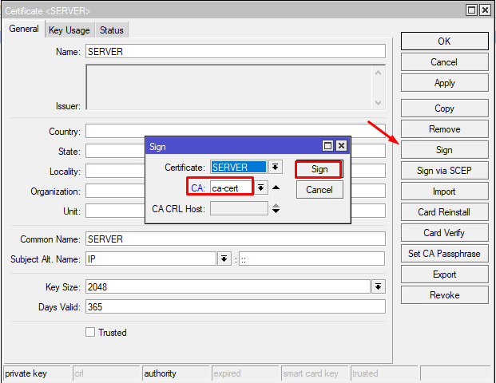
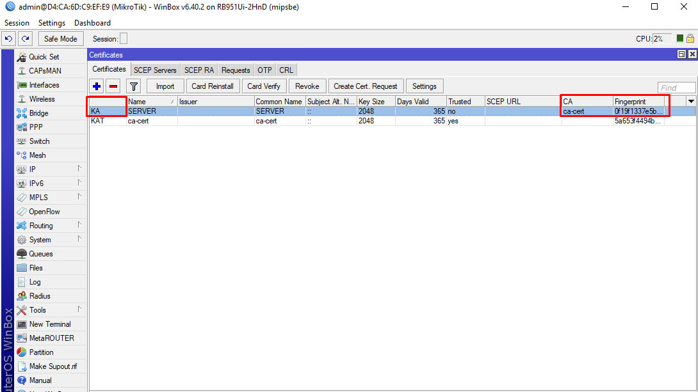
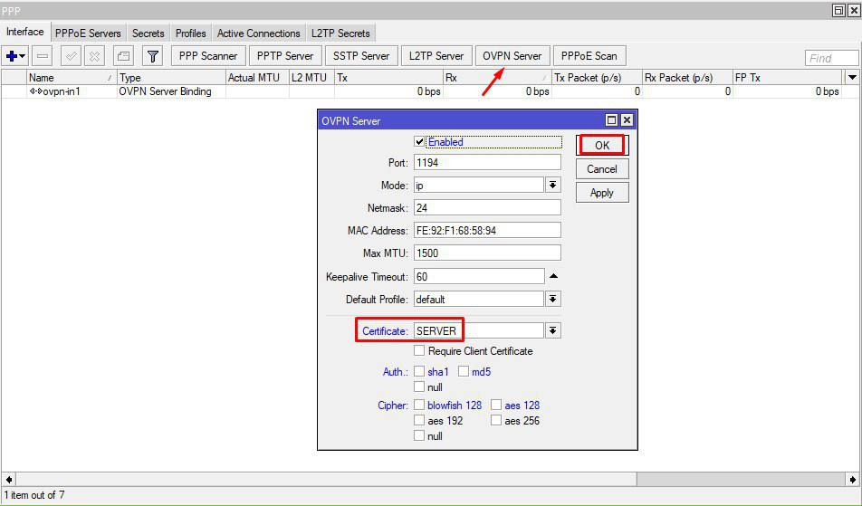
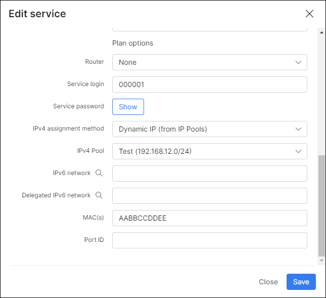

Mikrotik: OpenVPN, Radius
==========

When using this feature, please make sure that your radius server settings are configured according to the configurations specified on the [PPPoE Radius](networking/authentication_of_customers/mikrotik_pppoe_radius/mikrotik_pppoe_radius.md) page.

The following is a guide you can follow to configure your OpenVPN server.

The radius server should be configured the same as in other PPP uses.

Be sure to enable radius for PPP.

Then we have to create the OpenVPN server.
 *Please note, it is necessary to create and assign a certificate to it, to be able to use it.*

---
### Creating the Certificate:

On your Mikrotik router, navigate to System → Certificates and add 2 certificates, one will be the certificate for the server, and the other will be used to sign as the CA.

Add the certificate for the Server.

Add the certificate to sign as the CA.

Sign the ca-cert certificate, without CA.

A fingerprint will appear.

Now sign the server certificate using the CA as the other certificate.

Now it is signed and ready to be used.

---
Enable the OpenVPN server setting features you need and the server certificate. In this case we have configured it without a client certificate.

---
Finally, we will be able to connect customers with their login's and password's, that have been set in Splynx in the customer's services. We will receive an IP from the pool we have selected, or if set, the static/permenant IP. The other option is to get an IP directly from the MikroTik, if the "IPv4 assignment method" setting is set to "None (Router will assign IP).

