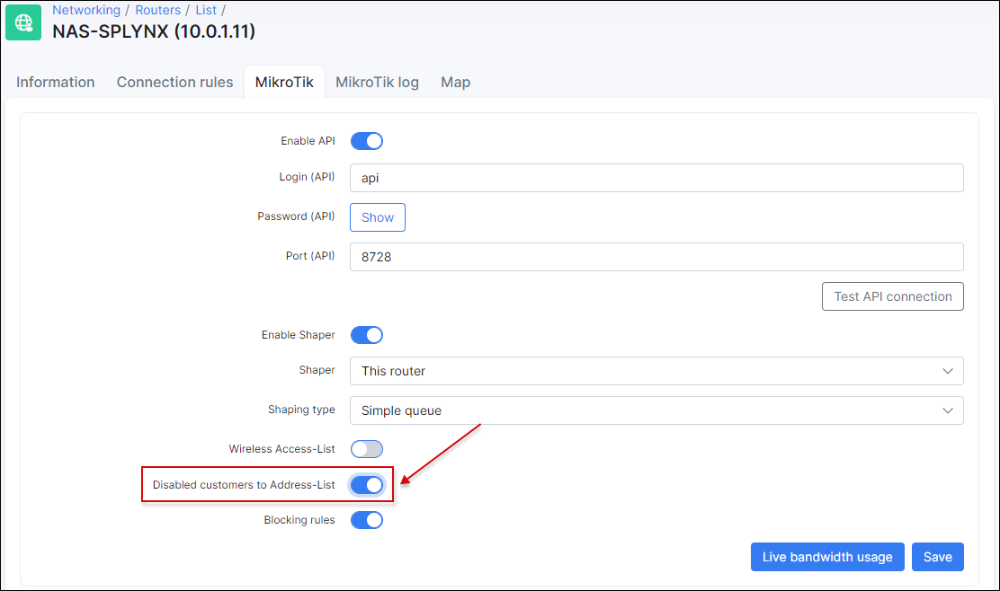

Mikrotik: Static IPs with API
==========

Some of the network topologies of WISPs do not have centralized authentication of customers based on PPPoE or DHCP. Instead, each customer's device is connected using a static IP address. But what will happen if the customer gets access and then changes the static IP address to a different one? Possibilities are that their speed limitations will become inactive, because that is also based on IP address of the customer.

In Splynx you can setup authentication for statically configured IP addresses. It is also possible to match IP addresses of CPE's with MAC addresses, to achieve static IP + MAC address authentication.

This setup only works for Mikrotik RouterOS devices, because authentication rules are pushed to router via API.

The first step is to configure the Router, IP address and MAC (if needed) of the customer's internet service:

In the router settings within Splynx (NAS-SPLYNX) it is necessary to select the correct authentication type, which is "Firewall IP/MAC filter". Accounting will be grabbed by Splynx every 5 minutes via API:

The API should be enabled on the Mikrotik router and as well as in the router settings within Splynx:

Splynx connects to the router and creates entries in `IP → Firewall → Filter`, allowing access for the IP/MAC combination of the customer.

If a MAC address is added to the customer's internet service, then the Firewall rule will also contain the MAC address:

As you can see, Splynx does not create any DENY rule. If you do have any other rules in your Firewall, Splynx will not touch or change them. The system only adds allow rules to the beginning of the Filter chain "Forward". To prevent all non-authenticated customers from accessing the network, you can create a manual DENY rule on Forward chain:

---
### Blocking of customers with static IP address authentication

Blocking behavior depends on the settings of the Router. There are 2 options:

#### Customer's entry is removed from the IP `Firewall - Filter`.

If the router doesn't have the option of adding disabled customers to an Address list, then Splynx will remove the authentication entry from the firewall:

#### Customer's IP is added to a Blocking address list.

In the router settings within Splynx, the **Disabled customers to address list** option should be enabled. In this case, blocked customers in Splynx is not removed from IP firewall, but the IP address is added to the blocked Address-list.

SpLBL_Blocked address list is used for blocking customers:

For more information on blocking customers using Splynx, please read the [Blocking customers](networking/blocking_customers/blocking_customers.md) in Splynx tutorial page .
