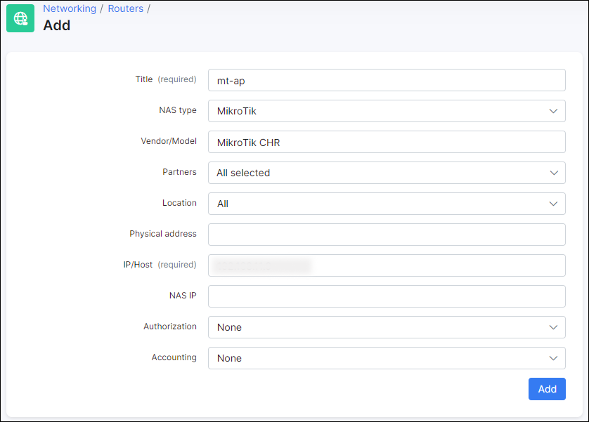
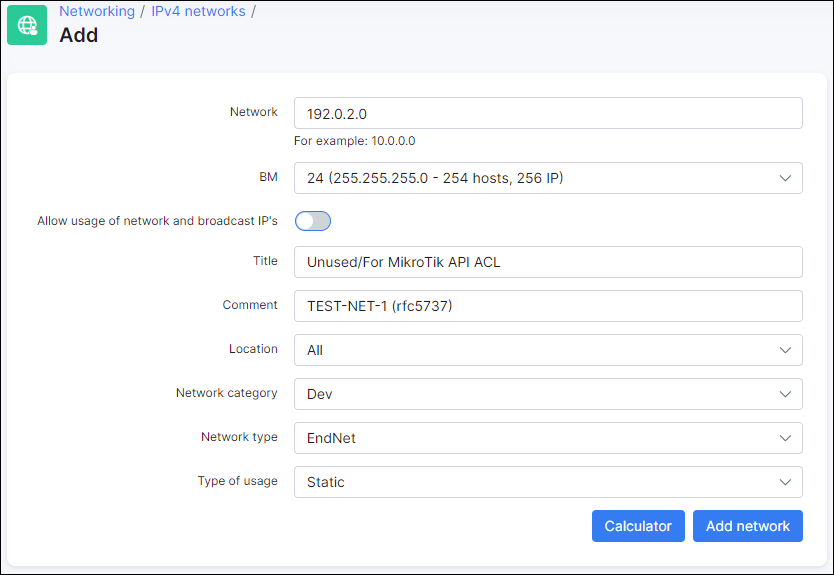

Mikrotik: Wireless ACL Authentication
==========

Splynx can authorize wireless stations on MikroTik by making changes to *Wireless Access List* in Router OS. With Wireless Access List you can set up the complex logic to work with customers: by signal strength, time of day, limit the speed of each customer, move their to a specific VLAN, etc.

On **MikroTik Wireless Access Point** device, make the following configuration steps:

1. Create a new user account and a special access group with the following permissions. After that, include the user account to the created group:

2. Disable **Default Authenticate** option in your wireless interface configuration:

------------

On **Splynx** side, make the next configuration steps:

3. Create a new Internet tariff for Mikrotik: Wireless ACL to prevent any possible issues:

4. Add your wireless access point as a separate router in Splynx

5. After the AP is added, navigate to 'MIKROTIK' tab and `enable API` with the help of toggle, then, add the user credentials from **step 1** to the related fields. Also, enable `Wireless Access-List` option. Press **Test API connection** to test the configuration.

6. **Important:** In Splynx v3.1, MikroTik Wireless ACL will be added through API only if the customer has `Permanent (Static)` IP address assigned to the related Internet service.

One possible workaround is to add an IP network address space that will not conflict with your network, e.g. you can use `192.0.2.0/24`, `198.51.100.0/24`, `203.0.113.0/24` pools that are reserved by *IANA* ([RFC5737](https://datatracker.ietf.org/doc/html/rfc5737)).

7. Add for the customer the Internet service which is based on the tariff created on the **step 3**.

**NOTE:**

**MAC(s)** = MAC address of station’s wireless interface.

------------

To **check if the Wireless ACL Authorization works correctly**, enable `wireless` log on **MikroTik Wireless Access Point**:

 

If customer is `Active`, Splynx will add the ACL allowing their CPE to connect:

On the other hand, when the customer is `Blocked`, Splynx will remove the ACL and customer's CPE will be disconnected:

