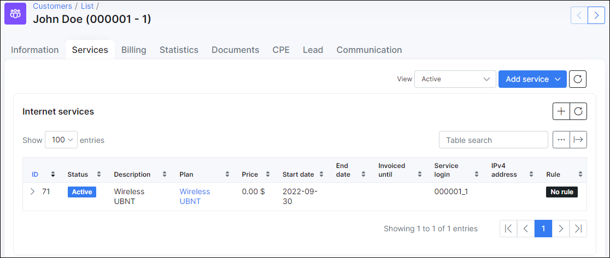
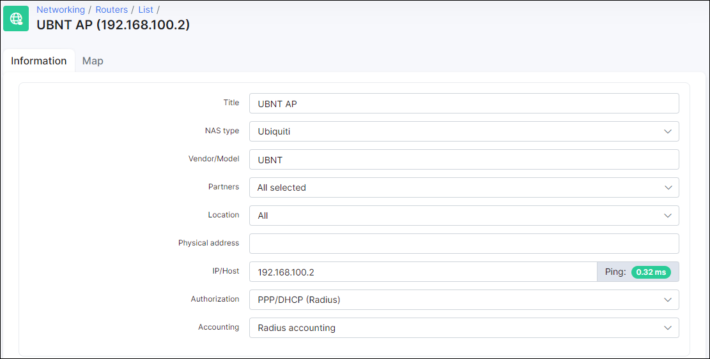

Ubiquiti: Wireless auth, Radius
==========

Ubiquiti access points have the ability to authenticate CPE's via a Radius server. This means that administrators does not have to maintain local passwords for wireless authentication, as each CPE/radio can have its own account in Splynx and our Radius server will authenticate the UBNT CPE's.

Usually ISP's already have a PPPoE or similar authentication mechanism in place, which is why wireless Radius authentication is added in Splynx to existing customers as a new (empty) service.


In the first step, we define a Plan in Splynx with the price as 0 and 0 in all other fields.


Then, we should add the wireless service to the customer's services and enter their login's and password's.



It is also important to add the AP to splynx.



In the last step we should enable Wireless Radius authentication for EAP on the UBNT router and setup a Radius server IP address and secret. Below is the Access point or router configuration:


Now we can connect a UBNT radio CPE to a UBNT Access Point. This is CPE configuration:  
  
  


Another mandatory configuration you need to do, is to setup the Message-Authenticator attribute to the Radius configuration.


Under `Config → Radius → NAS Type (Ubiquiti) → Ubiquiti Configuration` add **Message-Authenticator=0** in the rate limit attributes field:


#### Notice
EAP-TTLS authentication should work from Splynx version 2.1.  
You may have to change freeradius configurations to make EAP-TTLS authentication work.  
* Find the eap or eap.conf file in /etc/freeradius. For different freeradius versions, the location of this file may differ  
* Set in the eap section `default_eap_type = ttls`  
* Set in the ttls section `default_eap_type = mschapv2`  

```bash
cat /etc/freeradius/mods-enabled/eap
eap {
        default_eap_type = ttls #here
...
        ttls {
                tls = tls-common
                default_eap_type = mschapv2 #and here
                copy_request_to_tunnel = yes
                use_tunneled_reply = no
                virtual_server = "inner-tunnel"
                tls_min_version = "1.0" # On Ubuntu 20.04 (Splynx 3.1)
                tls_max_version = “1.2" # On Ubuntu 20.04 (Splynx 3.1)
...
}
```

#### EAP-PEAP
If you do not have EAP-Type selector on CPE, Freeradius should be configured for EAP-PEAP instead of EAP-TTLS. 
