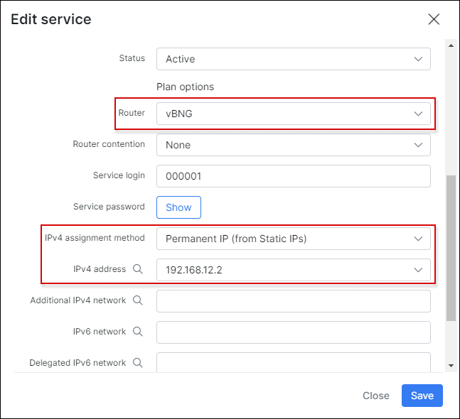
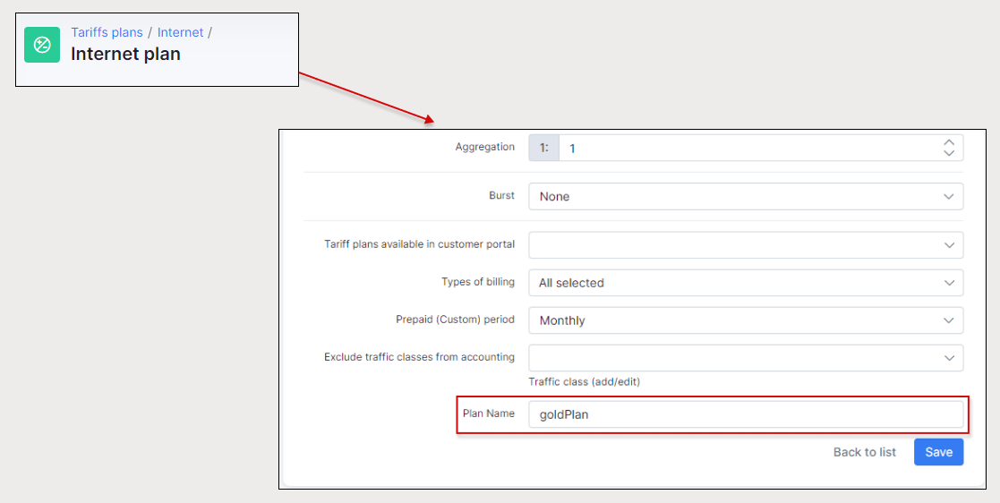
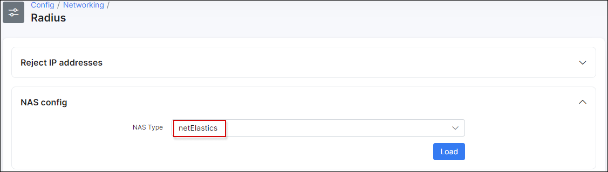
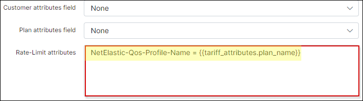

netElastic vBNG: PPPoE, Radius
==========

In this guide we’ll show you how to properly configure virtual Broadband
Network Gateway (vBNG) solution from netElastic
([www.netelastic.com](http://www.netelastic.com)) along with its
integration with Splynx ISP Framework
([www.splynx.com](http://www.splynx.com)). We’ll demonstrate how Splynx
Radius server can be used for complete AAA (Authentication,
Authorization & Accounting) coverage of your customers.

So, let’s get started. We’d assume that you already have freshly
installed instances of vBNG Router, vBNG Manager and Splynx up and
running. In our demo we’ll be creating a test user with certain
parameters using our Splynx solution and then connect him over PPPoE
session to Internet through vBNG device.

The lab setup is shown below. This test case shows how to configure vBNG
to work with PPPoE access with Radius authentication, authorization, and
accounting.

The process of configuring PPPoE connections on the vBNG with Radius
authentication, authorization and accounting involves:

-   Configuring access interface

-   Creating a PPPoE template

-   Creating a VGI interface

-   Creating Radius Authentication group

-   Creating Radius Accounting group

-   Creating AAA Authentication template

-   Creating AAA Authorization template

-   Creating AAA Accounting template

-   Creating an IPPool

-   Creating a domain

-   Creating and configuring VCI

So, we’ll start with the interfaces first. As seen on the screenshot
below, our vBNG is installed on a server with two 10Gb NICs; the
10gei-1/1/0 interface will be used as an access interface (incoming for
customer’s links), that is UNI (User Network Interface) on the diagram.
The second physical interface, 10gei-1/1/1, will be used as a network
interface (outgoing to Internet), and that’s NNI (Network-to-Network
Interface) accordingly.

We assigned the following IP address 192.168.10.10 to 10gei-1/1/1, and our
interface setup looks the following way:

Please note there is also a NAT-related parameter here, we’ll be
discussing it further in this guide.

Next, moving on to RADIUS Authentication group creation, which is used
for authorization as well. We created ‘demo\_group’ with the following
parameters:

Our Radius Server is at the 192.168.10.3 IP address as per diagram, uses
default port 1812 and the key above. Please change these values as per
your own setup. If configured properly, you should be able to test the
connection to Radius server in vBNG Manager GUI.

Now we create Radius Accounting group ‘acc\_grp’ with the following
configuration. It’s similar to Authentication group above, except it
uses port 1813.

We also need to enable Radius accounting under Radius configuration.

Next, we create an Authentication template. For Radius authentication,
we need to specify authentication type to use Radius. Here is our
configuration.

Radius authorization means vBNG will take authorization properties such
as user’s IP address, QoS plan, ACL rules, etc. from the attributes
carried in the Radius accept reply message instead of using locally
configured properties. To achieve this, we need to create an
authorization template from which to specify Radius authorization.

Similarly, we create an Accounting template.

Now we need to configure an IP pool from which PPPoE access subscribers’
IP address will be assigned via DHCP. netElastic’s vBNG provides
flexible IP pool configurations that can span multiple disjoint
segments. In this example, we will configure one IP segment
192.168.100.1/24 with gateway IP 192.168.100.1 Since we’ll be managing
the IP allocation on Splynx itself, we have to reserve the IP range on
vBNG, so it honors the IPs assignments obtained via Radius.

Next, creating a VGI interface. Subscribers need to have an access
gateway configuration on the vBNG to have network access. netElastic’s
vBNG implements the concept of Virtual Gateway Interface (VGI) to
configure subscriber’s access gateway. The VGI interface IP address
shall match the gateway address in the IP pool configuration as
described above.

We have created authentication, authorization & accounting templates, an
IP pool, and a VGI interface. Now we need to create a domain to tie all
these together and bind the domain to PPPoE access to achieve the
desired access behavior. A user access domain defines user access
behavior. Multiple domains can be defined for the same access method to
define different behaviors. User’s access domains can be switched during
operations (through Radius COA or command line) to alter access
behaviors.

Same information displayed in the vBNG Manager web interface.

Next, we create a PPPoE template. The parameters ppp-authentication,
ac-name, default-domain should be configured according to your own
setup.

Finally, we need to create a VCI configuration to tie the PPPoE template
and the domain to the access interface so the access behavior for
traffic coming to the interface will be subject to what we have defined
in the PPPoE template and domain template.

In our test case for the users to be able to access the Internet we need
to enable NAT on both the network interface (NAT outside) and the access
side user gateway (NAT inside).

Here is the sample NAT configuration for our case.

Also we need to enable NAT in the authorization template.

This pretty much completes the setup on the vBNG side and now it’s time
to perform some additional configuration on the Splynx side.

First off, let’s add our vBNG to Splynx, so they can communicate
properly. Go to *Config → Networking → NAS types* and add a new one.

Go to `Networking → Routers → Add` and add our vBNG with the
configuration according to the diagram.

For our test case we created a demo user with an assigned Internet tariff
plan.

We want him to obtain an IP address from Radius, so assigned a static
one for testing purposes.

So, let’s say we also want him to have a certain rate limit on the
internet service, for instance 20mbit/10mbit. This is how to
configure it properly on both sides, vBNG and Splynx accordingly.

In Splynx we have to edit the internet plan by adding an additional
field, which will be sent by Radius to vBNG QoS engine in order to
define the policy applied to customers.
To add a new field, navigate to *Config System Additional fields* and select a proper module. In our case, this is **"Internet plans"**:

In order for this functionality to work, let’s make additional tweaks to
the Radius configuration. Go to *Config → Networking → Radius*,
under NAS Config section choose netElastic for NAS type from the
drop-down menu and click on `Load` button.

Under netElastic Configuration scroll down to Rate-Limit attributes and
enter as follows:

``
NetElastic-Qos-Profile-Name = {{tariff_attributes.plan_name}}
``

Here, NetElastic-Qos-Profile-Name is the parameter which tells the
vBNG’s internal QoS engine which policy to apply, so essentially, we are
sending from our Radius NetElastic-Qos-Profile-Name=goldPlan as per
configuration described earlier.

The QoS configuration on the vBNG side involves the following steps:

1.  Create class\_map to define the flows for which QoS behaviours are
    intended to be applied on. class\_map can be defined either directly
    by listing flow characteristics or by referencing defined ACL lists.

2.  Create intended behaviours for the class\_map rules defined. The
    behaviours supported by vBNG are car, cbq, remark, etc.

3.  Create policies to create class\_map and behaviour pairs and setup
    the relative priority among them. Each policy can have up to 8
    class\_map/behaviour pairs.

4.  QoS policies can be directly applied to interfaces.

5.  If QoS policies need to be applied to subscribers, user QoS profiles
    need to be created where both the upstream and downstream policies
    can be specified. The defined user QoS profile is then referenced in
    the authorization template of the user’s access domain. All users
    accessing through this domain are subject to the QoS policies
    defined in the user QoS profile.

Here is the configuration for our test case.

Same configuration referenced in vBNG Manager

The QoS profile is attached to the authorization template as follows:

If everything is configured properly, you should be able
to see the various accounting information related to our test user in
Splynx dashboard.
