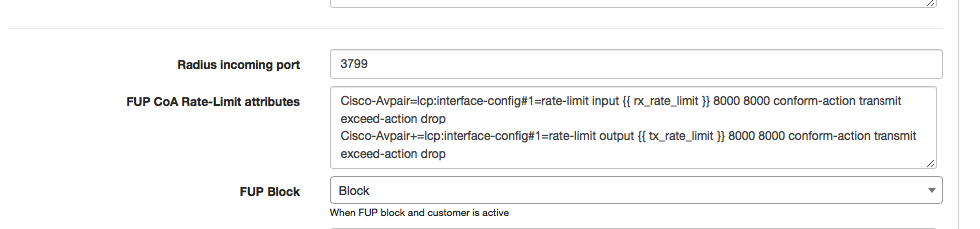
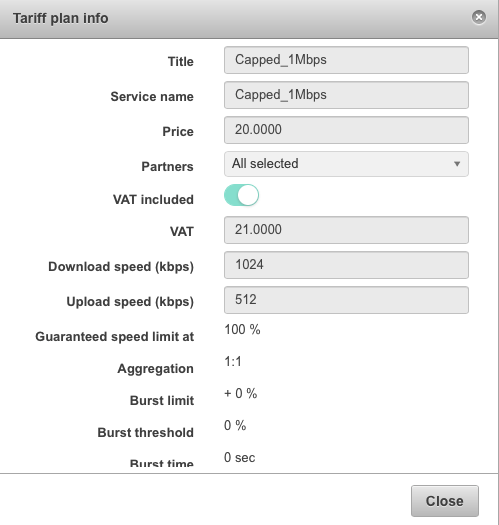

Cisco IOS: PPPoE with Radius
==========

Cisco IOS and Cisco IOS XE have a bit different commands, but the main difference is that Cisco IOS allows pushing the rate-limit attributes and using of rate-limit on Virtual interface, while Cisco IOS XE doesn't have option to use rate-limiting. That's why in Cisco IOS XE we should use the policing for speed limitations. This tutorial shows Cisco IOS Radius configuration :

First of all we need to have configured a NAS type in Splynx correctly with all attributes.

`Config → Radius → Choose NAS type cisco`




Radius Incoming port is the port that Splynx will use to send Change of Authorization (COA) or Packet of Disconnect (POD) messages to the router.

The most important are the rate-limit attributes. Rate limit attributes are used in these cases:

1. When PPPoE session is created on Cisco router and we need to setup to customer his speed from the tariff plan
2. If customer reaches the FUP limit, then Splynx changes the speed using COA packet. Packet is sent to Cisco router incoming port from Radius server
3. You can also limit the customer's speed when he is blocked, for example to 56 kbps

---
The syntax of attribute in Splynx Radius server is :

```
Cisco-Avpair=lcp:interface-config#1=rate-limit input {{ rx_rate_limit }} 80000 80000 conform-action transmit exceed-action drop
Cisco-Avpair+=lcp:interface-config#1=rate-limit output {{ tx_rate_limit }} 80000 80000 conform-action transmit exceed-action drop
```

* **rx_rate_limit** - is the Download speed of the plan, it's applied on Output direction of PPPoE tunnel in Cisco router.

* **tx_rate_limit** - is the Upload speed of the plan, it's applied on Input direction of PPPoE tunnel in Cisco router.

* **80000** are the burst values, that you can change. We prefer to have static burst value, for example of 100 kbps.


---
The whole description of the Cisco rate-limit attribute is :

`rate-limit {input | output} [dscp dscp-value] [access-group [rate-limit] acl-index] bps burst-normal burst-max conform-action conform-action exceed-action
exceed-action`


The burst can be taken from Splynx as well this way, but then Bursts must be always configure in Splynx, if you left it 0, PPPoE session will not be established :

```
Cisco-Avpair=lcp:interface-config#1=rate-limit input {{ rx_rate_limit }} {{ rx_burst_rate }} {{ rx_burst_rate }} conform-action transmit exceed-action drop
Cisco-Avpair+=lcp:interface-config#1=rate-limit output {{ tx_rate_limit }} {{ tx_burst_rate }} {{ tx_burst_rate }} conform-action transmit exceed-action drop
```

---
In testing scenario, we have 1 Mbps Download / 512 Kbps Upload plan :




The configuration of Cisco routers for the IOS version 15 and above :

First part is related to aaa, we are saying that we want to Authenticate, Authorize and Account our PPPoE sessions using Radius server:

```
aaa new-model

aaa authentication ppp default group radius
aaa authorization network default group radius
aaa accounting delay-start
aaa accounting network default start-stop group radius
```

---
Then we are configuring incoming packets for Radius protocol. Server from IP 10.0.1.16 can send us the COA or POD messages on port 3799
```
aaa server radius dynamic-author
client 10.0.1.16 server-key 123456
server-key 123456
port 3799
auth-type any
ignore session-key
```

---
Configuration of PPPoE server :
```
bba-group pppoe SPLYNX
virtual-template 1

interface Virtual-Template1
mtu 1492
ip unnumbered Loopback0
no peer default ip address
ppp authentication pap chap ms-chap ms-chap-v2
```

---
Applying the PPPoE server on interface where customers will connect :
```
interface Ethernet0/0
no ip address
pppoe enable group SPEED
```

And finally the Radius server connection details :
```
radius-server attribute 6 on-for-login-auth
radius-server attribute nas-port-id include vendor-class-id plus remote-id plus circuit-id
radius-server host 10.0.1.16 auth-port 1812 acct-port 1813
radius-server key 123456
```

If everything is configured properly, we should be able to connect the PPPoE customer :
```
#show pppoe session

1 session in LOCALLY_TERMINATED (PTA) State
1 session total

Uniq ID PPPoE RemMAC Port VT VA State
SID LocMAC VA-st Type
12 12 5000.0001.0001 Et0/0 1 Vi3 PTA
aabb.cc00.0200 UP
```

---
When the PPPoE session is established, we can display the rate limiting on PPPoE interface on Cisco using command

```
#show interfaces rate-limit
```
The output should be :
```
Virtual-Access3
Input
matches: all traffic
params: 512000 bps, 80000 limit, 80000 extended limit
conformed 23 packets, 2829 bytes; action: transmit
exceeded 0 packets, 0 bytes; action: drop
last packet: 19387ms ago, current burst: 0 bytes
last cleared 00:21:25 ago, conformed 17 bps, exceeded 0 bps

Output
matches: all traffic
params: 1024000 bps, 80000 limit, 80000 extended limit
conformed 0 packets, 0 bytes; action: transmit
exceeded 0 packets, 0 bytes; action: drop
last packet: 1947334ms ago, current burst: 0 bytes
last cleared 00:21:25 ago, conformed 0 bps, exceeded 0 bps
```

The customer is online in Splynx, and we can try to kill his session to verify that Radius Incoming port on Cisco router is working:


---
The whole final Cisco configuration please find below :
```
aaa new-model

aaa authentication ppp default group radius
aaa authorization network default group radius
aaa accounting delay-start
aaa accounting network default start-stop group radius

aaa server radius dynamic-author
client 10.0.1.16 server-key 123456
server-key 123456
port 3799
auth-type any
ignore session-key

bba-group pppoe SPLYNX
virtual-template 1

interface Virtual-Template1
mtu 1492
ip unnumbered Loopback0
no peer default ip address
ppp authentication pap chap ms-chap ms-chap-v2

interface Ethernet0/0
no ip address
pppoe enable group SPEED

radius-server attribute 6 on-for-login-auth
radius-server attribute nas-port-id include vendor-class-id plus remote-id plus circuit-id
radius-server host 10.0.1.16 auth-port 1812 acct-port 1813
radius-server key 123456
```
