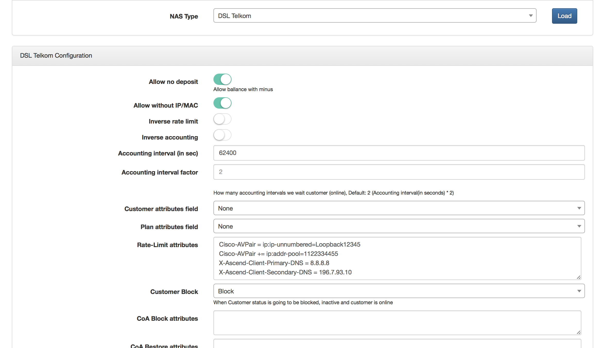
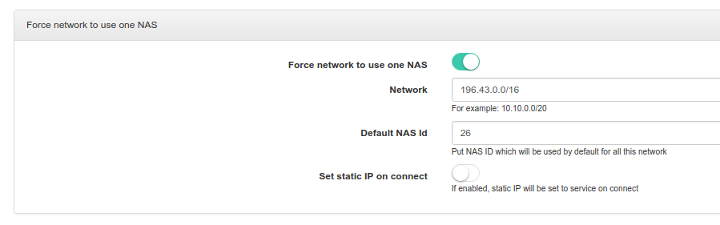

DSL Telkom (Openserve) authentication
==========

South African provider Telkom allows smaller ISPs to resell his services. The services are sold under trademark Openserve (http://openserve.co.za/). Splynx can communicate with Telkom/SAIX proxy servers and authenticate PPPoE DSL customers. But few configuration steps are needed to allow Splynx to talk with Openserve proxies.


1. First of all create NAS type DSL_Telkom or with similar name that will help you to recognise Openserve server. Please add Radius attributes provided to you by Telkom. Please setup accounting interval to default SAIX interval :



2. Then add all proxies as Routers to Splynx software, please specify NAS type = DSL_Telkom (configured in previous step). Also define the Radius secret that is used for proxy server and Radius server communication.


3. Next step is to add to `/var/www/splynx/config/radius.php` following lines :



Important field is **Default NAS Id**. This is the ID of Router in Splynx routers, that will "link" customers - show that they are connected through it online.


4. Last step is to add missing attribute to Freeradius dictionary, open file `/etc/freeradius/dictionary` and add there one line :
```
ATTRIBUTE Alcatel-Lucent-Service- 3002 integer
```

This setup is supported by Splynx 1.x and Splynx 2.x versions and Freeradius 2 and Freeradius 3 daemons.
