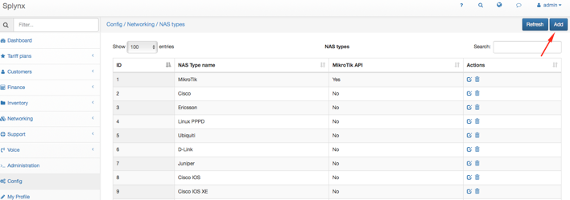
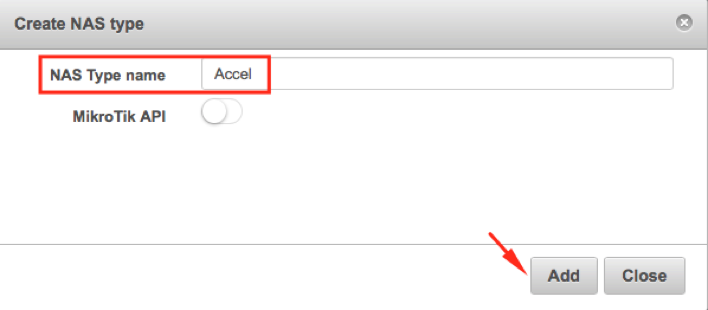
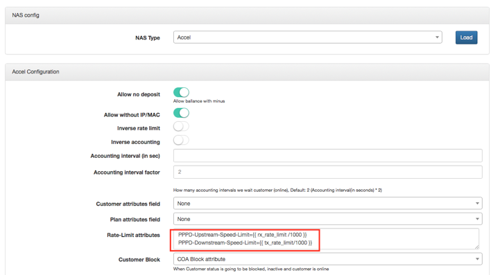
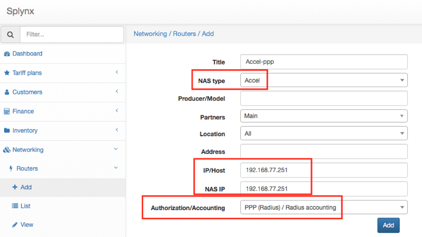
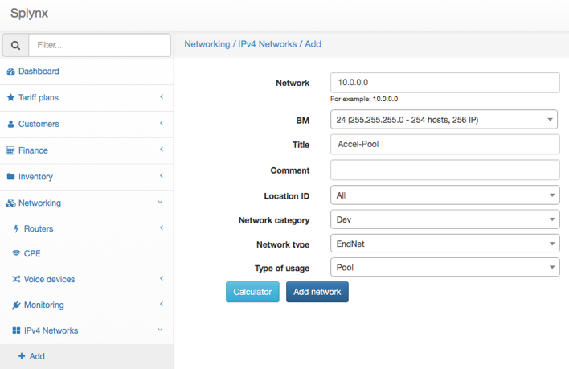

Linux: Accel-ppp server
==========

Accel-ppp is high permormance pptp/L2tp/PPPoE/IPoE server for Linux. The advantage of Accel-ppp is that is not only specialized in one technique, it’s various popiuar VPN service in on server application.

With this guide, you will be able to authenticate splynx customers with Accel-ppp Server, use tariffs limits, set FUP Rules, use Session disconnect and others.

## INSTALLING ACCEL-PPP

#### Install packages for compilation
```
sudo apt install cmake libpcre3-dev libssl-dev
```

#### Get accel–ppp source files
```
git clone git://git.code.sf.net/p/accel-ppp/code accel-ppp-code
mkdir accel-build
cd accel-build
```

#### Build accel-ppp
```
cmake -DRADIUS=TRUE ../accel-ppp-code/
make
sudo make install
```

## Configuring Splynx

#### Add new NAS type “Accel”
`Config -> Networking -> NAS types -> Add`




---
#### Configure Accel NAS type  
`Config - Networking - Radius - NAS config - NAS Type`

Choose “Accel”, “press Load”


Paste in field “Rate-Limit attributes”:
```
PPPD-Upstream-Speed-Limit={{ rx_rate_limit /1000 }}
PPPD-Downstream-Speed-Limit={{ tx_rate_limit/1000 }}
```
Press “Save”



---
#### Configure Splynx RADIUS
Add to the end of `/etc/freeradius/dictionary`
```
$INCLUDE                   /usr/share/freeradius/dictionary.accel
```

Create file `/usr/share/freeradius/dictionary.accel` with this content
```
# Limit session traffic
ATTRIBUTE Session-Octets-Limit 227 integer
# What to assume as limit - 0 in+out, 1 in, 2 out, 3 max(in,out
ATTRIBUTE Octets-Direction 228 integer
# Connection Speed Limit

ATTRIBUTE PPPD-Upstream-Speed-Limit 230 integer
ATTRIBUTE PPPD-Downstream-Speed-Limit 231 integer
ATTRIBUTE PPPD-Upstream-Speed-Limit-1 232 integer
ATTRIBUTE PPPD-Downstream-Speed-Limit-1 233 integer
ATTRIBUTE PPPD-Upstream-Speed-Limit-2 234 integer
ATTRIBUTE PPPD-Downstream-Speed-Limit-2 235 integer
ATTRIBUTE PPPD-Upstream-Speed-Limit-3 236 integer
ATTRIBUTE PPPD-Downstream-Speed-Limit-3 237 integer
ATTRIBUTE Acct-Interim-Interval 85 integer
ATTRIBUTE Acct-Input-Gigawords    52      integer
ATTRIBUTE Acct-Output-Gigawords   53      integer
```

---
#### Add new router:

`Networking -> Routes -> Add`

* **Title** – whatever you want

* **NAS type** – Accel (we create it in previous steps)

* **IP/Host** – IP address of accel-ppp server

* **Radius secret** – the same as in file `/etc/accel-ppp.conf` on accel-ppp server (section [radius], parameter “server”)

* **NAS IP** - the same as in file `/etc/accel-ppp.conf` on accel-ppp server (section [radius], parameter “nas-ip-address”)




---
#### Add IP-pool for users

`Networking - IPv4 Networks – Add`



---
## Configuring Accel server
```
sudo cp /etc/accel-ppp.conf.dist /etc/accel-ppp.conf
```

#### Edit default config file `/etc/accel-ppp.conf`
```
[modules]
log_file
#log_syslog
#log_tcp
#log_pgsql

pptp
#l2tp
#sstp
pppoe
#ipoe

#uncomment auth methods for your need
auth_mschap_v2
#auth_mschap_v1
#auth_chap_md5
#auth_pap

radius
#chap-secrets


#ippool
pppd_compat


shaper
#net-snmp
#logwtmp
#connlimit

#ipv6_nd
#ipv6_dhcp
#ipv6pool

#net-accel-dp

[core]
log-error=/var/log/accel-ppp/core.log
thread-count=4

[common]
#single-session=replace
#sid-case=upper
#sid-source=seq
#max-sessions=1000

[ppp]
verbose=1
min-mtu=1000
mtu=1492
mru=1492
#accomp=deny
#pcomp=deny
#ccp=0
#check-ip=0
#mppe=require
ipv4=require
#ipv6=deny
#ipv6-intf-id=0:0:0:1
#ipv6-peer-intf-id=0:0:0:2
#ipv6-accept-peer-intf-id=1
lcp-echo-interval=10
#lcp-echo-failure=3
### !!!
lcp-echo-timeout=20
unit-cache=1
#unit-preallocate=1

[auth]
#any-login=0
#noauth=0

[pptp]
verbose=1
echo-interval=30
#ifname=pptp%d

[pppoe]
verbose=1
#ac-name=xxx
#service-name=yyy
#pado-delay=0
#pado-delay=0,100:100,200:200,-1:500
called-sid=mac
#tr101=1
#padi-limit=0
#ip-pool=pppoe
#ifname=pppoe%d
#sid-uppercase=0
#vlan-mon=eth0,10-200
#vlan-timeout=60
#vlan-name=%I.%N
#interface=eth1,padi-limit=1000,net=accel-dp
#interface name for running pppoe server
interface=enp0s3

[l2tp]
verbose=1
#dictionary=/usr/local/share/accel-ppp/l2tp/dictionary
#hello-interval=60
#timeout=60
#rtimeout=1
#rtimeout-cap=16
#retransmit=5
#recv-window=16
#host-name=accel-ppp
#dir300_quirk=0
#secret=
#dataseq=allow
#reorder-timeout=0
#ip-pool=l2tp
#ifname=l2tp%d

[sstp]
verbose=1
#cert-hash-proto=sha1,sha256
#cert-hash-sha1=
#cert-hash-sha256=
#ssl=1
#ssl-ciphers=DEFAULT
#ssl-prefer-server-ciphers=0
#ssl-ca-file=/etc/ssl/sstp-ca.crt
#ssl-pemfile=/etc/ssl/sstp-cert.pem
#ssl-keyfile=/etc/ssl/sstp-key.pem
#host-name=domain.tld
#timeout=60
#hello-interval=60
#ip-pool=sstp
#ifname=sstp%d

[ipoe]
verbose=1
username=ifname
#password=username
lease-time=600
renew-time=300
max-lease-time=3600
#unit-cache=1000
#l4-redirect-table=4
#l4-redirect-ipset=l4
#l4-redirect-on-reject=300
#l4-redirect-ip-pool=pool1
shared=0
ifcfg=1
mode=L2
start=dhcpv4
#start=UP
#ip-unnumbered=1
#proxy-arp=0
#nat=0
#proto=100
#relay=10.10.10.10
#vendor=Custom
#weight=0
#attr-dhcp-client-ip=DHCP-Client-IP-Address
#attr-dhcp-router-ip=DHCP-Router-IP-Address
#attr-dhcp-mask=DHCP-Mask
#attr-dhcp-lease-time=DHCP-Lease-Time
#attr-dhcp-opt82=DHCP-Option82
#attr-dhcp-opt82-remote-id=DHCP-Agent-Remote-Id
#attr-dhcp-opt82-circuit-id=DHCP-Agent-Circuit-Id
#attr-l4-redirect=L4-Redirect
#attr-l4-redirect-table=4
#attr-l4-redirect-ipset=l4-redirect
#lua-file=/etc/accel-ppp.lua
#offer-delay=0,100:100,200:200,-1:1000
#vlan-mon=eth0,10-200
#vlan-timeout=60
#vlan-name=%I.%N
#ip-pool=ipoe
#idle-timeout=0
#session-timeout=0
#soft-terminate=0
#check-mac-change=1
#calling-sid=mac
#local-net=192.168.0.0/16
interface=eth0

[dns]
# dns for users
# !!! for some reason you must use both: dns1 and dns2 (otherwise mikrotik pppoe-client try to connect twice and splynx radius rejects this)
dns1=192.168.77.1
dns2=8.8.8.8

[wins]
#wins1=172.16.0.1
#wins2=172.16.1.1

[radius]
dictionary=/usr/local/share/accel-ppp/radius/dictionary
# whatever you want (not used in Splynx)
nas-identifier=accel-ppp
# Ip of accel (ip of this server). This IP is sent to RADIUS for authorize accel server as router
nas-ip-address=192.168.77.251
# gateway for users PPP sessions
gw-ip-address=10.0.0.1
# IP of splynx, secret, radius ports
server=192.168.77.204,password123,auth-port=1812,acct-port=1813,req-limit=50,fail-timeout=0,max-fail=10,weight=1
# IP of accel, incoming port and secret, for allow session disconect and FUP
dae-server=127.0.0.1:3799,password123
verbose=1
#timeout=3
#max-try=3
#acct-timeout=120
#acct-delay-time=0
#acct-on=0
#attr-tunnel-type=My-Tunnel-Type

[client-ip-range]
#ip addresses from which users can connect to accel
#disable=any
#10.0.0.0/8
disable

#[ip-pool]
#gw-ip-address=192.168.0.1
#vendor=Cisco
#attr=Cisco-AVPair
#attr=Framed-Pool
#192.168.0.2-255
#192.168.1.1-255,name=pool1
#192.168.2.1-255,name=pool2
#192.168.3.1-255,name=pool3
#192.168.4.1-255,name=pool4,next=pool1
#192.168.4.0/24

[log]
log-file=/var/log/accel-ppp/accel-ppp.log
log-emerg=/var/log/accel-ppp/emerg.log
log-fail-file=/var/log/accel-ppp/auth-fail.log
#log-debug=/dev/stdout
#syslog=accel-pppd,daemon
#log-tcp=127.0.0.1:3000
copy=1
#color=1
#per-user-dir=per_user
#per-session-dir=per_session
#per-session=1
level=3

#[log-pgsql]
#conninfo=user=log
#log-table=log

[pppd-compat]
verbose=1
#ip-pre-up=/etc/ppp/ip-pre-up
#ip-up=/etc/ppp/ip-up
#ip-down=/etc/ppp/ip-down
#ip-change=/etc/ppp/ip-change
radattr-prefix=/var/run/radattr
#fork-limit=16

[chap-secrets]
#gw-ip-address=192.168.100.1
#chap-secrets=/etc/ppp/chap-secrets
#encrypted=0
#username-hash=md5

[shaper]
#attr=Filter-Id
#down-burst-factor=0.1
#up-burst-factor=1.0
#latency=50
#mpu=0
#mtu=0
#r2q=10
#quantum=1500
#moderate-quantum=1
#cburst=1534
#ifb=ifb0
up-limiter=police
down-limiter=tbf
#leaf-qdisc=sfq perturb 10
#leaf-qdisc=fq_codel [limit PACKETS] [flows NUMBER] [target TIME] [interval TIME] [quantum BYTES] [[no]ecn]
#rate-multiplier=1
#fwmark=1
verbose=1
attr-down=PPPD-Downstream-Speed-Limit
attr-up=PPPD-Upstream-Speed-Limit

[cli]
verbose=1
telnet=127.0.0.1:2000
tcp=127.0.0.1:2001
#password=secretpass
#sessions-columns=ifname,username,ip,ip6,ip6-dp,type,state,uptime,uptime-raw,calling-sid,called-sid,sid,comp,rx-bytes,tx-bytes,rx-bytes-raw,tx-bytes-raw,rx-pkts,tx-pkts

[snmp]
master=0
agent-name=accel-ppp

[connlimit]
limit=10/min
burst=3
timeout=60

[ipv6-pool]
#gw-ip6-address=fc00:0:1::1
fc00:0:1::/48,64
delegate=fc00:1::/36,48

[ipv6-dns]
#fc00:1::1
#fc00:1::2
#fc00:1::3
#dnssl=suffix1.local.net
#dnssl=suffix2.local.net.

[ipv6-dhcp]
verbose=1
pref-lifetime=604800
valid-lifetime=2592000
route-via-gw=1

[accel-dp]
socket=/var/run/accel-dp.sock
```

#### Create and edit `/etc/init.d/accel-ppp`
```
#!/bin/sh
# /etc/init.d/accel-pppd: set up the accel-ppp server
### BEGIN INIT INFO
# Provides:          accel-ppp
# Required-Start:    $networking
# Required-Stop:     $networking
# Default-Start:     2 3 4 5
# Default-Stop:      0 1 6
### END INIT INFO


set -e


PATH=/bin:/usr/bin:/sbin:/usr/sbin:/usr/local/sbin;
ACCEL_PPTPD=`which accel-pppd`
. /lib/lsb/init-functions


if test -f /etc/default/accel-ppp; then
    . /etc/default/accel-ppp
fi


if [ -z $ACCEL_PPPTD_OPTS ]; then
  ACCEL_PPTPD_OPTS="-c /etc/accel-ppp.conf"
fi


case "$1" in
  start)
        log_daemon_msg "Starting accel-ppp server" "accel-pppd"
        if start-stop-daemon --start --quiet --oknodo --exec $ACCEL_PPTPD -- -d -p /var/run/accel-pppd.pid $ACCEL_PPTPD_OPTS; then
            log_end_msg 0
        else
            log_end_msg 1
        fi
  ;;
  restart)
        log_daemon_msg "Restarting accel-ppp server" "accel-pppd"
        start-stop-daemon --stop --quiet --oknodo --retry 180 --pidfile /var/run/accel-pppd.pid
        if start-stop-daemon --start --quiet --oknodo --exec $ACCEL_PPTPD -- -d -p /var/run/accel-pppd.pid $ACCEL_PPTPD_OPTS; then
            log_end_msg 0
        else
            log_end_msg 1
        fi
  ;;


  stop)
        log_daemon_msg "Stopping accel-ppp server" "accel-pppd"
        start-stop-daemon --stop --quiet --oknodo --retry 180 --pidfile /var/run/accel-pppd.pid
        log_end_msg 0
  ;;


  status)
    do_status
  ;;
  *)
    log_success_msg "Usage: /etc/init.d/accel-ppp {start|stop|status|restart}"
    exit 1
    ;;
esac


exit 0
```

#### Create Accel service
```
sudo chmod +x /etc/init.d/accel-ppp
sudo update-rc.d accel-ppp defaults
```
Add to the end of `/usr/local/share/accel-ppp/radius/dictionary`
```
$INCLUDE       dictionary.accel
```


Create file `/usr/local/share/accel-ppp/radius/dictionary.accel` with this content
```
# Limit session traffic
ATTRIBUTE Session-Octets-Limit 227 integer
# What to assume as limit - 0 in+out, 1 in, 2 out, 3 max(in,out)
ATTRIBUTE Octets-Direction 228 integer
# Connection Speed Limit
ATTRIBUTE PPPD-Upstream-Speed-Limit 230 integer
ATTRIBUTE PPPD-Downstream-Speed-Limit 231 integer
ATTRIBUTE PPPD-Upstream-Speed-Limit-1 232 integer
ATTRIBUTE PPPD-Downstream-Speed-Limit-1 233 integer
ATTRIBUTE PPPD-Upstream-Speed-Limit-2 234 integer
ATTRIBUTE PPPD-Downstream-Speed-Limit-2 235 integer
ATTRIBUTE PPPD-Upstream-Speed-Limit-3 236 integer
ATTRIBUTE PPPD-Downstream-Speed-Limit-3 237 integer
ATTRIBUTE Acct-Interim-Interval 85 integer
ATTRIBUTE Acct-Input-Gigawords    52      integer
ATTRIBUTE Acct-Output-Gigawords   53      integer
```

#### Start accel service
```
sudo service accel-ppp start
```


## Connection
You must configure your accel-ppp server as router (NAS)
Example:
```
sudo sysctl net.ipv4.ip_forward=1
sudo iptables -t nat -A POSTROUTING -o enp0s3 -j MASQUERADE
```
enp0s3 is the name of accel’s WAN interface

#### Restart Splynx RADIUS
`Config – Networking – Radius – Restart Radius`


#### Restart accel service
```
sudo service accel-ppp restart
```

Now you can connect to accel-ppp server.
Create PPPoE, PPTP or L2TP connection and connect
