Mikrotik Hotspot Login from Splynx portal
==========================================

This Splynx feature allows you to set up fully automatic customers registration and internet usage via Mikrotik Hotspot. Automatic registration can be done with [Splynx self-registration add-on](addons_modules/self_registration/self_registration.md). Customers can pay for the internet by using one of [payment systems](payment_systems/payment_systems.md). And then customers can login to Mikrotik Hotspot using Splynx portal. No admin intervention is required to register customers and to let them use internet (activate customers, etc.).

### Splynx settings

This feature is built-in in Splynx starting from version 2.3
It can be configured under _Config / Main / Portal_:
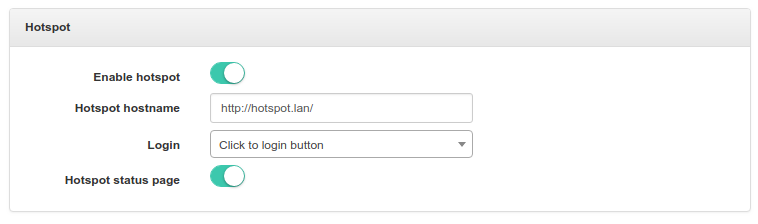

* **Enable hotspot** - Enable or disable this feature.
* **Hotspot hostname** - Should be the same as in Mikrotik settings. In Hotspot Server Profile (*DNS Name*):
    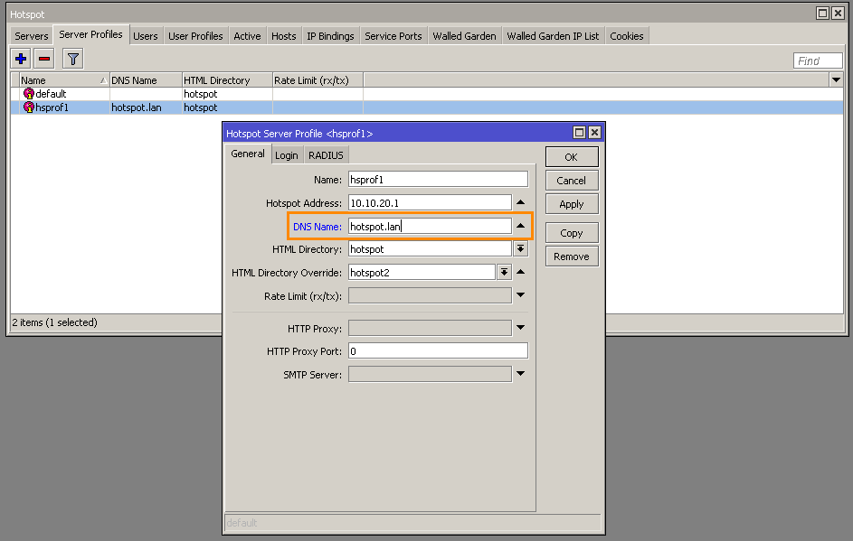
* **Login**:
  * **Automatic, after login to portal** - customer will be logged in to Hotspot automatically just after entering to Splynx portal.
  * **Click to login button** - Hotspot login button will appear on the Splynx portal page. Customer will be logged in to Hotspot after he press this button.
  
  * **Disabled** - Hotspot login button will appear on the Splynx portal page. Customer won't be logged in to Hotspot after he press this button.
* **Hotspot status page**
  * **Enabled** - show Mikrotik Hotspot status after successful login:
  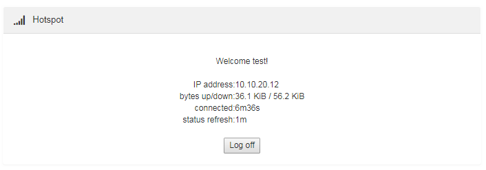
  * **Disabled** - show "Hotspot connected..." after successful login:
  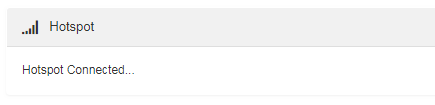

### Mikrotik settings

We use custom Hotspot HTML pages. You can download them here - [splynx-hotspot.zip](splynx-hotspot.zip)

1. Extract the archive.
2. Replace http://example.com to your own Splynx URL in all HTML files. In Linux you can do it using `sed`. In the folder with HTML files, where zip archive was extracted, run in the terminal:
    ```bash
    sed -i s%http://example.com%http://yoursplynxurl%g *
    ```
    \* replace **yoursplynxurl** with the actual domain name or IP.
3. Copy modified files into Mikrotik. To copy, you can use FTP, SSH, Drag and Drop, etc.
4. In Hotspot Server Profile set *HTML Directory override* to the directory just copied:
   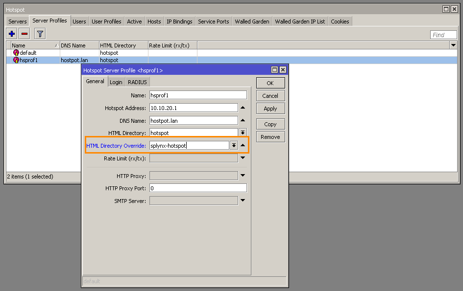
5. In Hotspot Server Profile set *Login By* to **HTTP CHAP**:
   
6. If you want to use RADIUS authorization, enable **Use RADIUS**. And add RADIUS entry:
   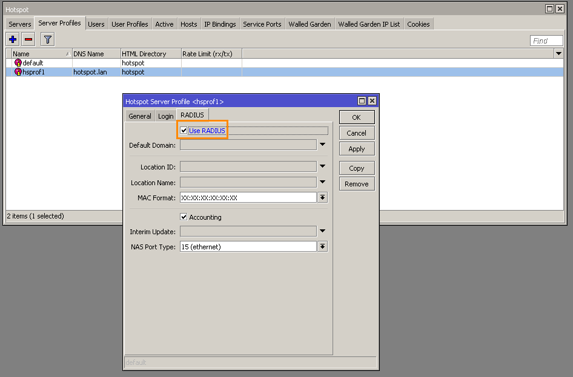
   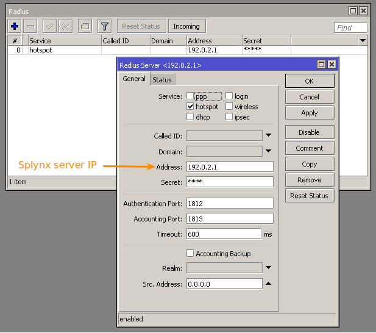
7. Add IP address of the Splynx server to the *Walled Garden IP List* to give access to the Splynx portal for unauthorized customers:
   

<icon class="image-icon"></icon> Please note:

* First Active internet service will be used for login via Mikrotik Hotspot.
* The customer will be redirected to Splynx portal only if he is trying to connect to HTTP web-page (not to HTTPS).


### Example #1. RADIUS authorization

In this scenario we use the simplest configuration, without using IP pools from Splynx. Router (NAS) will assign IP addresses for customers.

Suppose we have clean Splynx. Follow these steps:

1. [Create customer](customer_management/add_new_customer/add_new_customer.md), make him active (status=active):
    
    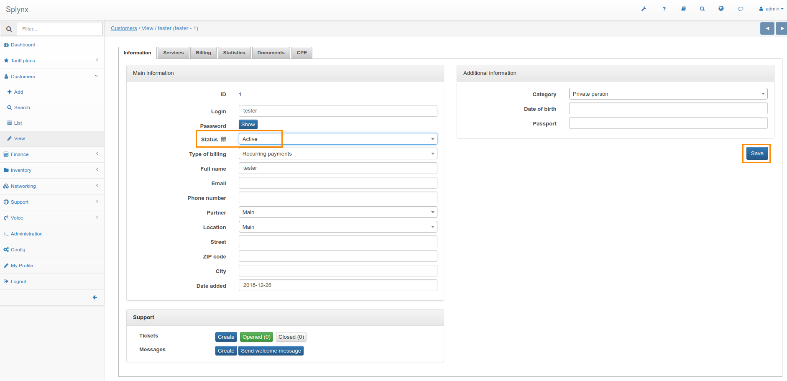
2. Create [internet plan](configuring_tariff_plans/internet_plans/internet_plans.md):
    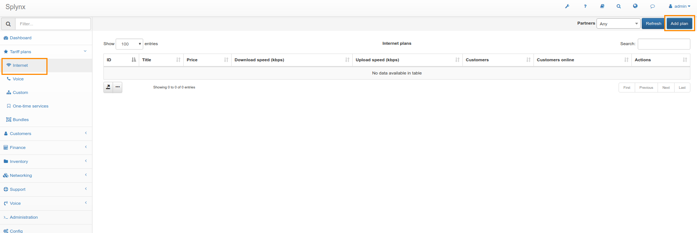
    
3. Create [internet service](customer_management/customer_services/customer_services.md) for the customer:
    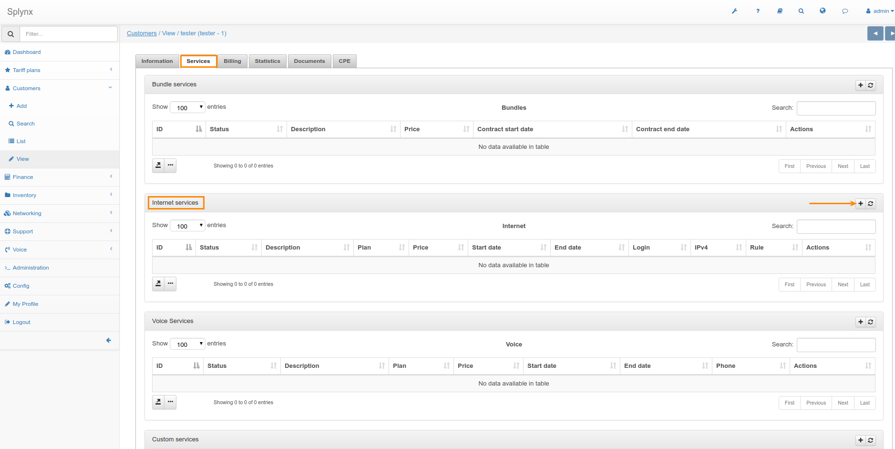
    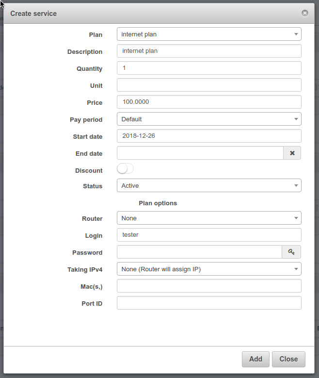
4. Add your router (NAS) into [Splynx routers](networking/routers_settings/routers_settings.md). **Authorization/Accounting** - **Hotspot (Radius) / Radius accounting**:
    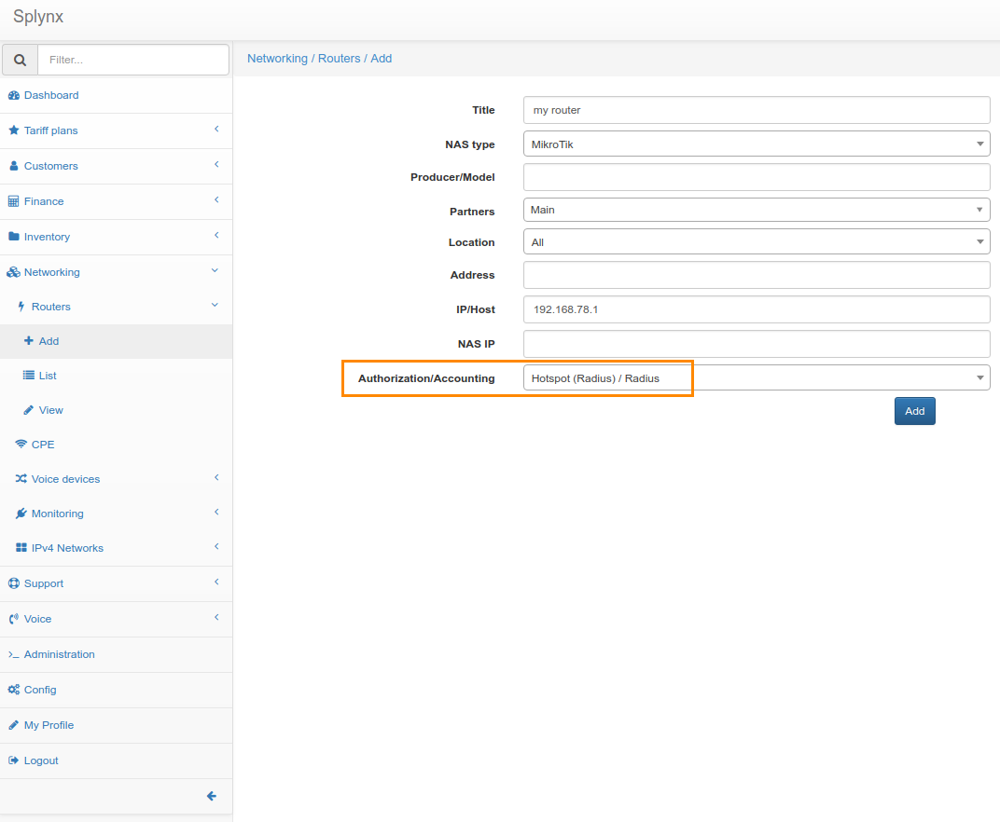
5. After you add router in Splynx, RADIUS secret will be generated. Create RADIUS record in Mikrotik settings with this RADIUS secret:
    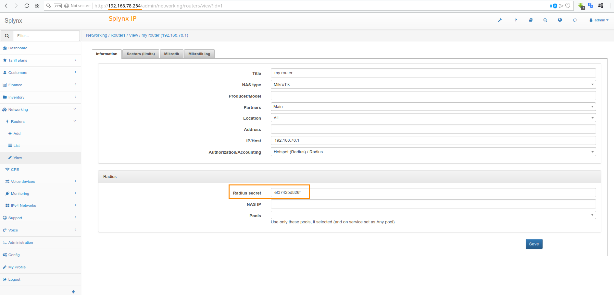
    
6. Disable **Use reject IP 0..4** under _Config / Networking / Radius_:
    
7. Create Mikrotik Hotspot server:
    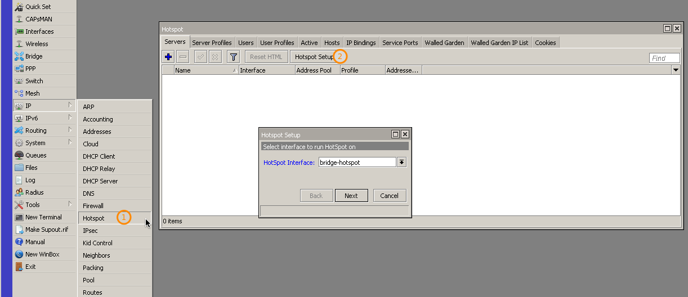
    
    
    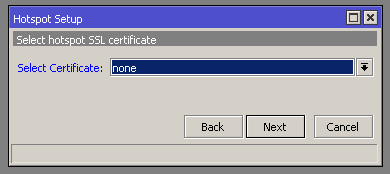
    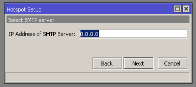
    
    
    
8. In Hotspot Server Profile set *Login By* to **HTTP Chap** and enable **Use RADIUS**:
    
    
9.  Download [this archive](splynx-hotspot.zip), extract it.
10. Replace "example.com" to your Splynx URL (domain name or IP) in all HTML files:
    
11. Copy these files into Mikrotik and set in Hotspot Server Profile *HTML Directory override* to the directory "splynx-hotspot":
    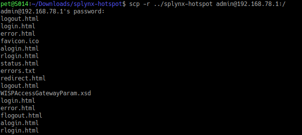
    
12. Add Splynx server IP into Walled Garden IP list:
    
13. Enable Hotspot login via Splynx Portal under **Config / Main / Portal**:
    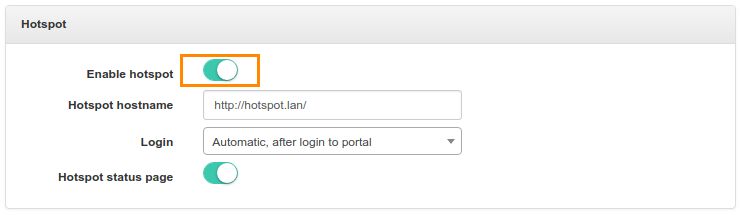


### Example #2. API authorization

In this scenario we use IP pool from Splynx.

Suppose we have clean Splynx. Follow these steps:

1. [Create customer](customer_management/add_new_customer/add_new_customer.md), make him active (status=active):
    
    
2. Create [internet plan](configuring_tariff_plans/internet_plans/internet_plans.md):
    
    
3. Create IP pool for customers. **Type of usage** - *Static*:
    
4. Reserve first IP of the pool for the router:
    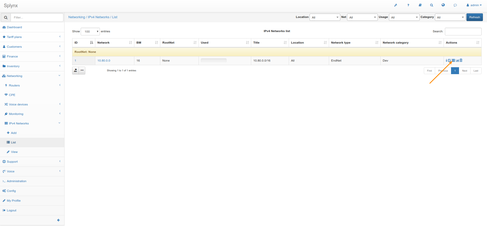
    
    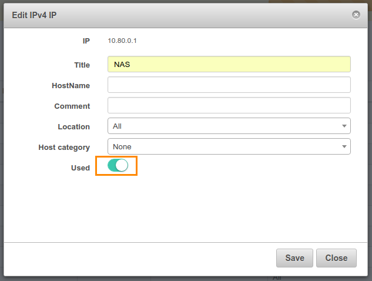
5. Add this IP to the hotspot interface:
    
6. Create NAT rule for the Splynx pool:
    
    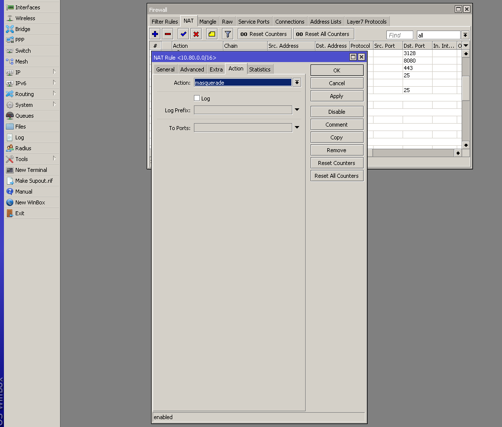
7. Add your router (NAS) into [Splynx routers](networking/routers_settings/routers_settings.md). **Authorization/Accounting** - *Hotspot (Users) / API accounting*:
    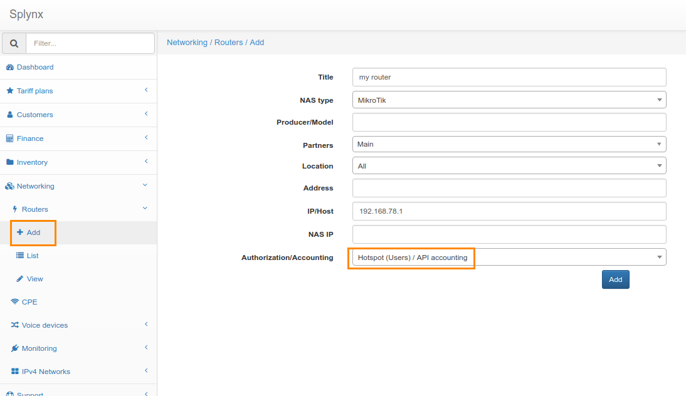
8. Enable API usage for this router in Splynx, enter API login and password:
    
9. Enable API for the router in Winbox, create API group and API user:
    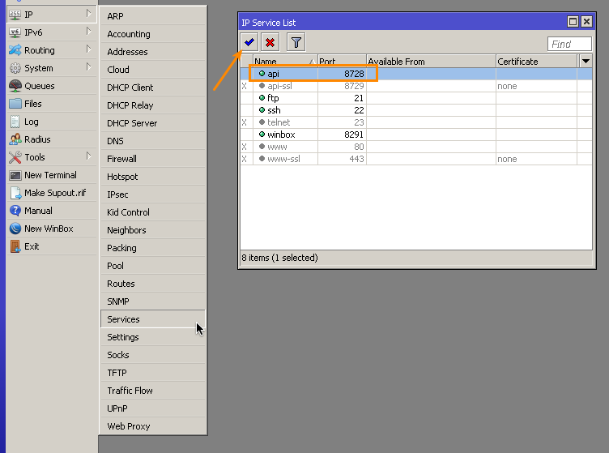
    
    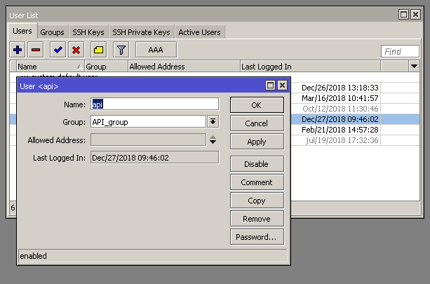
10. Create [internet service](customer_management/customer_services/customer_services.md) for the customer. Select Router (required !) and permanent IP:
    
    
11. Create Mikrotik Hotspot server:
    
    
    
    
    
    
    
    
12. In Hotspot Server Profile set *Login By* to **HTTP Chap** and disable **Use RADIUS**:
    
    
13. Download [this archive](splynx-hotspot.zip), extract it.
14. Replace "example.com" to your Splynx URL (domain name or IP) in all HTML files:
    
15. Copy these files into Mikrotik and set in Hotspot Server Profile *HTML Directory override* to the directory "splynx-hotspot":
    
    
16. Add Splynx server IP into Walled Garden IP List:
    
17. Enable Hotspot login via Splynx Portal under **Config / Main / Portal**:
    


### How it works (scheme)

* The customer is trying to access web page (HTTP site).
* Router (NAS) redirects the customer to Mikrotik Hotspot IP (to router IP).
* Mikrotik Hotspot redirects the customer to Splynx portal (to Splynx URL).
* The customer authenticates on the portal and logs in into Mikrotik Hotspot on the Splynx portal.
* Customer can browse internet.
