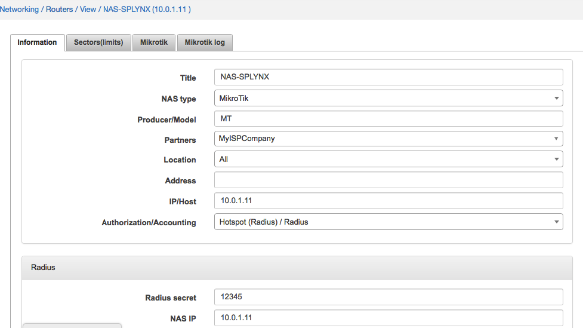
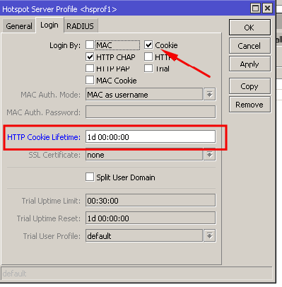
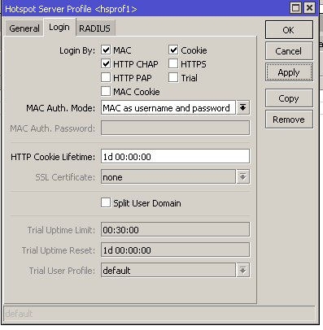

Mikrotik: Hotstpot, Radius
==========

#### Hostpot configuration on Mikrotik router

The first steps in the configuration for Hotspot Radius authentication are the same as for other types of Radius authentication.

The router should be added to Splynx and the Radius Hotspot authentication needs to be enabled. Even if other Radius authentication methods will be chosen in Splynx router settings, it will still allow Radius hotspot authentication.

* **Radius secret** - the password for authentication/communication between the Radius server and router.
* **IP/HOST** - this is the physical IP address from which packets are sent to the Radius server. In a case where the router is behind a NAT, this is the public IP address of NAT device. This field can be set as a domain name or a dynamic DNS entry.
* **NAS IP** - the real IP source address for radius packets. It is recommended that in the Radius settings of the Mikrotik router, the source address should be the NAS IP in Splynx.

The next step is to configure Radius settings within the router:

In the configuration of the Hotspot we have added the local IP pool 10.200.255.0/24, this pool will be used to provide IP's to the customers connecting for the first time. As soon as customers are authenticated, they will receive an IP address from the IP range defined in Splynx - 192.168.102.0/24

The last step is to enable hotspot Radius authentication in the Hotspot Profile, the arrow in the image below indicates the type of connection, when using a Wireless setup, choose 19/wireless and for ethernet, please select ethernet:

#### Hotspot authentication login and password
Now when customer's connects to the router, they will be presented with the login screen where they should enter the username and password specified in the Splynx internet service.

In this example the username is alex-pppoe and 12345 is the password, the customer will receive a permanent IP address after successful authentication:

Authentication Mikrotik screen:

After entering the correct username and password, the customer will be granted access and their DHCP address: 10.200.255.x will be mapped to the real routable IP address: 192.168.102.x in the Hosts list.
We will be able to see that the customer is active, and the "R" means that the customer was authenticated via the Radius server:

We can also see that the customer is online in Splynx, where we can check his session and current usage statistics:

---
If you would like to close/end the session of the customer, there is an option available in Splynx to do so, forcing the customer to reconnect.

The option to close/end sessions is can be used by clicking the "X" button in the service of the customer or in the Online view if the "X" option is added to the list of column in the table.

Service close session:

Online customers close session action:

### Hotspot authentication using cookies
When a customer is already authenticated, Mikrotik routers can store their information in the cache for certain periods of time to avoid the customer having to enter their usernames and passwords again. Authenticated customers are added to cookies with the lifetime specified in the router settings.

For example, if we don't want customers to re-enter their passwords for 24 hours, meaning if they reconnect their PC/device several times during a day to the Wifi or router, the login and password page should not appear. The example below illustrates how to enable the cookies and set the lifetime to 24 hours or 1 day.

#### Hotspot MAC authentication

Splynx has the ability recognise the MAC address of customers, if it is configured in their internet services. If MAC authentication is enabled in the Hotspot server profile settings and the MAC address of the customer is set in the customer's internet service. This will eliminate the process of the customer having to authenticate themselves with a username and password on a login page as they will be authenticated via their registered MAC address.

The image below illustrates the enabling of MAC authentication in the Hotspot profile on the Mikrotik router:

In the image below is an example of setting/applying the MAC address of a customer to their internet service:

#### Blocking of hostpot users

If a customer has a static/permanent IP address assigned to their service, then the blocking of such a customer is done by adding the IP address to the address list and further redirecting. In a case of using a dynamic IP address, the hotspot IP of the customer is mapped to one of the IP's from the blocking range within Splynx. For more information on blocking customers, please read through the following tutorial page - [blocking customers in Splynx](blocking_customers/blocking_customers.md)

#### Setting different values to Radius attributes

In `Config → Networking → Radius` there is a field available for setting additional attributes.

To understand the usage of Radius attributes customization, please follow this guide - [Radius server customization](radius_customization/radius_customization.md)
