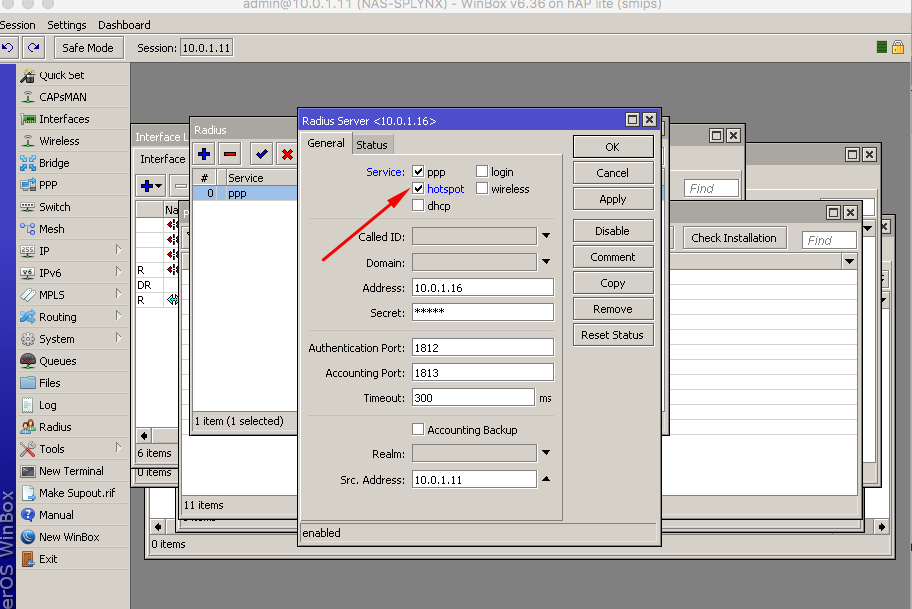
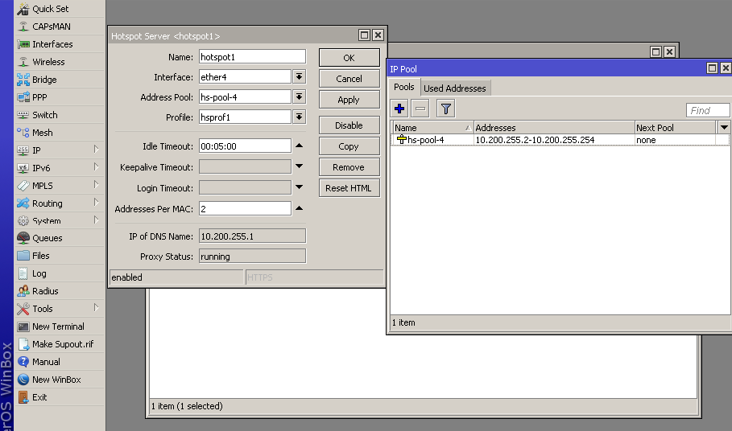
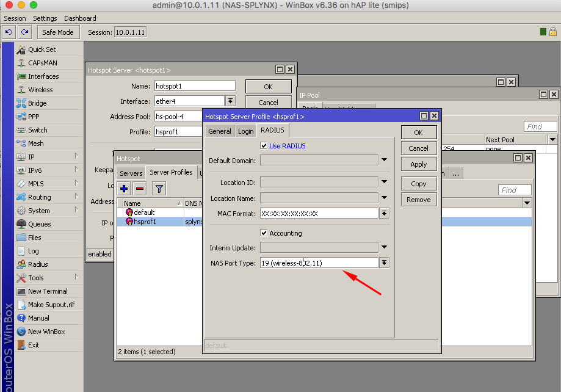
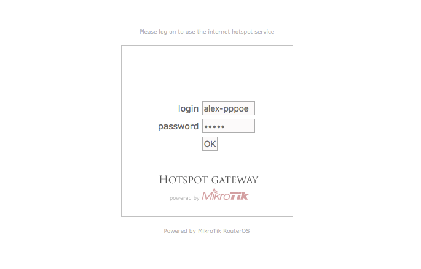
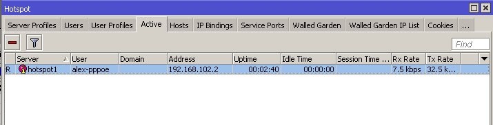
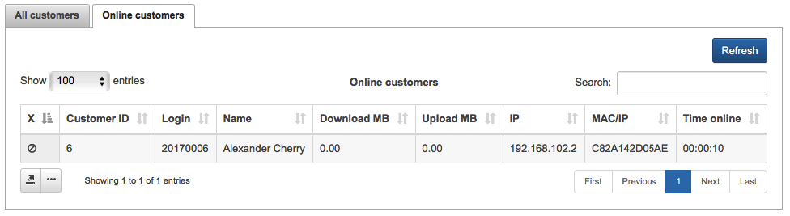
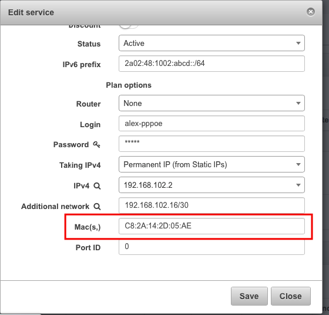

Mikrotik: Hotstpot, Radius
==========

#### Hostpot configuration on Mikrotik router

First configuration steps for Hotspot Radius authentication are the same as for other types of Radius authentication.

Router should be added to Splynx and Radius Hotspot authentication enabled. Even, if other Radius authentication method will be chosen in Splynx router settings, it will still allow Radius hotspot authentication.

* **Radius secret** - the password for communication between Radius server and router.
* **IP/HOST** - this is the physical IP address from where packets are sent to Radius server. In case when router is behind NAT, this is the public IP address of NAT device. Can be set as a domain name or dynamic DNS entry.
* **NAS IP** - the real IP source address for radius packets. It's recommended than in Radius settings in Mikrotik router Src. address = NAS IP in Splynx.

Next step is to configure Radius settings inside the router:

In configuration of Hotspot we have added IP local pool 10.200.255.0/24, this pool will be used to provide IP to the client connected for the first time. As soon as he will become authenticated, he will get IP address from the IP range defined in Splynx - 192.168.102.0/24

The last step is to enable hotspot Radius authentication in HS Profile, arrow shows type of connection, in case of Wireless choose 19/wireless in case of ethernet please select ethernet:

#### Hotspot authentication login and password
Now when customer connects to the router, he receives the login screen where he should enter the username and password specified in Splynx internet service.

In this case it's alex-pppoe name and 12345 password, client will get permanent IP address after successful authentication:

Authentication Mikrotik screen:

After setting the right password and username, customer get access and his DHCP address 10.200.255.x is mapped to the real routable IP address 192.168.102.x in Hosts list.
Also we can see that client is active, and "R" means that he was authenticated via Radius server:

And client is online in Splynx, where we can see his session and current usage:

---
If we would like to close the session of the customer, there is an option in Splynx how to close the session and enforce customer to reconnect.

It's available through "X" button in service of the client or in Online view if the "X" option is added to the list of table.

Service close session:

Online customers close session action:

### Hotspot authentication using cookies
When client is already authenticated, Mikrotik can store in cache his information for certain period of time and don't ask him to enter username and password again. Authenticated customer is put to cookies with lifetime specified in settings.

For example, we don't want to ask customer for a password for 24 hours. So, if he will reconnect his PC several times during a day to Wifi or router, the login and password page will not appear. On example below is shown how to enable the cookies and set the lifetime to 24 hour or 1 day.

#### Hotspot MAC authentication

Splynx can recognise the MAC address of customer if it is set to his internet service. If MAC authentication is enabled in Hotspot server profile and MAC is set in customer's service, then the login page will not appear for such customer and he will get internet access immediately.

Enabling MAC authentication in Hotspot profile:

Setting the MAC address of client to his internet service

#### Blocking of hostpot users

If client has a static/permanent IP address assigned to the service, than blocking is made via putting IP address to the address list and further redirect. In case of dynamic IP address, the hotspot IP of client is mapped to one of IPs from the blocking range of Splynx. To get more information about blocking customers, please, read our tutorial page - [blocking customers in Splynx](../../blocking_customers/blocking_customers.md)

#### Setting different values to Radius attributes

In `Config → Networking → Radius` is field available for setting additional attributes.

To understand the usage of Radius attributes customization, please, follow the guide - [Radius server customization](../../radius_customization/radius_customization.md)
