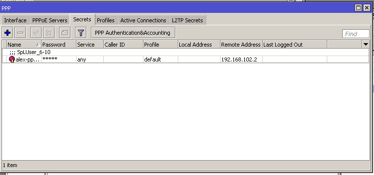
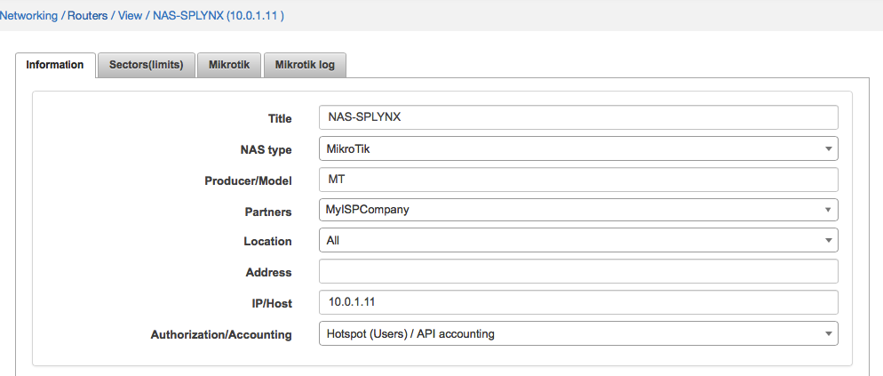

Mikrotik: Local auth, API
==========

Instead of using Radius, Splynx is able to push authentication rules for customers to Mikrotik router via API. Advantage of this approach is that rules for authentication are created in routers and are stored there locally. It means, if Splynx or Radius server will not respond, customers will still  be able to get Internet access. Disadvantage is that router should be always specified in customer settings where customer is connected. Also customers can only get permanent IP from Splynx.

Authentication rules can be added via API:

* PPP Secrets
* DHCP Leases
* Hotspot users

In all types of API authentication is important to have Mikrotik API enabled on router and also in Splynx router settings.

When both things are enabled, it's useful to create a special admin account for Splynx, which will be used for API login to routers and making changes there. You can create an admin API or with other name and assign him to special access group for API login:

Below are described all types of API authentication and how Splynx covers it with Mikrotik RouterOS:

#### Mikrotik PPP Secrets via API

First of all, select PPP secrets as type of authentication in Spynx router settings:

Then in internet service of customer should be selected a router where Splynx will push authentication rules and also grab statistics from. Login and password should be specified there and also Permanent IP address. API authentication works well only with permanent IP assignments. In case of dynamic IP assignment, Splynx will not know which IP is used by customer and will not be able to gather statistics from IP accounting of Mikrotik router.

After saving, Splynx will connect to router and create entries in `PPP → Secrets`:

#### Mikrotik DHCP Leases via API

Please choose DHCP leases as type of authentication in Spynx router settings.

In internet service of customer should be selected a router where Splynx will push authentication rules and also grab statistics from. It is important to set the MAC address of the customer. Only permanent IP works in API authentication because of limitations in grabbing accounting from Mikrotik IP accounting:

When we save the service information, Splynx connects to the router and setup static `DHCP Leases on IP → DHCP Server → Leases`

In settings of DHCP server you can set an option, that all non authenticated customers will get IPs from fake pool and all authenticated users will get IPs which are set in Leases by Splynx.

#### Mikrotik Hotspot users via API

Select Hotspot as type of authentication in Spynx router settings:

In internet service of customer should be selected a router where Splynx will push authentication rules and also grab statistics from. Login and password are values for hotpost entry. In case of MAC authentication you can specify a MAC address of end user:

When it saved, Splynx creates IP hostpot entries in Mikrotik router under `IP → Hotspot → Users`:

---
When authentication type is configured and Splynx pushed the rules to Mikrotik router, we can see clients coming online in 5 minute interval. Splynx grabs statistics from Mikrotik routers via API every 5 minutes. The log of accounting you should be able to find in `Splynx → Networking → Routers` under Mikrotik API log tab:

