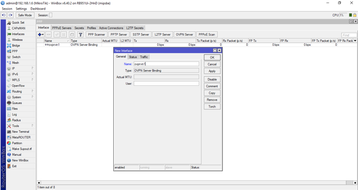
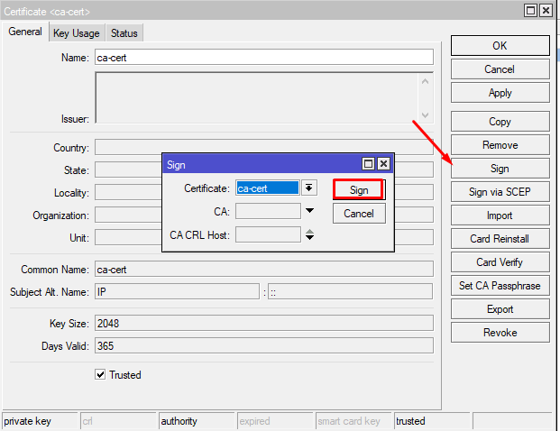
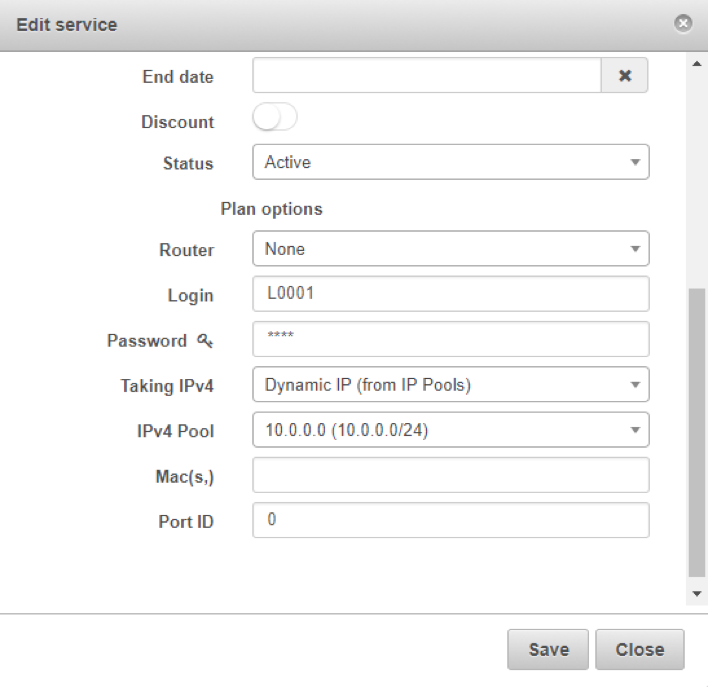

Mikrotik: OpenVPN, Radius
==========

The radius server should be configured following the page [PPPoE Radius](networking/mikrotik_pppoe_radius/mikrotik_pppoe_radius.md). In the following guide you can follow steps for configure OpenVPN.

We have to configure the radius server like in the other PPP cases.

And enable radius for PPP.

Then we have to create the OpenVPN server. We should create and sign one certificate to be able to use it.add

---
### Create Certificate:

On Mikrotik go to System → Certificates and we need to add 2 certificates, one will be the certificate for the server, and the other should be used to sign as CA.

Add certificate for Server.

Add certificate for sign as CA.

Sign the ca-cert certificate, without CA.

It will appear a fingerprint

Now sign the server certificate usign as CA the other certificate.

Now is signed and ready to use.

---
Enable OpenVPN server setting the features you need and the server certificate. In this case we have configured it without client certificate.

---
Finally, we will be able to connect customers with login and password, that are set in Splynx for the customer's service. We will receive an IP from the pool we set, or is also possible to set an statical IP. Other option is to get them directly by mikrotik setting "none (router will assign)".

