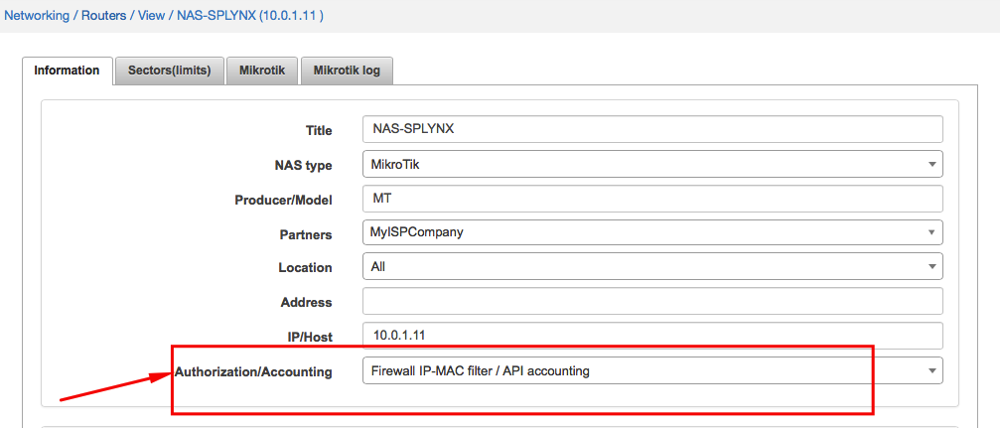
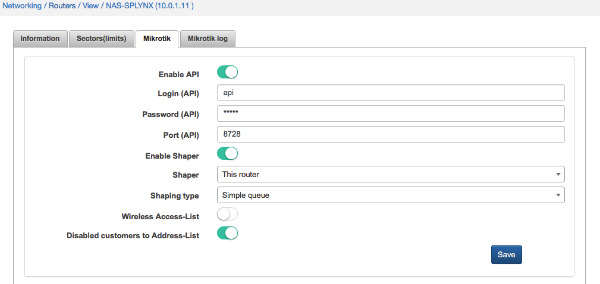
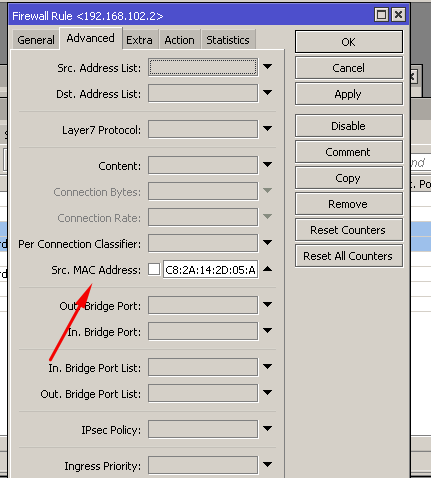
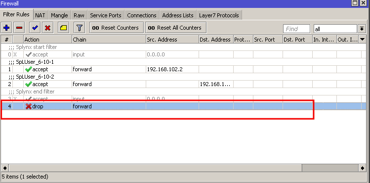
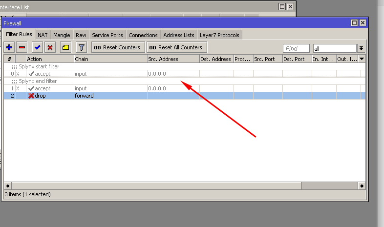
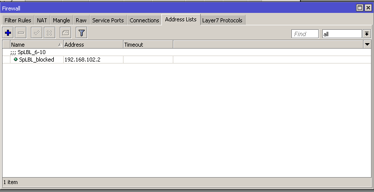

Mikrotik: Static IPs with API
==========

Some topologies of WISPs don't have central authentication of customers based on PPPoE or DHCP. Instead of it each client's device is connected using static IP address. But what will happen if customer will get access and change the static IP address to a different one? Probably his speed limitation will become inactive, because it's also based on IP address of the client.

In Splynx you can setup authentication for statically configured IP addresses. Also it's possible to match IP address of CPE with MAC address and achieve static IP + MAC authentication.

This setup works only for Mikrotik RouterOS devices, because authentication rules are pushed to router via API.

First step is to add to internet service of the customer Router, IP address and MAC (if needed):

In settings of router NAS-SPLYNX we should enable proper authentication type, it's Firewall IP/MAC filter. Accounting will be grabbed by Splynx every 5 minutes via API:

The API should be enabled on Mikrotik router and in Splynx settings for router as well:

Splynx connects to the router and create in IP `Firewall → Filter` entries allowing access for the IP/MAC combination for the user.

If MAC is added to customer's service, then the Firewall rule also contains the MAC address:

As you can see, Splynx doesn't create any DENY rule. If you have other rules in Firewall, Splynx don't touch or change them as well. System just adds allow rules to the beginning of Filter chain "Forward". To prevent all non authenticated customers access the network you can create a manual DENY rule on Forward chain:

---
### Blocking of customers with static IP address authentication

Blocking behavior depends on settings on Router. There are 2 options:

#### Customer's entry is removed from the IP `Firewall - Filter`.

If router doesn't have option of putting disabled customers to Address list, then Splynx will remove the authentication entry from firewall:

#### Customer's IP is put to Blocking address list.

Router should have Disabled to address `list = Yes`. In this case blocked customer in Splynx is not removed from IP firewall, but IP address is put to Address-list.

SpLBL_Blocked address list is used for blocking customers:

To get more information about blocking customers using Splynx, please visit the tutorial page [Blocking customers](networking/blocking_customers/blocking_customers.md) in Splynx.
