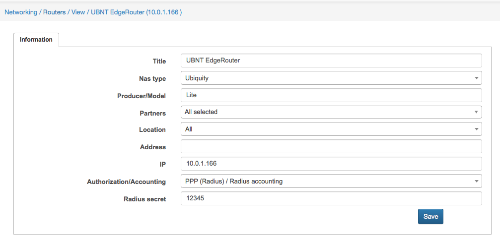
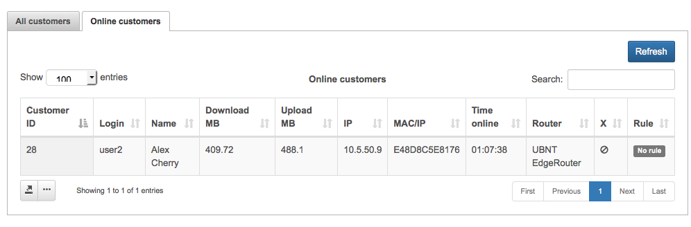
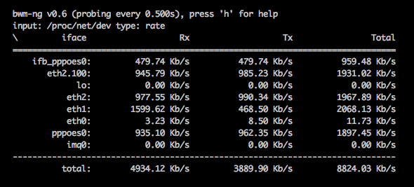

Ubiquiti: PPPoE on Edge Routers
==========

UBNT EdgeRouters can act as a PPPoE server with authentication of CPEs, providing statistics, blocking end users, and setting up speed limits and FUP rules.

Let’s divide it into parts:

1. Configure EdgeRouter PPPoE server with Radius
2. Configure EdgeRouter PPPoE server for incoming radius packets
3. Add EdgeRouter to Splynx
4. Connect PPPoE customer and check that everything is working fine
5. Install other usefull tools to Edgerouter

### 1. Configure EdgeRouter PPPoE Server with Radius support

The first step is to upgrade the system to at least 1.5 version and higher, because support of Radius attributes was added to EdgeOS in this version. The version we describe here is EdgeOS v1.8.5.
Upgrade can be achieved in CLI with commands:
```
add system image http://dl.ubnt.com/...
add system image new-version-1085.tar
```


As a second step we need to define the IP address for communication between Radius and EdgeRouter.
In my case it’s 10.0.1.166, set it up as the main IP of EdgeRouter with a command (in configure mode):
```
set system ip override-hostname-ip 10.0.1.166
```
In case that your router version don't accept that command, you could set it by the interface web.


Then I setup the PPPoE server with mandatory settings:
```
edit service pppoe-server
set authentication mode radius
set authentication radius-server 10.10.10.65 key 12345
set client-ip-pool start 10.5.50.2
set client-ip-pool stop 10.5.50.200
set interface eth2
```


Radius configuration can also be done in web browser:


Encryption on Edge Routers tunnels is disabled by default. To enable it:
Please login via SSH to EdgeRouter and type:
```
sudo su -
vi /opt/vyatta/share/perl5/Vyatta/PPPoEServerConfig.pm
```

press "/" on your keyboard and type: refuse-chap
and then press 'i' on your keyboard and change "refuse-chap" to "require-chap".
after that press Escape button and type :wq
The same way you can enable PAP and MSCCHAP.


### 2. Configure EdgeRouter PPPoE incoming packets

This is an important part because we need to change plans, disconnect customers or apply FUP rules. In all these cases Splynx Radius sends packets to Edge Router.
Default port is of UBNT is 3779. To enable incoming packet processing run these command on EdgeOS:
```
sudo cp /opt/vyatta/etc/pppoe-server/start-pppoe-radius-disconnect /config/scripts/post-config.d/
```
and reboot the router.

to debug, if packets are received use file pppoe-radius-disconnect.log:
```
tail /var/log/pppoe-radius-disconnect.log
```

---
Below is example of output when packet disconnect was received by EdgeOS:


### 3. Add EdgeRouter to Splynx and set up settings in Splynx

Just add a router to Splynx in `Networking -> Routers` and choose the NAS Type Ubiquiti:





You can add additional attributes to the configuration of NAS Type under `Config -> Networking -> Radius`.
By default we support radius-rate-limit attributes to setup speeds of PPPoE tunnels.


### 4. Connect PPPoE customer and check that everything is working fine

Now we can connect the PPPoE user to EdgeRouter and check that everything works fine.
With the „show pppoe-server“ command we can see how many users are connected to the PPPoE server:


In Splynx we can see if customer is online and get his stats:



When we click disconnect button the customer should dissapear from the online list and reconnect with a new session which means that EdgeRouter accepted the incoming packet from Splynx Radius server.


### 5. Install other usefull tools to EdgeRouter

PPPoE client tunnels are dynamically created and are not shown in the web dashboard. We need to get statistics of customer throughput, and a simple way to do it is to install the software bwm-ng. It’s located in the Debian repository, which means we need to add new repositories first and then install bwm-ng.
Add new repositories:
```
configure
set system package repository wheezy components 'main contrib non-free'
set system package repository wheezy distribution wheezy
set system package repository wheezy url http://http.us.debian.org/debian
set system package repository wheezy-security components main
set system package repository wheezy-security distribution wheezy/updates
set system package repository wheezy-security url http://security.debian.org
commit
save
exit
```
and install the tool
```
apt-get install bwm-ng
```

Then you can run bwm-ng -u bits to get the actual Kbps throughput of pppoe clients.
Example of output of bwm-ng is in picture below:



Now you can configure Splynx Radius server with UBNT EdgeRouter and benefit from a fast router that delivers 1 million packets per second routing performance in a compact and affordable unit!


If you face any difficulties, please, use our forum – https://forum.splynx.com/ or submit us a ticket – https://splynx.com/my-tickets/
