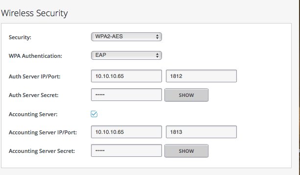
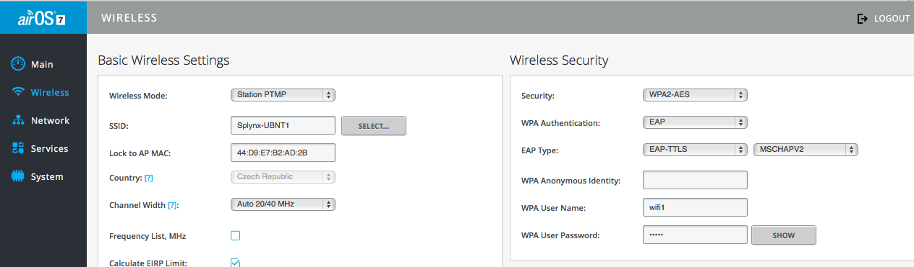
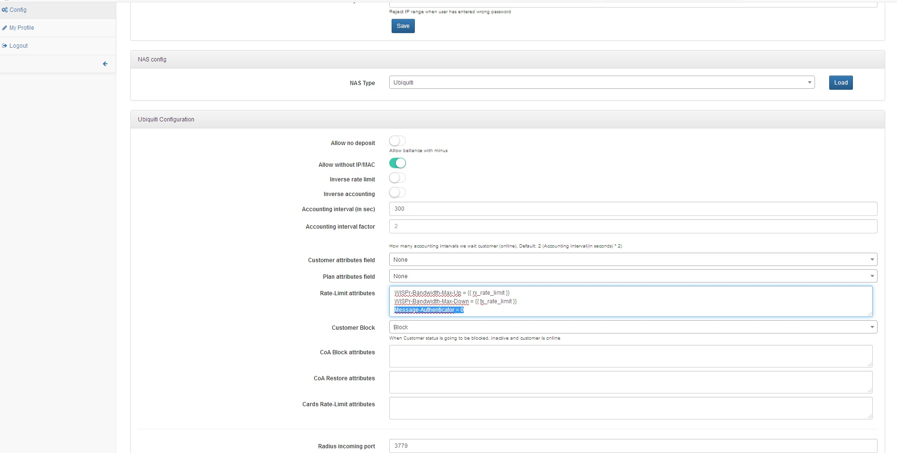

Ubiquiti: Wireless auth, Radius
==========

Ubiquiti access points have the ability to authenticate CPEs via Radius server. This means the admin doesn’t have to maintain local passwords for wireless authentication, each CPE/radio can have its own account in the Splynx ISP Framework and our Radius server will authenticate UBNT CPEs.

Usually ISP already has a PPPoE or similar authentication mechanism which is why wireless Radius authentication is added in Splynx to existing customers as one new (empty) service.

As a first step, we define a Plan in Splynx with 0 price and 0 in all other fields.


Then, we should add a wireless service to the customer and enter his login and password.


It is also important to add AP to splynx.


In the last step we should enable Wireless Radius authentication EAP on the UBNT router and setup a Radius server IP address and secret. This is Access point or router configuration:



Now we can connect a UBNT radio CPE to a UBNT Access Point. This is CPE configuration:




One thing that you must do is to setup Message-Authenticator attribute to to the Radius configuration.

Under `Config → Radius → NAS Ubiquiti → Add Message-Authenticator=0` to the rate limit attributes field:



#### Notice
EAP-TTLS authentication should work from Splynx version 2.1.  
You may have to change freeradius configuration to make EAP-TTLS authentication working.  
* Find eap or eap.conf file in /etc/freeradius. For different freeradius versions location of this file may differ  
* Set in eap section `default_eap_type = ttls`  
* Set in ttls section `default_eap_type = mschapv2`  

```bash
cat /etc/freeradius/mods-enabled/eap
eap {
        default_eap_type = ttls #here
...
        ttls {
                tls = tls-common
                default_eap_type = mschapv2 #and here
                copy_request_to_tunnel = yes
                use_tunneled_reply = no
                virtual_server = "inner-tunnel"
...
}
```
