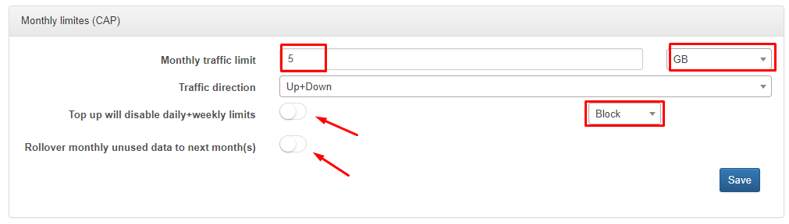
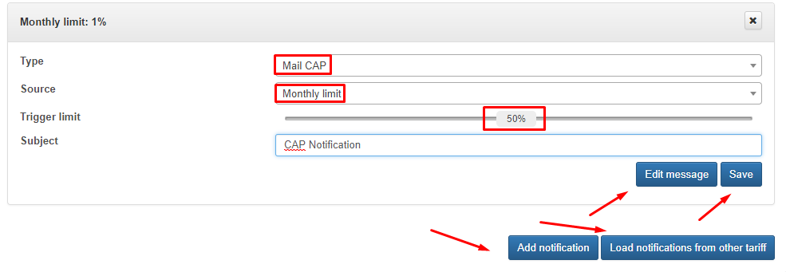
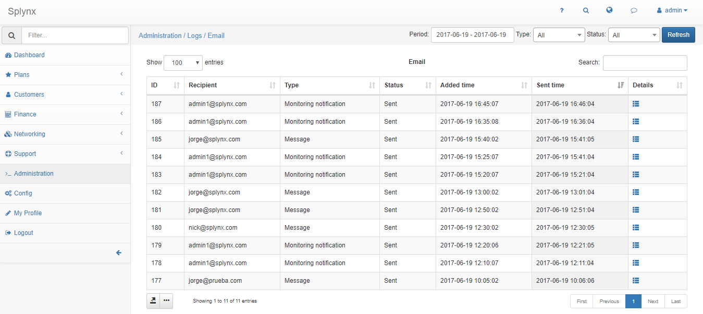
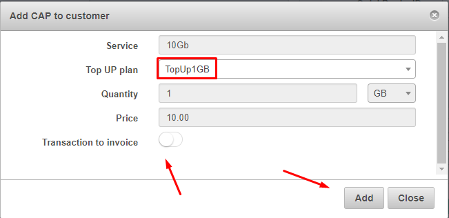
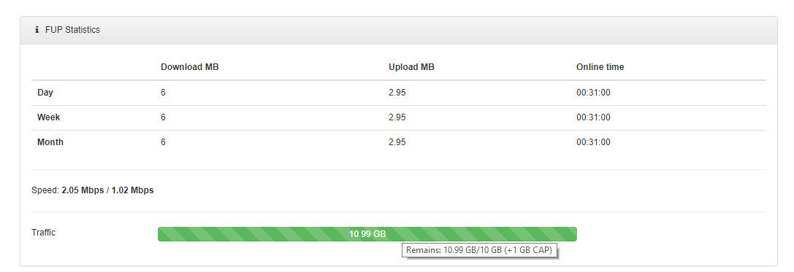
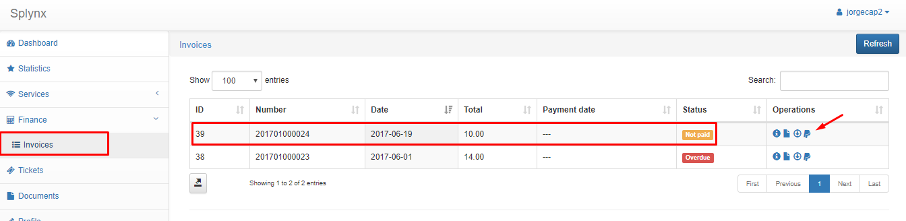
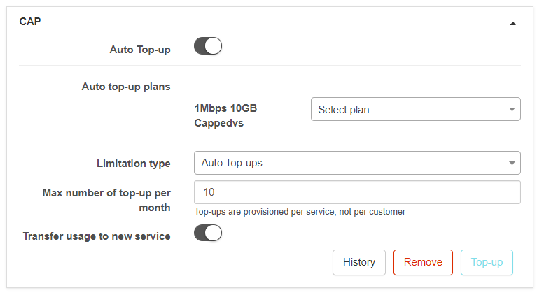

Capped plans and top up
==========

CAP is a feature that allows ISP's to provide Internet services with monthly limitations of data and the ability to charge customers for additional data.

The advantage is that customer can pay more to extend his CAP using the tool Top Up. Administrator designs Top Up plans, that are avaliable for customers in addition to their regular Internet plans.

### CAP configuration

To configure CAP policies navigate to `Tariffs → Internet`, and then select the tariff plan you want to apply CAP to and click on the FUP button, a new window  will appear called CAP.

In CAP there are 3 configuration sections, Monthly limits(CAP), Top Up Plans and Notifications.

In the first section, we can set the total amount of data (in KB, MB, GB or TB) customers using the Internet plan will be able to consume. Limits can be set to dowload, upload or bidirectional usage. When the CAP monthly data is used, Splynx will automatically block the customer or reduce their speeds according to the configured percentage level.

You can also disable daily or weekly limits by setting an FUP rule or enabling the Rollover mode. Rollover means that unused monthly data of the CAP will be moved to the next month.

In the second section, we can configure Top Up plans. These plans are used when customers have reached their monthly data CAP and wish to purchase more data . Customers simply pays for a Top Up, and then receives more data.

The validity of Top Up data can be set to several months or it can set to unlimited. There is also an option to add Top Up charges to the customer's invoice.

A very useful option is to Load plans from other tariffs. Meaning, you only have to configure top up plans once and then the same plans can simply be loaded to all other tariffs.

The third section is the configuration of Notifications, which informs customers by means of email or SMS, about monthly usage, Top Up data usage or Top Up actions.

Like with top up plans, it is also possible to load notifications that we have created in other plans.

Source - the counter or action that we want to notify our customer about.

Monthly limit - the data included in CAP,

Top Up usage - notify the customer when a certain percentage of their the top up data has been spent

Top Up action - notify the customer when a top up was added to customer's account

Auto Top Up - notifies the customer when dat has been automatically added to the customer's account by Splynx.

It is necessary to type a subject and customize the message by clicking on the Edit message button. You also have the option to load a template you have prviously created in `Splynx → Config → Templates`.

To make sure that the email or notifications are working correctly, you can view email logs by navigating to `Administration → Logs → Email`.

The same method of verification is available for SMS messages in `Splynx → Administration → Logs → SMS`

### Top Up plans

Splynx has 3 types of Top up methods :

1. Administrative top up
2. Customer portal top up
3. Auto top up

#### 1. Administrative Top up

To perform an administrative top up, navigate to `Customers → List` and choose the customer you want to add the Top Up to. The CAP section can be found on the bottom right of the customer information tab, with the top up options available. When clicking on the Top UP button, a new window will appear, requesting a service and Top up plan. Administrators can be granted permissions to add custom top ups. This means that they can define the amount of Data to top up and the price of the single top up.

After we've added a Top UP for 1 GB of data, we can see that the 1GB of data was added to customer's account. The transaction for the top up will be added to the customer's list of transactions and we can proceed to charge the customer to generating the invoice.

Because we have enabled the option "To invoice" in the Top UP transaction, the Top up will appear on the PDF invoice  :

#### 2. Customer portal Top up

In Splynx, customer's can order a top up from the customer portal. The administrator will then configure permissions in Splynx and the options that the customers have to perform top ups. The configuration of these permissions can be found in `Config → Main → Portal`. There are two sections with options for customer Top Ups:

1. You can enable Top Ups and edit auto top up settings. Auto top up permissions shows whether a customer can enable/disable auto top ups and whether they can choose from the top up plans available. There is also an option to allow customer's to change the maximum amount of auto top ups per month.

2. To enable manual top ups from the customer portal, select which type of document will be created when customer's performs top ups from the portal. Pay before means that the customer will not get the top up data until they pay the invoice.

When a customer enters the Portal and clicks on `Services → Top Up`, they will be presented with top up options, for automatic and/or manuall top ups.

In the manual top up option, customer's can choose a plan and add a top up.

Thereafter, the customer's statistics will display the amount of traffic in the usage bar. The actual top up data will also be displayed.

In a case that an administrator enables the option to Pay Before Top Up, the data will only be available after the customer pays for it.

Once the invoice is paid, another 1GB of data is now added to the customer's account.

#### 3. Auto Top up

Whitin the CAP section in the customer information tab, we can enable auto top ups.

Then we can define the auto top up plan and maximum amount of top ups allowed per month.

Transfer usage to new service means that, Splynx will transfer unused data between plans in the case that the customer changes their plan.
