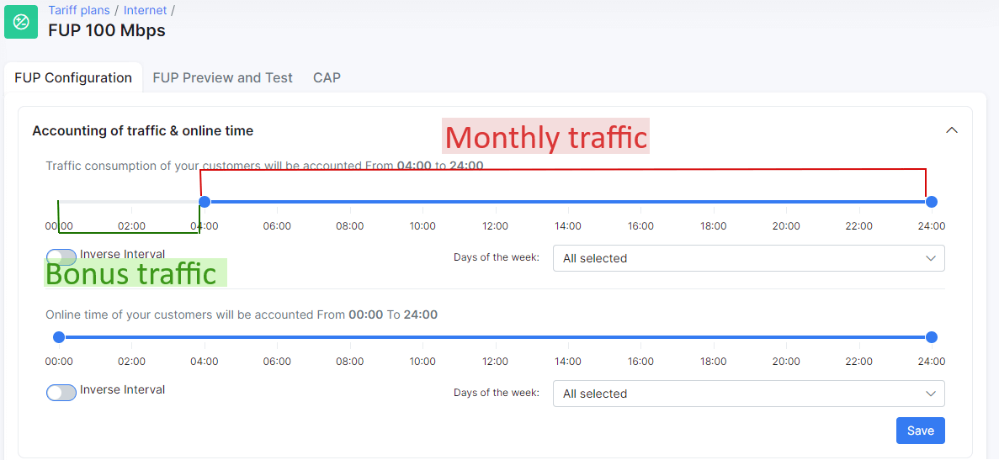
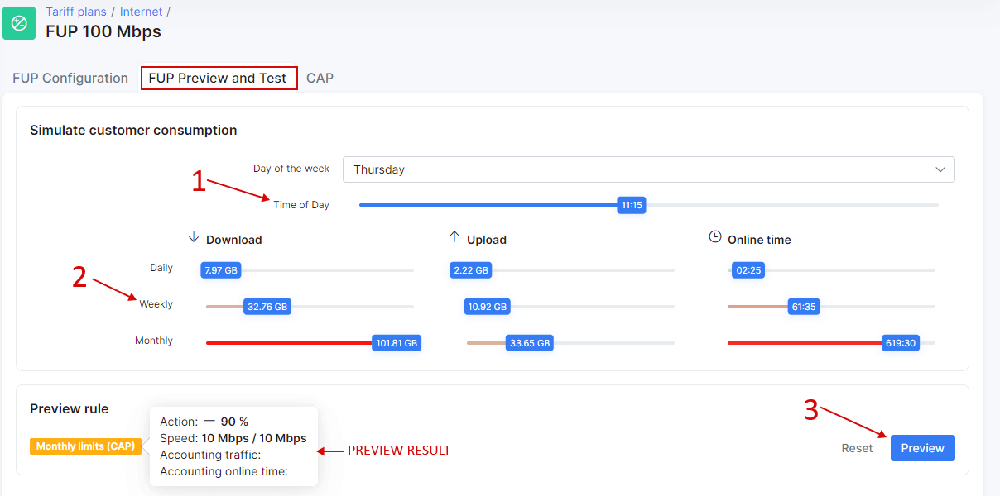
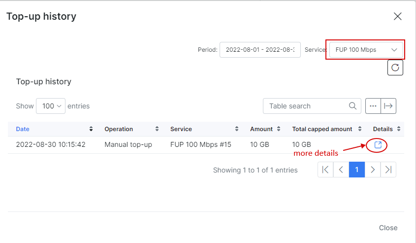
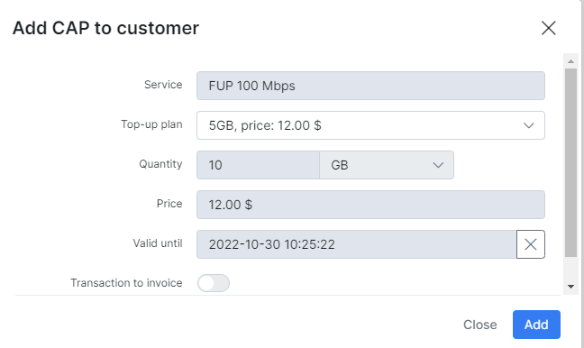

Capped plans and Top-Ups
===

CAP is a feature that allows ISPs to provide Internet services with monthly limitation of data and charge customers for additional data in the form of top-ups.

For example, the monthly limit for an internet tariff plan in Splynx is 200GB, once a customer has used 200GB the connection can be blocked or speed can be decreased. In a case, where the customer wants to use the Internet connection without speed limitations they can purchase a Top-up (additional data pack) and use this data without any speed limitations. In Splynx, we have designed this feature so that the customer can issue a Top-up from the customer portal, the administrator can also issue a Top-up for a customer on the administrator portal, and it can also be done automatically (when the monthly limit is reached - an auto top-up can be issued automatically).

Firstly, you need to enable the CAP module under _Config → Integrations _→ Main Modules.__

Once this done you can navigate to _Tariff Plans -> Internet_ and click on this button to configure CAP:

Here you can configure FUP policies, CAP, simulate & test the behavior of the system on FUP and CAP rules. Do not mix FUP and CAP configurations, it could cause conflicts on the router. We will skip the FUP rules and only focus on CAP + time frames for traffic accounting.

## CAP сonfiguration

Let's start with the `Monthly limits (CAP)` configuration:

Here’s a description of available options:

* **Monthly traffic limit** - here you can set the amount of data a customer can consume per month

* **Bonus traffic limit** - this option will ONLY work if a time frame has been specified under `FUP configuration` tab:

In this case, the customer will be able to use 50GB of bonus traffic only from 00:00 to 04:00 (A monthly limit of 100GB won't be used here). If you account for traffic for a whole day (without FUP time frames) - this option will not work.

You can set bonus traffic here or enable the toggle `Unlimited` to allow a customer to consume traffic without limits between 00:00 and 04:00.

* **Traffic direction** - select the direction of traffic for accounting: `Up + Down`, `Up` or `Down`;

* **Action** - select what to do with the connection once the monthly limit is reached: `Block`, `Set fixed speed`, `- Speed %`;

* **Auto top-up plan** - select one of the previously created top-ups that will be automatically applied to the customer when the monthly limit is reached (auto top-ups have to be enabled under customer's settings as well);

* **Compensate for over-usage with top-up** - this option is created for tariff plans with high speed to avoid not being charged for over-usage of traffic. Let's say a customer has a plan with 1Gbps speed and accounting interval = 5 minutes and CAP limit = 500GB, Splynx receives data that the customer has already used 499.95GB and Splynx won't block this connection as CAP limit is 500GB and in another 5 minutes Splynx receives the last data that a customer has already used 502GB, so the goal of this toggle is that Splynx will charge for over-used 2GB according to tariff price;

* **Auto top-up trigger value** - specify the amount of data (in percent) that a connection can consume after which an auto top-up will be applied. For example, a top-up of 1GB was applied and the customer has used it, so if it’s set to 10% of 1GB, once 100MB will be used additionally - an auto top-up will be applied;

* **Top-up will disable daily and weekly limits** - enable/disable this option to ignore daily or weekly FUP limits (under "FUP configuration" tab);

* **Rollover unused data(monthly)** - enable/disable option to rollover unused data to the next month;

* **Allow the usage of bonus traffic when normal CAP is finished** - with this option enabled customers will be able to use bonus traffic even if the monthly limit is reached.

## Top-ups

These plans are used when the monthly data CAP's are reached and the customer wishes to extend their services. Customers pay for Top-Ups in order to regain access according to the data limits of the Top-up plan.

Top-up plans are beneficial to you as an ISP as this creates an additional source of income with existing customers using a capped service.

Splynx has simplified the top-up concept for anyone to use appropriately, with just 5 parameters to be set to create a top-up plan or simply loading a preexisting top-up plan.

On this screenshot, you can see 2 top-up plans: 5GB and 10GB. Use the buttons `Add top-up plan` to add a new top-up, `Load top-ups from another tariff` - to load existing top-ups from what you previously created for another plan, and the `Save` button to save the changes.

To create a new plan you need to specify the data amount, price, validity, transaction category, and enable/disable the option to add this transaction onto an invoice.

## Notifications

It's really important to inform the customer about the amount of data used to avoid "surprises" when the Internet is not available and the customer wasn't notified.

For this scenario we developed a flexible system of CAP notifications:

According to these notification settings (as seen on the screenshot), Splynx will send an email message when half of the monthly limit is used with a subject which you can specify under the `Subject` field and a message body which you can specify by clicking on `Edit message` button.

Under the `Source` field you can select which data will be used for the notification:

* **Monthly limit** - the system will check only for the Monthly limit amount(CAP) to send the notification, top-ups, and bonus data will be ignored. For example, when the CAP is set at 100GB and the customer has bought a top-up of 10GB, a notification will be sent when the customer has used 50GB, not 55GB(50% of available 100GB + 10GB);

* **Total usage** - the system will check for total available data amount including top-ups;

* **Top-up usage** - the system will check only for top-up data usage, CAP limit is ignored;

* **Top-up action** - the system will inform the customer about any top-up applied;

* **Auto top-up action** - inform the customer about applied auto top-up.

Click on the `Add notification` button to add a new notification or `Load notifications from another tariff` to load previously created notifications from another tariff plan.

## Difference between auto top-ups and compensate overusage

### Auto top-ups:

* If the customer reached top-ups limit (*Amount* field), Splynx won't apply any new top-ups for this customer (option *Auto top-up trigger value* won't be used);

* The auto top-up feature won't cover overusage. Overused data will be free for this customer. For example if customer has a CAP limit 1GB, but due to some reasons this customer has used 1.2GB - the service will be blocked. Once it's blocked system applies an auto top-up 100MB so customer could use some internet. After this the customer will be able to use 100MB but that 200MB of overusage will be free;

* The system can apply a top-up only 1 time per 5 minutes.

### Compensate overusage

* This option *Compensate for over-usage with a top-up* can ignore max amount of auto top-ups per month if the overusage is more than *Auto top-up trigger value*;

* This option will cover overusage. Overused data won't be free for this customer. For example if customer has a CAP limit 1GB, but due to some reasons this customer has used 1.2GB - the service will be blocked. Once it's blocked system will do a compensate with step 10MB ( 200MB of overusage = 20 x 10MB top-ups ). Each top-up will be added to the invoice so customer will pay for 200MB overused data;

## Preview and test configuration

Once CAP or FUP is configured you can preview and test settings under the `FUP preview and test` tab. Here you need to select "Day of the week", "Time of the day" (1), some values for "download/upload" (2) and "Online time" and click on the "Preview" button (3) to view the result.

According to our CAP configuration (monthly limit 100GB) when a customer will use a monthly limit Splynx will decrease speed by 90% and the maximum speed will be 10 Mbps / 10 Mbps.

## Examples

Let's add an internet service with a monthly limit for the customer:

So the customer has a 100GB monthly limit + 50GB bonus available only between 00:00 and 04:00 according to tariff plan settings.

On the customer main information page we now have this window with personal CAP settings:

* **Auto top-up** - enable/disable auto top-ups;

* **Auto top-up plans** - select a top-up plan that will be applied automatically (if auto top-up is enabled);

* **Limitation type** - select the type of limitation to apply the number of top-ups per month too;

* **Max number of top-ups per month** - set max amount of top-ups per month;

* **Transfer usage to the new service** - enable/disable the transfer of unused top-up data to a new service in case of plan change.

Using the button `History` you can see top-up data history (top-ups, rollover data, transfers of data) for a specific period of time:

Using the button `Top-up` you can apply a top-up manually for a customer:

Here you can select one of the available top-up plans OR set an amount(quantity), price or validity period manually.

The transaction is added to the list of transactions since the toggle to add transaction to invoice is disabled and the amount will be debited to the customer's account. If this toggle is enabled the transaction will be added to the customers' next generated invoice.

To remove an amount of data that was added by the top-up use the `Remove` button.

It is possible to add bonus data using the `Add bonus data` button:

Just select the service, the amount of data, validity, and click on the `Add` button.

You can track bonus data history by clicking on the `Bonus history` button.

With a top-up applied and bonus data a customer's service will look like this:

**NOTE!** Bonus data will be available for use only on off-peak hours (00:00 - 04:00 according to tariff plan settings). If you want to bypass this, simply set the top-up price to 0.

## What customer will see in their portal

The look and feel can be customized according to which items you want to display to a customer but in this case, we have enabled displaying of all items related to traffic amount, CAP, and FUP so the customer will be able to see their available and used data directly on their dashboard:

Under `Services -> Top-up` the customer can enable/disable auto top-up issuing, select auto top-up plan (we disabled this option in our example) and issue a top-up manually:

For this option to be available, permissions in the portal should be granted for customers to have access to this feature. To grant access, navigate to Config → Main → Portal and select "Per partner settings". There are two sections to grant access for customers to perform top-ups:

**Top-up settings** - Permissions regarding auto top-up plans made available to the customer tariffs and how they can interact with these fields:

* **Enable** - allow/deny the ability to perform auto top-ups;

* **Auto Top-up** - select the level of access/ability to use the Auto top-up feature (View, Edit, All selected);

* **Auto top-up plans** - select the level of access/ability to use plans(View, Edit, All selected);

* **Limitation type** - select the level of access/ability to change limitation types(View, Edit, All selected);

* **Max number of top-ups per month** - select the level of access/ability to change the maximum allowed top-ups per month(View, Edit, All selected).

**Manual Top-up** settings - These are permissions and actions for customers to create top-ups manually and how they can interact:

* **Enable** - allow/deny the ability to make manual top-ups;

* **Create finance document** - which type of documents to create for the applied/requested top-up;

* **Pay before top-up** - select whether the customer has to pay for the top-up before the data can be used or not.

**Global CAP settings can be adjusted under [Config -> Main -> CAP](configuration/main_configuration/cap/cap.md)**
