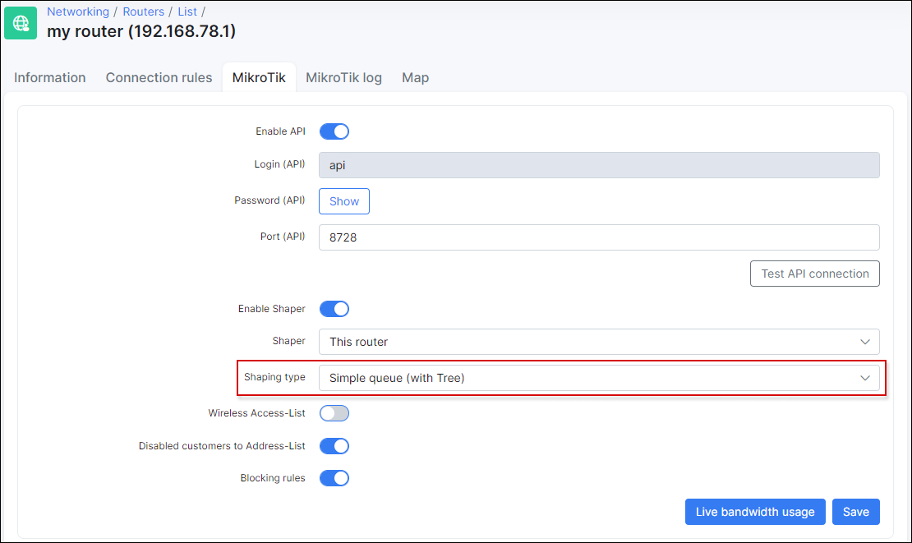

Contentions
==========

Splynx provides the feature of contention or aggregation. This feature is used when ISP sells to end users services with contention rate for example 1:5, 1:10 etc. Contention means that end user will share the bandwidth with other end users in his group.

Splynx operates with two types of contention: Per Plan based and Per Router contention.

 To use this feature, Mikrotik API should be enabled in router settings.

### Plan based contention.
Let’s take a look on example.
We are selling to end users plan 5 Mbps with contention rate 1:5. It means, that Splynx will setup the parent speed-limit of 5 Mbps and under this parent it will place 5 users with speed-limit of 5 Mbps each. What happens in this situation is that if the line is free and one user starts to download/upload, he gets full 5 Mbps throughput. In case when second user starts active downloading, they will get 2,5 Mbps each. When all 5 users will simultaneously download with maximum speed, they will share the bandwidth.

It’s described in the image below:

We can tune a bit sharing of speed with setting up “Limit-at” or guaranteed speed. If we place 1 Mbps to each user, then all users will get at least 1 Mbps always.

In that case all 5 users will simultaneously download with 1 Mbps speed. It’s shown on second screenshot.

What will happen in situation when we will put 7 users on 1:5 contention plan? Splynx will change the parent speed to 7 Mbps in this particular case, but will leave maximum speeds of each user on 5 Mbps.

If you are planning to deploy Plan-based contentions, use it on central routers to achieve high amounts of users in one tree. Compare two situations – 1:5 contention tree with 5 users and two of them are hard downloaders, it means that 3 other users will never get 5 Mbps speed, because they are all under one common parent of 5 Mbps.

If we place 100 users on this contention 1:5, then parent maximum speed will be set to 20 Mbps and then two or more high downloaders will not use the whole bandwidth.

### Router based contention.

Router based contention is used in this scenario:

Imagine that we have a wireless AP which is connected to backbone network with 30 Mbps speed. But we connected to that AP users with total possible bandwidth of 60 Mbps. What can happen in peak time is that users will consume more traffic than can be sent through uplink. It means that wireless link can become overutilized and unstable. It’s shown in the picture below.

To prevent this situation, router based contention can be used. In Splynx each router has field “Sector/Speed limits”, where can be defined groups and administrator can put users under these groups. As a result we will achieve contention per router:

### Shaping type

For plan based contention, please set Shaping type to *Simple queue (with Tree)*:

For router based contention, please set Shaping type to *Simple queue*:

### Video tutorial
You can find on a short video tutorial how to configure Splynx and Plan based contention:

<iframe frameborder=0 height=270 width=350 allowfullscreen src="https://www.youtube.com/embed/e2aOsfdBTYA?wmode=opaque">Video on youtube</iframe>

Router based contention video:

<iframe frameborder=0 height=270 width=350 allowfullscreen src="https://www.youtube.com/embed/XgSGhYad_Ik?wmode=opaque">Video on youtube</iframe>
