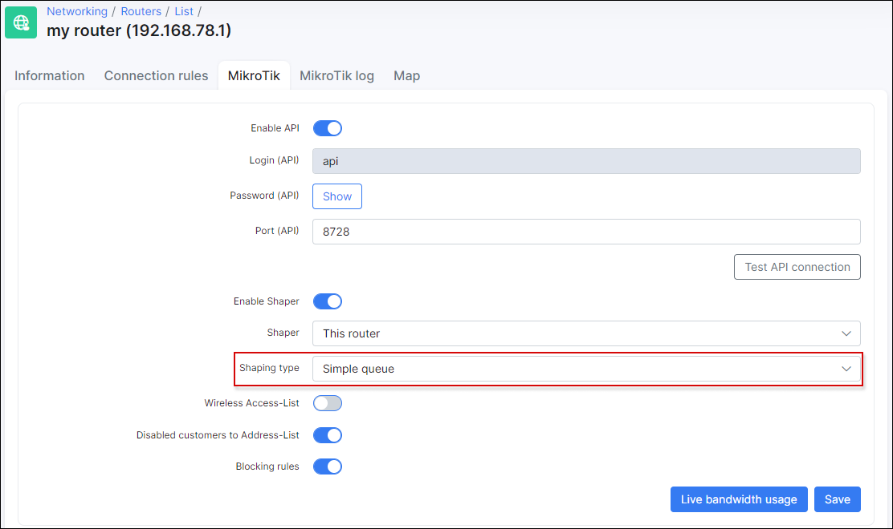

Contentions
==========

Within Splynx we've provided the feature of contention or aggregation. This feature is used when ISP sells services to end users with a contention ratio for example 1:5, 1:10 etc. Contention means that end users will share the bandwidth with other end users in the same group.

Splynx operates with two types of contentions: Per Plan based and Per Router contention.

<icon class="image-icon"></icon> To use this feature, Mikrotik API should be enabled in router settings.
*************************************************************
### Plan based contention
Example to explain this type of contention:

We are selling a 5 Mbps plan to customers with a contention ratio of 1:5. This means that Splynx will setup the parent speed-limit of 5 Mbps and under this parent it will place 5 users with a speed-limit of 5 Mbps each. What happens in this situation is that, if the line is free and one user starts to download/upload, this user will get the full 5 Mbps throughput. In the case that a second user starts actively downloading, they will receive 2,5 Mbps each. When all 5 users are simultaneously downloading they will share the parent queue's bandwidth: each receiving their required 1Mbps minimum speed.

The image below illustrates this contention ratio:

It's not good to play with this "Guaranteed speed limit at" feature - in contention its best practice to leave it at 100%:

What will happen in a situation that 7 users are put on a 1:5 contention plan? Splynx will change the parent speed to 7 Mbps in this particular case, but will leave the maximum speeds of each user in the contention plan to 5 Mbps.

If you are planning to deploy Plan-based contentions, we would advise you to use it on central routers to achieve high amounts of users in one tree. Comparing the following two situations – 1:5 contention tree with 5 users and two of them are hard downloaders, this means that the 3 other users will never get the maximum of 5 Mbps speeds, because they are all under one common parent of 5 Mbps.

If we place 100 users on a contention ratio of 1:5, then parent maximum speed will be set to 20 Mbps and then the two or more high downloaders, will not use all the bandwidth within the contention.

### Router based contention.

The following is an example of Router based contentions:

Imagine that we have a wireless AP which is connected to the backbone network with 30 Mbps speeds. But we've connected users to the AP with a total possible bandwidth of 60 Mbps. What can happen in peak times, is that users will consume more traffic than can be sent through uplink. This means that the wireless link can become overutilized and unstable. This is depicted in the image below.

To prevent this situation, router based contention can be used. In Splynx each router has a “Sector/Speed limits” field, where groups can be defined and administrators can put users under these groups. As a result, we will achieve contention per router:

### Shaping type

For plan based contentions, please set the Shaping type to *Simple queue (with Tree)*:

For router based contentions, please set the Shaping type to *Simple queue*:

### Video tutorial
For a short tutorial on how to configure Splynx and Plan based contention, please view the video below:

<iframe frameborder=0 height=270 width=350 allowfullscreen src="https://www.youtube.com/embed/e2aOsfdBTYA?wmode=opaque">Video on youtube</iframe>

For a tutorial on Router based contentions, please view the video below:

<iframe frameborder=0 height=270 width=350 allowfullscreen src="https://www.youtube.com/embed/XgSGhYad_Ik?wmode=opaque">Video on youtube</iframe>
