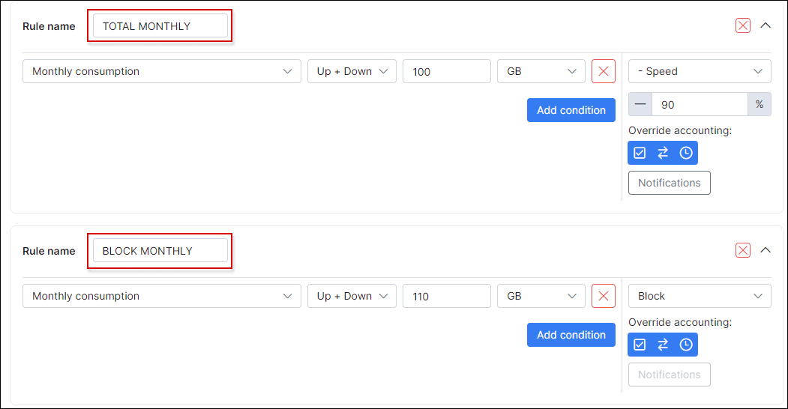

Fair user policy - FUP
==========

Many ISP's use Fair Usage Policies (FUP) – this means that if a customer downloads or uploads more than a certain amount of data, their speeds are reduced according to configurations. We've moved this idea to a different level and made it as configurable as possible.

In Splynx, we have smart bandwidth management. You can define customer speeds based on the amount of traffic consumed per month, per week, or even per day. You can also set up maximum online times in hours per customer.

Do you perhaps want to give your users double their speeds at night, limited traffic on weekends, or set up a speed limit for downloaders who exceed the daily download limits? This is all possible now with the help of Splynx!

FUP settings can be located in Tariff Plans when clicking on the "arrows" button of the desired plan.

Let’s use the following as an example. We have a 5 Mbps download and upload plan and we've decided that there will be unlimited traffic for customers on weekends, and they will receive speeds of 7 Mbps on Saturdays and Sundays. The first rule has been created below, defining the first rule which is “Unlimited traffic on weekends”:

Increased speeds from 5 Mbps to 40% more on Saturdays and Sundays:

Then we can check which rule will be applied on Saturday's in the Preview & Test tab:

The next step is to set up a rule for users with data transfers of 10GB per day: We will reduce their speeds to 2 Mbps after they've reached 10 GB in one day.

We will set up a total Monthly usage limit of 100 GB, after this limit has been reached, we will limit the user's speeds to 1 Mbps. When the user reaches 110 GB, we will block the user and charge for the additional data.

As you can see in the image above, we have created a full comprehensive policy for bandwidth management for a 5 Mbps plan. You can use our FUP builder and create your own rules! Speed limitations are done via Radius using CoA attributes on any supporting equipment or via Mikrotik API on RouterOS.

<iframe frameborder=0 height=270 width=350 allowfullscreen src="https://www.youtube.com/embed/gIG2_2wK58I?wmode=opaque">Video on youtube</iframe>
