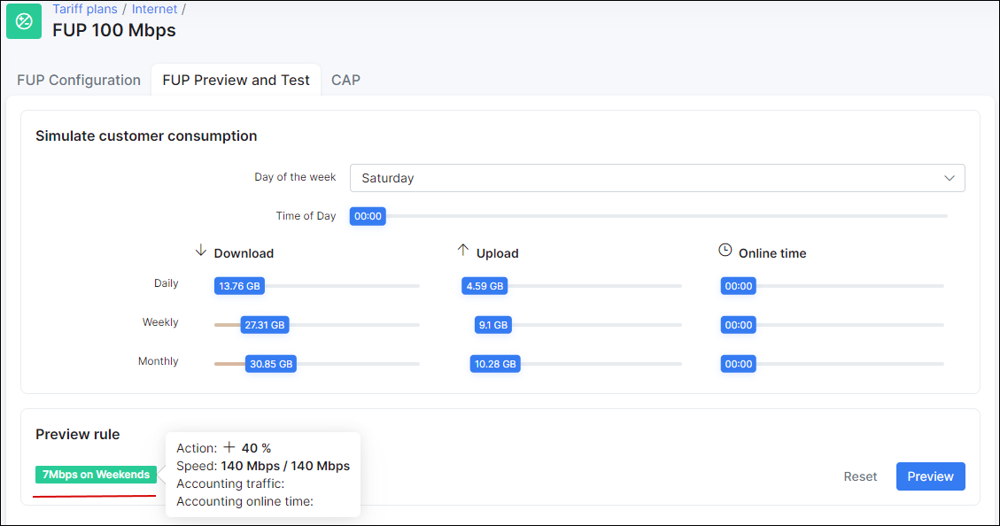

Fair user policy - FUP
==========

Many ISPs use a Fair User Policy (FUP) – this means that if a customer downloads or uploads more than a certain amount of data, his speed is reduced. We moved this idea to a different level and made it as configurable as it can be.

In the Splynx ISP Framework we have smart bandwidth management. You can define customer speed based on the amount of traffic consumed per month, per week, or even per day. You can also set up maximum online time in hours per customer.

Do you want to give your users double speed at night, dounlimited traffic on the weekends, or set up a speed limit for downloaders who exceed the daily download limit ? Do it with Splynx right now!

FUP settings are located in Plan under the arrow button

Let’s create an example. We have a 5 Mbps download and upload plan. I decided that there will be unlimited traffic for customers on weekends and they will get 7 Mbps on Saturdays and Sundays. The first rule have been created below. The first rule is “Unlimited traffic on weekends”:

Increased speed from 5 Mbps to 40% more on Saturdays and Sundays:

Then we can check what rule will be applied on Saturday:

The next step is to set up a rule for downloaders with transfers of 10GB per day: I will reduce their speed to 2 Mbps after they reach 10 GB in one day.

I’ll set up a total Monthly usage limit of 100 GB; after  this limit is reached, we will give the user 1 Mbps. When the user reaches 110 GB, we will block him and charge additional data.

As you can see in the last picture, we have created a full comprehensive policy for bandwidth management for a 5 Mbps plan. You can use our FUP builder and create your own rules! Speed limitation is done via Radius using CoA attributes on any supporting equipment or via Mikrotik API on RouterOS.

<iframe frameborder=0 height=270 width=350 allowfullscreen src="https://www.youtube.com/embed/gIG2_2wK58I?wmode=opaque">Video on youtube</iframe>
